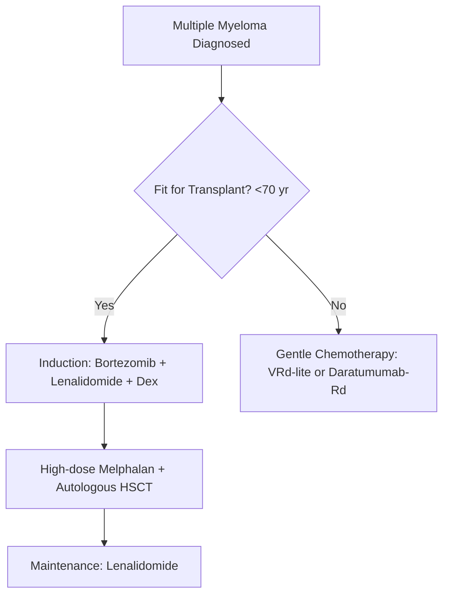

---
tags:
  - internalmedicine
  - disease
  - hematology
status: active
---

# 🩸 Multiple Myeloma / MM (โรคเอ็มเอ็ม / โรคมะเร็งเม็ดเลือดขาวชนิดมัลติเปิลมัยอิโลมา)

> **Definition**: Clonal plasma cell malignancy characterized by abnormal proliferation of monoclonal plasma cells in the bone marrow, production of monoclonal immunoglobulins or light chains (M-protein), and associated organ dysfunction.

---

## 🦠 Pathophysiology & Molecular Mechanisms

1. **Clonal Expansion & Bone Marrow Adhesion**:
   * Malignant transformation of a post-germinal center B-cell. Myeloma cells home to bone marrow.
   * Adhesion to bone marrow stromal cells (BMSCs) via **VLA-4 on myeloma cells binding to VCAM-1 on BMSCs**.
   * Adhesion stimulates BMSCs to secrete high levels of **Interleukin-6 (IL-6)**, which acts as the major paracrine/autocrine growth and survival factor for myeloma cells (gp130/JAK/STAT3 pathway).
2. **Osteoclast Overactivation & Osteoblast Inhibition (Lytic Bone Lesions)**:
   * **Osteoclastogenesis**: Myeloma cells and BMSCs express high levels of **RANKL** and secrete cytokines (MIP-1$\alpha$, TNF-$\beta$, IL-1$\beta$) that bind to RANK on osteoclast precursors, stimulating differentiation. Myeloma cells also secrete osteoprotegerin (OPG) antagonists, decreasing OPG (decoy receptor), leading to a highly elevated **RANKL/OPG ratio**.
   * **Osteoblast Inhibition**: Myeloma cells secrete **DKK-1** (Dickkopf-1) and **Sclerostin**, which inhibit the Wnt/$\beta$-catenin pathway, blocking osteoblast differentiation.
   * *Result*: Uncoupled bone remodeling (extreme osteolysis with zero bone formation), leading to pathological fractures, bone pain, and hypercalcemia.
3. **M-Protein & Myeloma Cast Nephropathy**:
   * Monoclonal plasma cells produce excess single immunoglobulins (typically **IgG $\sim 50\%$**, **IgA $\sim 20\%$**) or free light chains ($\kappa$ or $\lambda$).
   * **Nephrotoxicity**: Excess free light chains are filtered by glomeruli. In distal convoluted tubules, they bind to **Tamm-Horsfall mucoprotein** under acidic conditions, forming large, hard, obstructing casts. These casts induce direct tubular epithelial injury, rupture, and tubulointerstitial inflammation (**Myeloma Cast Nephropathy / Myeloma Kidney**).
   * *Precipitating Factors*: Dehydration, contrast media, and **NSAID use** (which decreases renal blood flow via prostaglandin inhibition, promoting cast precipitation).

---

## 🔍 Clinical Manifestations & Diagnostic Criteria

Requires **$\ge 10\%$ clonal bone marrow plasma cells** (or biopsy-proven bony/extramedullary plasmacytoma) PLUS one or more **SLiM-CRAB** criteria.

### 1. The Classic CRAB Criteria (Organ Damage)
* **C — Calcium Elevation**: Serum calcium **$>11\text{ mg/dL}$** (or $>1\text{ mg/dL}$ above upper limit of normal). Presents as muscle weakness, constipation, polyuria, polydipsia, confusion, and shortened QTc.
* **R — Renal Insufficiency**: Serum creatinine **$>2\text{ mg/dL}$** (or creatinine clearance $<40\text{ mL/min}$).
* **A — Anemia**: Normocytic, normochromic. Hemoglobin **$<10\text{ g/dL}$** (or $>2\text{ g/dL}$ below lower limit of normal). Due to marrow replacement and renal-induced erythropoietin deficiency.
* **B — Bone Lesions**: $\ge 1$ osteolytic lesions on skeletal survey, CT, or MRI/PET-CT. Presents as severe localized **bone pain** (especially back pain, rib pain) and pathologic fractures.

### 2. The SLiM Biomarkers of Malignancy ( redefine active MM without CRAB)
* **S — Sixy Percent**: Clonal bone marrow plasma cells **$\ge 60\%$**.
* **Li — Light Chain Ratio**: Involved-to-uninvolved serum free light chain (SFLC) ratio **$\ge 100$** (provided involved free light chain is $\ge 100$ mg/L).
* **M — MRI Lesions**: **$>1$ focal bone marrow lesion** (at least 5 mm in size) detected on MRI.

### 3. Other Clinical Syndromes
* **Functional Hypogammaglobulinemia**: Clonal expansion suppresses normal B-cells, decreasing normal polyclonal immunoglobulins. Leads to **recurrent infections** (classically encapsulated organisms like *S. pneumoniae*, *H. influenzae*).
* **Hyperviscosity Syndrome**: High IgA or IgG levels increase blood viscosity. Presents as headache, visual changes (blurry vision, **sausage-like engorged retinal veins**), epistaxis, and confusion. (More common in [[Monoclonal and Polyclonal Gammopathies#Waldenstr m Macroglobulinemia|Waldenström Macroglobulinemia]]).
* **Spinal Cord Compression**: Oncologic emergency. Tumor extension from vertebral lesion compresses spinal cord. Presents as progressive back pain, radiculopathy, ascending sensory loss, motor weakness, and bladder/bowel incontinence.

---

## 🔬 Investigations

* **Complete Blood Count (CBC)**: Normocytic normochromic anemia.
* **Peripheral Blood Smear**: **Rouleaux Formation** (RBCs stacked like coins due to high serum protein neutralizing negative charges on RBC surface).
* **Serum Protein Electrophoresis (SPEP)**: Shows a sharp, narrow **M-protein spike** in the gamma or beta region.
* **Immunofixation Electrophoresis (IFE)**: Identifies specific heavy chain (IgG, IgA, rare IgD/IgE) and light chain ($\kappa$ or $\lambda$) type.
* **Urine Protein Electrophoresis (UPEP)**: Detects light chains (**Bence-Jones proteins**).
* *The Dipstick Trap*: Standard urine dipsticks detect only albumin. A patient with massive Bence-Jones proteinuria can have a **negative urine dipstick**. Confirm with **24-hour urine collection/UPEP** or **Sulfosalicylic Acid (SSA) precipitation test**.
* **Bone Marrow Aspirate & Biopsy**: Clonal plasma cells $\ge 10\%$. Plasma cells show **eccentric nuclei**, "clock-face" chromatin, basophilic cytoplasm, and a prominent **perinuclear halo (Hoff)**.
* **Skeletal Imaging**: Whole-body low-dose CT or MRI is preferred. Demonstrates **punched-out lytic lesions** (e.g., "pepper-pot skull").
  * > [!WARNING]
    > **Bone Scan Contraindication**: Do NOT order a Technetium-99m bone scan. Bone scans detect osteoblastic activity, which is absent in myeloma. Bone scans will be **falsely negative**. Use CT, MRI, or plain X-ray skeletal survey.

### International Staging System (ISS) & R-ISS

| Stage | ISS Criteria | Revised ISS (R-ISS) Criteria |
| :--- | :--- | :--- |
| **Stage I** | • Serum $\beta_2$-microglobulin $<3.5$ mg/L AND • Serum albumin $\ge 3.5$ g/dL | • ISS Stage I AND • No high-risk cytogenetics (by FISH) • Normal serum LDH |
| **Stage II** | • Neither Stage I nor Stage III | • Neither Stage I nor Stage III |
| **Stage III** | • Serum $\beta_2$-microglobulin $\ge 5.5$ mg/L | • ISS Stage III AND • High-risk cytogenetics [del(17p), t(4;14), or t(14;16)] OR • Elevated serum LDH |

---

## 🏥 Management

### 1. Acute Hypercalcemia Management
* **Aggressive IV Hydration**: Normal Saline $200-500$ mL/h to restore intravascular volume and promote renal calcium clearance.
* **Loop Diuretics (Furosemide)**: Administer only *after* volume depletion is corrected, to prevent worsening dehydration.
* **IV Bisphosphonates**: **Zoledronic acid** (4 mg IV over 15 mins) or **Pamidronate**. Inhibits osteoclasts to lower calcium and stabilize bone.
* Calcitonin: Rapid-acting (onset 4-6h) but transient (tachyphylaxis in 48h). Used for immediate bridging.

### 2. Induction Chemotherapy (Standard 3-Drug Regimen)
* **VRd Regimen**: **Bortezomib** + **Lenalidomide** + **Dexamethasone** for 4-6 cycles.

#### Antineoplastic Drug Profiles & Pearls:

| Drug | Class | Mechanism of Action | Clinical Pearls & Adverse Effects |
| :--- | :--- | :--- | :--- |
| **Bortezomib** | Proteasome Inhibitor | Reversibly inhibits 26S proteasome $\rightarrow$ halts protein degradation $\rightarrow$ accumulates misfolded proteins $\rightarrow$ ER stress and apoptosis. | • **Sensory peripheral neuropathy** (painful, burning feet). • High risk of **VZV reactivation**; **must co-administer acyclovir prophylaxis**. |
| **Lenalidomide** | Immunomodulatory (IMiD) | Binds **cereblon** (CRBN E3 ubiquitin ligase) $\rightarrow$ degrades transcription factors Ikaros/Aiolos $\rightarrow$ blocks myeloma growth. | • **Highly teratogenic** (phocomelia risk; requires strict birth control). • **Venous thromboembolism (VTE)** risk; **must co-administer aspirin or LMWH prophylaxis**. • Neutropenia. |
| **Dexamethasone**| Corticosteroid | Induces plasma cell apoptosis. | • Insomnia, hyperglycemia, gastritis, increased infection risk. |
| **Daratumumab** | Monoclonal Antibody | Targets **CD38** on plasma cells $\rightarrow$ direct ADCC, CDC, and apoptosis. | • Infusion reactions. • Interferes with blood bank crossmatching (requires indirect Coombs warning). |

### 3. Stem Cell Transplantation
* **Autologous Hematopoietic Stem Cell Transplant (ASCT)**: Consolidation therapy for fit patients ($<65-70$ years without severe comorbidities).
  * *Protocol*: Induce remission $\rightarrow$ harvest patient's CD34+ stem cells $\rightarrow$ administer high-dose **Melphalan** (myeloablative) $\rightarrow$ reinfuse harvested stem cells for hematologic rescue.

---

## 💡 Clinical Pearls

* > [!IMPORTANT]
  > **Osteonecrosis of the Jaw (ONJ)**: Patients on long-term bisphosphonates (Zoledronic acid) are at risk of ONJ. **Ensure a comprehensive dental exam is completed and any invasive dental procedures are performed BEFORE starting bisphosphonates**. Avoid tooth extractions during therapy.
* > [!WARNING]
  > **Cord Compression Emergency**: If an MM patient presents with new-onset lower extremity weakness, sensory level, or bowel/bladder changes, order an **emergent spine MRI** and administer **high-dose IV Dexamethasone** immediately to reduce tumor edema before radiation or surgical decompression.
* > [!TIP]
  > **Renal Dose Adjustments**: Lenalidomide is renally cleared and requires dosage adjustment in renal impairment. Bortezomib is metabolized by the liver and does not require dose adjustment in renal failure, making it ideal for active myeloma cast nephropathy.

---

## 🔗 Related Notes
* [[Leukemia]]
* [[Monoclonal and Polyclonal Gammopathies]]
* [[Proteinuria]]
* [[05 Medication Summary]]
