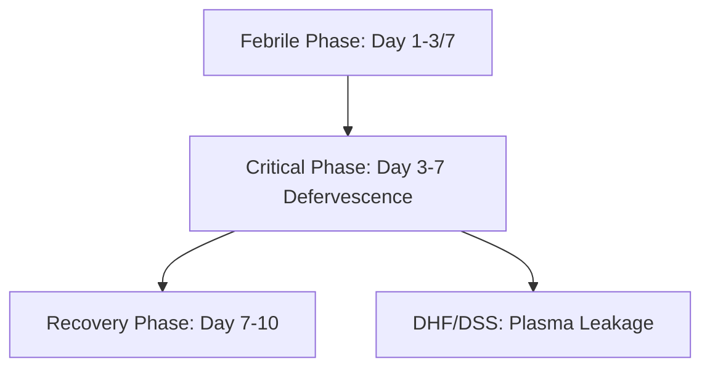

---
tags:
  - internalmedicine
  - disease
  - infectiousdisease
status: active
---

# 🦠 Dengue Infection (โรคไข้เลือดออก)

> **Definition**: Mosquito-borne viral infection caused by Dengue virus (DENV-1 to 4; genus *Flavivirus*), presenting as a spectrum from undifferentiated fever to life-threatening **Dengue Hemorrhagic Fever (DHF)** and **Dengue Shock Syndrome (DSS)**.

---

## 🦠 Pathophysiology & Antibody-Dependent Enhancement (ADE)

* **Vector**: *Aedes aegypti* mosquito (day-biting, breeds in clean stagnant water).
* **Immunology**:
  * Primary infection with one DENV serotype provides lifelong homologous immunity, but only temporary cross-protection against heterologous serotypes.
  * **Antibody-Dependent Enhancement (ADE)**: Occurs during **secondary infection with a different DENV serotype**. Non-neutralizing IgG antibodies from primary infection bind to new DENV serotype, but fail to neutralize it. Instead, the antigen-antibody complexes bind to **Fc-gamma receptors** on monocytes/macrophages, facilitating massive viral entry and replication.
  * **Cytokine Storm**: Infected macrophages release high levels of vasoactive cytokines (TNF-alpha, IL-2, IFN-gamma, VEGF) causing transient endothelial dysfunction, resulting in **plasma leakage** into the extravascular space (pleural cavity, peritoneum).

---

## 🔍 Clinical Phases

Classic course is divided into three distinct phases:

### 1. Febrile Phase (Days 1–5/7)
* Sudden onset of high continuous **[[Fever]]** ($39–40^\circ\text{C}$).
* Retro-orbital pain, severe **[[Myalgia]]** & **[[Joint Pain]]** ("breakbone fever"), frontal headache.
* Facial flushing, transient macular rash.
* Mild hemorrhagic manifestations (petechiae, mucosal bleeding).
* Positive **Tourniquet Test** (inflate BP cuff to midway between SBP and DBP for 5 mins; positive if $\ge 20$ petechiae per 1 square inch).

### 2. Critical Phase (Days 3–7; lasts 24–48 hours)
* Occurs around **defervescence** (temperature drops to $<38^\circ\text{C}$).
* **Key Event**: **Plasma leakage** due to peak capillary permeability.
* **Warning Signs for Severe Dengue**:
  * Severe abdominal pain or tenderness.
  * Persistent vomiting ($\ge 3$ times/day).
  * Mucosal bleeding (epistaxis, gum bleeding, hematemesis).
  * Clinical fluid accumulation (pleural effusion, ascites).
  * Lethargy, restlessness.
  * Hepatomegaly ($>2$ cm below costal margin).
  * **Rising Hematocrit** coexisting with a **rapid decrease in platelet count**.
* Can progress to **Dengue Shock Syndrome (DSS)** (narrow pulse pressure $<20$ mmHg, cold extremities, prolonged capillary refill time).

### 3. Recovery Phase (Convalescent Phase, Days 7–10)
* Gradual reabsorption of extravasated fluid back into intravascular compartment.
* General well-being returns, appetite improves.
* Hemodynamic stability, relative bradycardia.
* **Convalescent Rash**: Generalized petechial rash with **"white islands in a sea of red"** (highly pruritic).

---

## 🔬 Investigations

* **Complete Blood Count (CBC) Monitoring**:
  * **Leukopenia** (WBC $<5,000$/$\mu\text{L}$; earliest clue of entry into critical phase).
  * **Thrombocytopenia** (Platelets $<100,000$/$\mu\text{L}$).
  * **Hemoconcentration**: Hematocrit (Hct) increase $\ge 20\%$ from patient's baseline (confirms plasma leakage).
* **Diagnostic Assays**:
  * **Day 1–5 (Febrile Phase)**: **Dengue NS1 Antigen** (highly sensitive/specific) or RT-PCR (detects viral RNA).
  * **Day 5 onwards**: **Dengue IgM and IgG ELISA** (IgM positive indicates acute infection).
* **Radiology**: Chest X-ray (right-sided pleural effusion), Abdominal ultrasound (gallbladder wall thickening, ascites).

---

## 🏥 Management

No specific antiviral therapy. Management is purely supportive:

### 1. Febrile Phase Care
* Bed rest, oral hydration with electrolyte solutions/fruit juice (avoid plain water to prevent hyponatremia).
* Antipyretics: **Use Acetaminophen (Paracetamol) only**.
* > [!WARNING]
  > **Strictly Avoid NSAIDs**: Do NOT use Aspirin, Ibuprofen, Mefenamic Acid, or Naproxen for fever. NSAIDs cause platelet dysfunction and increase the risk of severe gastrointestinal hemorrhage and Reye syndrome.

### 2. Critical Phase & DHF Fluid Therapy
* Close monitoring of vital signs, hematocrit, and urine output (target $\ge 0.5$ mL/kg/h).
* **IV Fluid Selection**: Isotonic crystalloids (Normal Saline or Lactated Ringer's).
* **Rate**: Start at $5-7$ mL/kg/h for 1-2 hours, then taper step-by-step ($5 \rightarrow 3 \rightarrow 1.5$ mL/kg/h) as Hct falls and clinical status stabilizes. Stop fluids within 48 hours to avoid **fluid overload** during recovery.

### 3. Dengue Shock Syndrome (DSS)
* **Initial Bolus**: Isotonic crystalloid $10–20$ mL/kg IV over 15–30 mins.
* If shock persists and Hct remains high: Give second crystalloid bolus or switch to colloids (e.g., Dextran 40).
* > [!IMPORTANT]
  > **Occult Bleeding**: If shock persists but the **Hct drops abruptly** (without clinical recovery), suspect **internal hemorrhage** (GI tract). Administer **immediate blood transfusion** (Fresh Whole Blood or Packed Red Cells).

---

## 💡 Clinical Pearls

* > [!IMPORTANT]
  > **WBC Rise as Recovery Signal**: In daily CBC monitoring, the **rise in white blood cell count** is the earliest indicator that the critical phase is ending and the patient is entering the recovery phase. Platelet recovery follows shortly after.
* > [!WARNING]
  > **Fluid Overload in Recovery**: During the recovery phase, fluids are naturally reabsorbed. Continuing IV fluids during this phase can precipitate **acute pulmonary edema** (evidenced by tachypnea, crepitations, desaturation). Stop IV fluids immediately when the patient enters recovery.
* > [!TIP]
  > **Tourniquet Test Utility**: A positive tourniquet test is a useful screening tool in the febrile phase but does not differentiate dengue fever from DHF.

---

## 🔗 Related Notes
* [[Malaria]]
* [[Zika Virus Infection]]
* [[Septicemia]]
* [[05 Medication Summary]]
