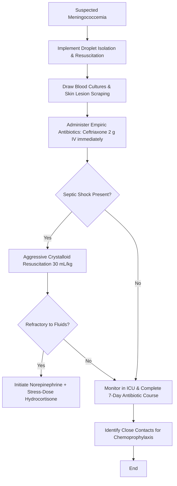

---
tags:
  - internalmedicine
  - disease
  - infectiousdisease
status: active
---

## type: disease

# Definition
Meningococcemia is a life-threatening systemic infection caused by the hematogenous dissemination of the Gram-negative bacterium *Neisseria meningitidis*. It is characterized by rapid clinical deterioration, septic shock, disseminated intravascular coagulation (DIC), and a distinctive petechial/purpuric skin rash (purpura fulminans), which can occur with or without concurrent meningitis.

# Epidemiology
* **Incidence**: Primarily affects infants, young children, and adolescents/young adults. 
* **Settings**: Outbreaks are associated with crowded living environments, such as college dormitories, military barracks, and schools.
* **Mortality**: Extremely high. Untreated meningococcemia is nearly always fatal. Even with prompt antibiotic therapy and modern ICU care, the mortality rate is $10-15\%$, rising to $>40\%$ in patients presenting with severe purpura fulminans and septic shock.
* **Prevention**: Preventable via meningococcal conjugate vaccines (targeting serogroups A, C, W, Y) and serogroup B vaccines.

# Etiology
* **Pathogen**: *Neisseria meningitidis*, an aerobic, encapsulated, Gram-negative, kidney bean-shaped diplococcus.
* **Serogroups**: Classified based on the antigenic structure of their polysaccharide capsule. The clinical disease is caused almost entirely by serogroups **A, B, C, W-135, Y, and X**.
* **Transmission**: Through respiratory droplets or direct contact with nasopharyngeal secretions from asymptomatic carriers (who comprise $10-20\%$ of the general population).

# Pathophysiology
1. **Colonization & Invasion**: Pathogens colonize the nasopharyngeal mucosa using pili. In susceptible hosts, the bacteria cross the mucosal epithelium to enter the bloodstream.
2. **Endotoxemia**: In the bloodstream, *N. meningitidis* undergoes rapid replication and releases massive amounts of outer membrane vesicles ("blebbing") containing **lipooligosaccharide (LOS) endotoxin**.
3. **Cytokine Storm**: LOS endotoxin binds to TLR4/MD2 complexes on immune cells, triggering an intense inflammatory cascade with systemic release of TNF-$\alpha$, IL-1, IL-6, and interferon-$\gamma$.
4. **Endothelial Dysfunction & Capillary Leak**: Severe endothelial cell activation leads to loss of vascular tone, capillary leak syndrome (causing third-spacing and intravascular volume depletion), and profound vasodilation.
5. **Thrombosis & Purpura Fulminans**: Endothelial injury upregulates tissue factor and downregulates natural anticoagulants (Protein C, Protein S, antithrombin). This leads to widespread microvascular thrombosis, tissue ischemia, and hemorrhagic necrosis of the skin (**Purpura Fulminans**), consuming clotting factors and platelets (**Disseminated Intravascular Coagulation / DIC**).
6. **Waterhouse-Friderichsen Syndrome**: Widespread microvascular thrombosis and hemorrhagic necrosis extend to the adrenal glands, causing acute bilateral adrenal hemorrhage and catastrophic **acute adrenal insufficiency**, which exacerbates refractory shock.

# Clinical Manifestations

## Symptoms
* **Prodrome**: Non-specific flu-like symptoms including high **[[Fever]]**, chills, severe **[[Myalgia]]** (especially leg pain), arthralgia, and headache.
* **Rapid Progression**: Evolution from mild illness to critical state occurs rapidly, often within $12-24$ hours.
* **Gastrointestinal**: Nausea, projectile vomiting, and abdominal pain are common.
* **Neurological**: Irritability, confusion, lethargy, or progress to [[Coma]] (if co-existing [[Bacterial Meningitis]] or severe encephalopathy is present).

## Physical Examination
* **Dermatological (The Pathognomonic Rash)**:
  * *Early*: Transient, erythematous maculopapular rash that can easily be mistaken for a viral exanthem.
  * *Intermediate*: Development of **petechiae** (1-2 mm non-blanching red/purple spots), primarily on the trunk, lower extremities, conjunctiva, and mucosal surfaces.
  * *Late*: Petechiae coalesce into large, irregular, purple/black ecchymoses and necrotic plaques with erythematous borders (**Purpura Fulminans**).
* **Hemodynamic (Septic Shock)**:
  * Hypotension, profound tachycardia, cool and mottled extremities, delayed capillary refill ($>3$ seconds), and oliguria.
* **Meningeal Signs**:
  * If meningococcemia is accompanied by meningitis ($50-60\%$ of cases), nuchal rigidity, Kernig's, and Brudzinski's signs will be present. In isolated meningococcemia, meningeal signs are absent.
* **Adrenal Crisis Signs**:
  * Shock that is highly refractory to massive fluid resuscitation and high-dose vasopressors.

---

# Differential Diagnosis
* **Rocky Mountain Spotted Fever (RMSF)**: Caused by *Rickettsia rickettsii*. Petechial rash typically begins on the wrists and ankles before spreading centrally (spares mucosal membranes early on); history of tick exposure.
* **Infective Endocarditis (with septic emboli)**: Subacute presentation, heart murmurs, splinter hemorrhages, Janeway lesions, Osler nodes.
* **Henoch-Schönlein Purpura (IgA Vasculitis)**: Palpable purpura localized to buttocks and lower extremities, colicky abdominal pain, arthritis, hematuria, patient is usually hemodynamically stable.
* **Toxic Shock Syndrome (TSS)**: Diffuse erythroderma (sunburn-like rash) followed by desquamation; petechiae are rare.
* **Severe [[Septicemia]] from other pathogens**: *Streptococcus pneumoniae*, *Staphylococcus aureus*, or Gram-negative bacilli can cause septic shock and DIC (purpura fulminans), but are less classically associated with rapid petechial eruption.

---

# Investigations

## Laboratory
* **Blood Cultures**: **Mandatory immediately**. Positive in $50-60\%$ of untreated patients.
* **Gram Stain and Culture of Skin Lesions**: Scraping or aspirating the center of a petechial/purpuric lesion for Gram stain and culture has a high yield ($70\%$) and is unaffected by brief prior antibiotic exposure.
* **Complete Blood Count ([[CBC]])**: Marked leukocytosis (or leukopenia/neutropenia in overwhelming sepsis, which is a poor prognostic sign) and severe thrombocytopenia.
* **Coagulation Profile ([[Coagulation Profile]])**: Elevated PT, PTT, INR; decreased fibrinogen; and markedly elevated D-dimer (diagnostic of **[[Disseminated Intravascular Coagulation]]**).
* **Arterial Blood Gas ([[ABG]])**: Shows metabolic acidosis with respiratory compensation, secondary to lactic acidosis from poor tissue perfusion.
* **Serum Electrolytes & Cortisol**: Hyponatremia, hyperkalemia, and inappropriately low random serum cortisol suggest **Waterhouse-Friderichsen syndrome** (adrenal crisis).
* **Polymerase Chain Reaction (PCR)**: Detection of *N. meningitidis* DNA in blood or CSF (highly sensitive and remains positive after antibiotic administration).

## Imaging
* **[[Chest X-Ray]]**: To rule out concurrent meningococcal pneumonia or ARDS.

## Special Tests
* **[[Lumbar Puncture]] (LP) and [[CSF Analysis]]**:
  * > [!CAUTION]
    > **LP Contraindication in Shock**: Do **NOT** perform a lumbar puncture if the patient is hemodynamically unstable, in septic shock, or showing signs of coagulopathy/DIC (risk of spinal hematoma) or elevated ICP (risk of herniation). Antibiotics must be initiated immediately; LP can be deferred.

---

# Diagnostic Criteria
Definitive diagnosis is confirmed by:
1. Isolation of *Neisseria meningitidis* from a sterile site (blood, CSF, synovial fluid) or from biopsy/aspiration of purpuric skin lesions.
2. Positive PCR assay for *N. meningitidis* DNA from blood or CSF.
3. Gram-negative intracellular diplococci identified on Gram stain of CSF or skin lesion aspirates in the presence of compatible clinical symptoms.

---

# Management

## Initial Management
* > [!IMPORTANT]
  > **Emergency Isolation**: Immediately place the patient on **Droplet Precautions** (maintained for 24 hours after starting effective antibiotic therapy) to protect healthcare staff and other patients.
* **Empiric Antimicrobial Therapy**:
  * **Ceftriaxone 2 g IV q12h** (or Cefotaxime 2 g IV q4-6h) immediately. Do not delay for diagnostics.
  * If severe penicillin allergy exists: **Chloramphenicol 12.5 - 25 mg/kg IV q6h**.
* **Hemodynamic Resuscitation**:
  * **Intravenous Fluids**: Rapid infusion of isotonic crystalloids ($30$ mL/kg) to correct intravascular volume loss from capillary leak.
  * **Vasoactive Support**: If hypotension is refractory to fluids, initiate **Norepinephrine** (first-line) to maintain MAP $\ge 65$ mmHg.
  * **Adrenal Support**: If shock is refractory to fluid resuscitation and vasopressors, administer **Hydrocortisone 200 mg/day IV** (divided q6h) to treat potential Waterhouse-Friderichsen syndrome.
* **Correction of Coagulopathy (DIC Management)**:
  * Transfuse platelets if $<50,000/\mu$L with active bleeding or $<20,000/\mu$L prophylactically.
  * Transfuse Fresh Frozen Plasma (FFP) and Cryoprecipitate if there is active clinical bleeding and prolonged PT/PTT or low fibrinogen ($<150$ mg/dL).

## Definitive Management
* Once susceptibility is confirmed, if the strain is fully penicillin-susceptible, therapy can be switched to **Penicillin G 24 million units IV daily** (divided q4h) or **Ampicillin 2 g IV q4h**. However, Ceftriaxone remains highly effective and is often continued.
* Total duration of therapy: **7 days** for uncomplicated cases.
* **Chemoprophylaxis for Contacts**:
  * Must be administered to close contacts (household members, roommates, daycare contacts, healthcare workers exposed to respiratory secretions without masks) within 24 hours of identifying the index case:
    1. **Rifampin**: $600$ mg PO bid for 2 days (4 doses). (Contraindicated in pregnancy).
    2. **Ciprofloxacin**: $500$ mg PO as a single dose (First-line alternative for adults).
    3. **Ceftriaxone**: $250$ mg IM as a single dose (Safe in pregnancy).

---

# Complications
* **Purpura Fulminans Sequelae**: Severe skin necrosis, compartment syndrome, peripheral gangrene requiring limb amputations ($10-15\%$ of survivors).
* **Adrenal Insufficiency**: Chronic adrenal insufficiency due to bilateral adrenal infarction (Waterhouse-Friderichsen syndrome).
* **Neurological**: Sensorineural hearing loss, seizure disorder, hydrocephalus, hemiplegia, or intellectual disability.
* **Immunological**: Post-meningococcal reactive arthritis, vasculitis, or episcleritis (immune complex deposition, usually 1-2 weeks after onset).

# Prognosis
* Poor prognostic factors include:
  * Absence of meningitis (isolated meningococcemia has higher mortality due to higher bacteremia levels).
  * Rapidly progressive rash ($<12$ hours).
  * Presentation with septic shock and DIC.
  * Leukopenia ($WBC < 5,000/\mu$L) or thrombocytopenia.
  * Inappropriately low serum cortisol.

# Clinical Pearls
* > [!TIP]
  > **The Glass Test (Diascopy)**: Press the side of a clear drinking glass firmly against a skin spot. If it is a normal rash, it will blanch (fade). A meningococcal petechial or purpuric rash is **non-blanching** (retains its color under pressure) due to extravasated red blood cells.
* > [!IMPORTANT]
  > **Isolated Meningococcemia Danger**: Paradoxically, patients with meningococcemia *without* meningitis have a **worse prognosis** than those with meningitis. The absence of meningeal irritation signs can delay diagnosis, allowing overwhelming endotoxemia to proceed unchecked.

---

# Related Notes
* [[Bacterial Meningitis]]
* [[Septicemia]]
* [[Shock]]
* [[Septic Shock]]
* [[Disseminated Intravascular Coagulation]]
* [[Coma]]
* [[Fever]]
* [[Headache]]
* [[CBC]]
* [[Coagulation Profile]]
* [[CSF Analysis]]
* [[ABG]]
* [[Lumbar Puncture]]
