---
tags:
  - internalmedicine
  - disease
  - infectiousdisease
status: active
---

# 🦠 Opportunistic Infection in HIV (โรคติดเชื้อฉวยโอกาสในผู้ป่วยเอชไอวี)

> **Definition**: Infections caused by pathogens that rarely cause disease in immunocompetent hosts, occurring in HIV patients due to progressive loss of cell-mediated immunity, structured by CD4+ T-cell count thresholds.

---

## 🦠 Prophylaxis & OI Timeline by CD4 Count

```mermaid
gantt
    title Opportunistic Infection CD4 Thresholds
    dateFormat  X
    axisFormat %s
    section CD4 Count
    CMV Retinitis / MAC (CD4 < 50) : active, 0, 50
    Toxoplasmosis / Cryptococcus (CD4 < 100) : active, 0, 100
    PJP / Esophageal Candidiasis (CD4 < 200) : active, 0, 200
```

| CD4+ Count | Key Pathogens | Primary Prophylaxis | Criteria to Stop Prophylaxis |
| :--- | :--- | :--- | :--- |
| **$< 200$ cells/$\mu\text{L}$** | • ***Pneumocystis jirovecii*** (PJP) • *Candida albicans* (Esophagitis) | • **TMP-SMX DS** 1 tablet PO daily (PJP prophylaxis) | • CD4+ $>200$ cells/$\mu\text{L}$ for $\ge 3$ months on ART |
| **$< 100$ cells/$\mu\text{L}$** | • ***Toxoplasma gondii*** (Cerebral) • ***Cryptococcus neoformans*** | • **TMP-SMX DS** 1 tablet daily (covers both PJP and *Toxoplasma*) | • CD4+ $>200$ cells/$\mu\text{L}$ for $\ge 3$ months on ART |
| **$< 50$ cells/$\mu\text{L}$** | • **Cytomegalovirus (CMV)** Retinitis • ***Mycobacterium avium*** (MAC) | • **Azithromycin** 1200 mg PO weekly (MAC prophylaxis; only if not starting ART immediately) | • CD4+ $>100$ cells/$\mu\text{L}$ for $\ge 3$ months on ART |

---

## 🔍 Major Opportunistic Infections

### 1. *Pneumocystis jirovecii* Pneumonia (PJP / PCP)
* **Clinical**: Subacute progressive dyspnea, dry cough, fever, hypoxia out of proportion to exam, and **exercise-induced desaturation**.
* **Diagnostics**: 
  * Elevated serum LDH (non-specific, high sensitivity).
  * **Chest X-ray**: Bilateral diffuse **interstitial/ground-glass opacities** (classic perihilar distribution).
  * **Sputum/BAL Stain**: **Gomori methenamine silver (GMS) stain** showing round/cup-shaped cysts.
* **Management**:
  * **First-line**: **High-dose TMP-SMX** (15-20 mg/kg/day of TMP component, IV or PO) for 21 days.
  * **Corticosteroids**: Add oral **Prednisone** (40 mg bid, tapered over 21 days) **within 72 hours** if: **$\text{PaO}_2 < 70$ mmHg** (room air) OR alveolar-arterial (A-a) oxygen gradient $\ge 35$ mmHg. *Reduces mortality by preventing inflammation from dying fungi.*

### 2. Cerebral Toxoplasmosis (*Toxoplasma gondii*)
* **Clinical**: Subacute focal neurological deficits (hemiparesis, aphasia), headache, fever, seizures.
* **Diagnostics**:
  * **Brain MRI / CT (with contrast)**: **Multiple ring-enhancing lesions** with surrounding vasogenic edema, showing a predilection for the basal ganglia and corticomedullary junction.
  * Toxoplasma IgG serology (highly sensitive; negative rules out disease).
* **Management**:
  * **First-line**: **Pyrimethamine** + **Sulfadiazine** + **Folinic acid** (Leucovorin; prevents bone marrow toxicity) for 6 weeks.
  * *Alternative*: TMP-SMX (IV or PO).

### 3. Cryptococcal Meningitis (*Cryptococcus neoformans*)
* **Clinical**: Subacute headache, fever, altered mental status, signs of **increased ICP** (CN VI palsy, papilledema). Classical signs of meningeal irritation (nuchal rigidity) are often absent.
* **Diagnostics**:
  * **CSF Analysis**: High opening pressure (often $>250$ mm $\text{H}_2\text{O}$).
  * **India Ink**: Shows round encapsulated budding yeast with a halo.
  * **Cryptococcal Antigen (CrAg)**: Detected in CSF and serum (highly sensitive/specific).
* **Management**:
  * **Induction Phase (2 weeks)**: **IV Amphotericin B** + **Oral Flucytosine**.
  * **Consolidation Phase (8 weeks)**: **Fluconazole** 800 mg PO daily.
  * **Maintenance Phase (1 year)**: **Fluconazole** 200 mg PO daily.
  * > [!IMPORTANT]
    > **ICP Control**: Perform **serial therapeutic lumbar punctures** (to drain CSF and lower pressure) if opening pressure is $\ge 250$ mm $\text{H}_2\text{O}$ or if the patient is symptomatic. Do NOT use acetazolamide.

### 4. Cytomegalovirus (CMV) Retinitis
* **Clinical**: Painless blurred vision, floaters, flashing lights (photopsia), blind spots. Unilateral, progresses to bilateral and permanent blindness.
* **Diagnostics**: **Fundoscopy** shows **"pizza-pie"** or **"ketchup-and-mustard"** appearance (perivascular fluffy yellow-white retinal exudates mixed with extensive retinal hemorrhage).
* **Management**: IV **Ganciclovir** OR oral **Valganciclovir** (severe cases require intravitreal ganciclovir injections).

### 5. Talaromycosis / Penicilliosis (*Talaromyces marneffei*)
* **Epidemiology**: Endemic in Southeast Asia (Northeast Thailand).
* **Clinical**: Fever, weight loss, anemia, lymphadenopathy, hepatosplenomegaly, and **classic umbilicated skin papules with central necrosis** (resembles molluscum contagiosum) on face and trunk.
* **Diagnostics**: Fungal culture of skin biopsy/blood. Wright-Giemsa stain shows intracellular yeast with **transverse septation** (binary fission, not budding).
* **Management**: **IV Amphotericin B** for 2 weeks, followed by oral **Itraconazole** consolidation.

---

## 🦠 Immune Reconstitution Inflammatory Syndrome (IRIS)

* **Definition**: Paradoxical worsening of a treated opportunistic infection or unmasking of an occult infection shortly after initiating Antiretroviral Therapy (ART), driven by recovery of CD4+ cells and subsequent hyper-inflammatory response.
* **Management**: **Continue ART** (do not stop). Treat the underlying opportunistic pathogen. Add corticosteroids (e.g., Prednisone) if inflammatory symptoms are life-threatening (e.g., CNS inflammation).
* > [!WARNING]
  > **ART Initiation Timing**:
  > * Start ART **within 2 weeks** of starting OI treatment for most OIs (decreases mortality).
  > * **Exceptions**: Delay ART for **2–6 weeks in Cryptococcal Meningitis** and **4–8 weeks in TB Meningitis**. Early ART in CNS infections increases mortality due to fatal intracranial IRIS (cerebral edema, herniation).

---

## 💡 Clinical Pearls

* > [!IMPORTANT]
  > **Steroids in PJP**: Never forget to check the room-air ABG in patients with suspected PJP. If $\text{PaO}_2 < 70$ mmHg, starting high-dose TMP-SMX without concurrent **Prednisone** can trigger respiratory failure due to acute lung inflammation from lysing organisms.
* > [!WARNING]
  > **Toxoplasmosis vs. Lymphoma**: Single ring-enhancing lesion on brain MRI in an AIDS patient is more likely **Primary CNS Lymphoma** (associated with EBV). Multiple ring-enhancing lesions favor **Toxoplasmosis**. Always treat for Toxoplasma first; if no improvement after 10-14 days of therapy, perform brain biopsy.
* > [!TIP]
  > **India Ink vs. CrAg**: India ink is operator-dependent and has lower sensitivity. Always confirm with Cryptococcal Antigen (CrAg) testing.

---

## 🔗 Related Notes
* [[HIV Infection and AIDS]]
* [[Bacterial Meningitis]]
* [[05 Medication Summary]]
