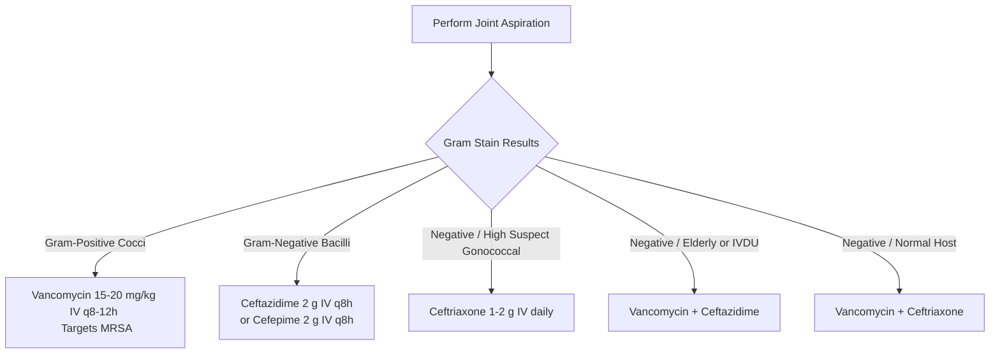

---
tags:
  - internalmedicine
  - disease
  - infectiousdisease
status: active
---

## type: disease

# Definition
Septic Arthritis, also known as **Infectious Arthritis**, is the direct invasion of a joint space by a pathogenic microorganism (bacteria, virus, mycobacteria, or fungi). It is a major **rheumatologic and orthopedic emergency** because delays in treatment can lead to rapid, irreversible articular cartilage destruction and systemic sepsis.

# Epidemiology
* **Incidence**: Approximately 4 to 10 cases per 100,000 person-years in Western nations, but significantly higher in patients with pre-existing joint disease (e.g., Rheumatoid Arthritis) or joint prostheses.
* **Risk Factors**: Advanced age ($>80$ years), Diabetes Mellitus, intravenous drug use (IVDU), immunosuppressive therapy, history of intra-articular steroid injections, indwelling catheters, and prosthetic joint surgery.

# Etiology
* **Non-Gonococcal Septic Arthritis**:
  * ***Staphylococcus aureus***: The most common pathogen overall ($~50-60\%$ of cases), including Methicillin-resistant *S. aureus* (MRSA) in high-risk groups.
  * ***Streptococcus* species** (e.g., *S. pneumoniae*, Group A/B/G Streptococci): Second most common ($~20\%$).
  * **Gram-Negative Bacilli** (*Pseudomonas aeruginosa*, *Escherichia coli*): Seen in IV drug users, elderly, and immunocompromised patients.
  * ***Staphylococcus epidermidis***: Most common in **prosthetic joint infections (PJI)**.
* **Gonococcal Arthritis**:
  * ***Neisseria gonorrhoeae***: The most common cause of septic arthritis in young, healthy, sexually active adults.
* **Chronic / Indolent Infections**:
  * ***Mycobacterium tuberculosis*** (often monoarticular, affecting spine [Pott's disease] or hips/knees).
  * **Fungi** (*Sporothrix*, *Coccidioides*, *Candida*).

# Pathophysiology
1. **Entry Pathways**:
   * **Hematogenous seeding** (most common): Pathogens seed the highly vascular synovial membrane during transient bacteremia.
   * **Direct inoculation**: Trauma, arthrocentesis, joint surgery, or intra-articular injection.
   * **Contiguous spread**: Extension from adjacent osteomyelitis, septic bursitis, or cellulitis.
2. **Inflammatory Cascade**: Pathogens adhere to synovial tissue and replicate, triggering a rapid influx of polymorphonuclear leukocytes (PMNs).
3. **Cartilage Destruction**: The release of lysosomal enzymes and matrix metalloproteinases from PMNs, combined with bacterial toxins (e.g., chondrocyte-activating toxins from *S. aureus*), destroys proteoglycans and collagen.
4. **Ischemia**: Elevated intra-articular pressure due to purulent effusion compromises synovial blood flow, leading to cartilage ischemia and subchondral bone necrosis within **48 hours**.

```
┌────────────────────────────────────────────────────────┐
│              PATHOGEN ENTRY INTO THE JOINT             │
└───────────────────────────┬────────────────────────────┘
                            │ (Hematogenous, Direct, or Contiguous)
                            ▼
          Synovial Membrane Infection & Replication
                            │
                            ▼
            Massive PMN (Neutrophil) Infiltration
                            │ (Purulent Joint Effusion)
                            ▼
            Release of Proteolytic Enzymes & Toxins
                            │
                            ▼
  Irreversible Cartilage Matrix & Collagen Loss (Within 48h)
```

# Clinical Manifestations

## Non-Gonococcal Septic Arthritis
* **Presentation**: Acute onset of severe, localized joint pain, swelling, warmth, and severe limitation of both active and passive range of motion.
* **Localization**: **Monoarticular in $>80-90\%$ of cases**. The **knee** is involved in $>50\%$ of cases, followed by the hip, shoulder, ankle, and wrist.
* **Systemic signs**: Fever ($>38^\circ\text{C}$), chills, and tachycardia are present in $60-80\%$ of patients.

## Gonococcal Arthritis (Disseminated Gonococcal Infection / DGI)
DGI presents with two distinct clinical syndromes:
1. **Dermatitis-Arthritis-Tenosynovitis Triad**:
   * **Tenosynovitis**: Simultaneous inflammation of multiple tendon sheaths, typically affecting wrists, fingers, and ankles.
   * **Dermatitis**: Painless, sparse ($<30$ lesions), purpuric macules, papules, or pustules with necrotic centers, primarily on the distal extremities.
   * **Migratory Polyarthralgias**: Migratory joint pain without focal joint swelling.
2. **Purulent Monoarticular / Oligoarticular Arthritis**:
   * Occurs without the classic skin lesions or tenosynovitis; clinically resembles non-gonococcal arthritis but is less destructive.

---

# Differential Diagnosis
* **Acute [[Gout]] / [[Pseudogout]]**: Crystal-induced arthritis. Can present with high fevers and a warm, swollen joint. Differentiated by finding intra-articular crystals and a lower synovial WBC ($<50,000/\mu\text{L}$ in most cases, though overlaps occur).
* **[[Rheumatoid Arthritis]] Flare**: Usually polyarticular and symmetric. However, RA patients have a high risk of developing secondary septic arthritis; any single joint that is out-of-proportionately inflamed in an RA patient must be aspirated.
* **[[Reactive Arthritis]]**: Sterile, asymmetric oligoarthritis affecting lower limbs, with preceding infection.
* **Lyme Arthritis**: Chronic, episodic monoarticular knee swelling in endemic areas; less painful and less acute than septic arthritis.

---

# Investigations

## 🚨 Arthrocentesis & Synovial Fluid Analysis (Diagnostic Gold Standard)
**Must be performed immediately prior to administering antibiotics.**

### 📊 Synovial Fluid Characteristics Comparison Table

| Parameter | Normal | Non-Inflammatory (OA) | Inflammatory (RA, Gout) | Septic Arthritis |
| :--- | :--- | :--- | :--- | :--- |
| **Color** | Clear | Straw/Yellow | Cloudy/Yellow | **Turbid / Purulent / Green-Yellow** |
| **Viscosity** | High | High | Low | **Very Low** |
| **WBC Count (/$\mu$L)**| $<200$ | $200 - 2,000$ | $2,000 - 50,000$ | **$>50,000$ (often $>100,000$)** |
| **PMN (%)** | $<25\%$ | $<25\%$ | $\ge 50\%$ | **$\ge 75\%$ (often $>90\%$)** |
| **Gram Stain** | Negative | Negative | Negative | **Positive in $50-70\%$** |
| **Culture** | Negative | Negative | Negative | **Positive in $>90\%$ (non-gonococcal)** |
| **Glucose (mg/dL)**| Equal to blood | Equal to blood | Slightly decreased | **Markedly decreased ($<50\%$ of blood)** |

## Laboratory
* **Blood Cultures**: **Two sets must be drawn.** Positive in $50\%$ of non-gonococcal septic arthritis cases (due to hematogenous origin).
* **CBC**: Leukocytosis with a left shift.
* **Inflammatory Markers**: ESR and CRP are almost always markedly elevated.
* **Gonococcal Screen**: If DGI is suspected, perform **NAAT** on urine, pharyngeal, rectal, and cervical/urethral swabs.

## Imaging
* **Plain Radiography**: Normal in the first few days except for soft tissue swelling and joint capsule distension. Later stages show joint space narrowing, subchondral bone erosions, and osteomyelitis.
* **Ultrasound**: Highly sensitive for detecting joint effusion (especially in deep joints like the hip) and guides diagnostic needle aspiration.
* **MRI**: Indicated if looking for concomitant osteomyelitis, soft tissue abscesses, or spinal involvement.

---

# Management

## 1. Joint Drainage (Source Control)
* Essential to remove bacteria, inflammatory cell debris, and lysosomal enzymes.
* **Methods**:
  * **Serial Needle Aspiration**: Performed daily or as needed for accessible joints (e.g., knee).
  * **Arthroscopic Lavage**: Preferred method; allows visualization, lysis of adhesions, and thorough irrigation.
  * **Open Arthrotomy (Surgical Drainage)**: Mandatory for **septic arthritis of the hip** (due to risk of avascular necrosis) and when needle aspiration/arthroscopy fails.

## 2. Empiric Intravenous Antibiotics
**Administered immediately after joint fluid has been obtained.**



* **De-escalation**: Adjust antibiotics once culture and susceptibility results are available.
* **Duration**: 
  * Non-gonococcal: **3 to 4 weeks** (usually at least 2 weeks of IV therapy, followed by oral transition once clinical signs improve and CRP trends down).
  * *N. gonorrhoeae*: Ceftriaxone 1 g IV daily for 24-48 hours after improvement, then step down to oral Cefixime or Ciprofloxacin to complete a **7-day course**.

---

# Complications
* **Osteoarthritic Joint Destruction**: Secondary to cartilage loss.
* **Osteomyelitis**: Spread of infection into subchondral bone.
* **Avascular Necrosis (AVN)**: Specifically of the femoral head in septic arthritis of the hip.
* **Fibrous Ankylosis**: Bony fusion and complete loss of joint mobility.
* **Septic Shock & Mortality**: Risk is highest in elderly patients with *S. aureus* infections.

# Prognosis
* Non-gonococcal: Mortality rate is approximately $10-15\%$ despite antibiotics. Persistent joint dysfunction occurs in up to $30-40\%$ of survivors.
* Gonococcal: Excellent; complete recovery in $>95\%$ of cases.

# Clinical Pearls
> [!IMPORTANT]
> **The RA Septic Trap**: Patients with active Rheumatoid Arthritis (RA) are at high risk for septic arthritis because they have damaged joints and are often on immunosuppressants. If an RA patient presents with an acute flare in a **single joint** that is far worse than the others ("out-of-proportion joint"), you must aspirate it to rule out septic arthritis. Never assume it is just a standard RA flare.

> [!TIP]
> **The Hip Rule**: Septic arthritis of the hip is a surgical emergency. The high intra-articular pressure within the tight hip capsule quickly cuts off the blood supply to the femoral head, leading to rapid avascular necrosis. Urgent surgical decompression via open arthrotomy is mandatory.

---

# Related Notes
* [[Reactive Arthritis]]
* [[Rheumatoid Arthritis]]
* [[Septicemia]]
* [[Osteoarthritis]]
