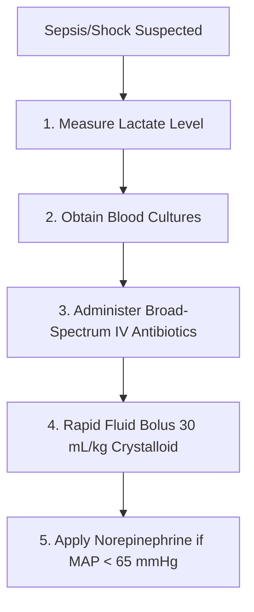

---
tags:
  - internalmedicine
  - disease
  - infectiousdisease
status: active
---

# 🦠 Sepsis and Septic Shock (ภาวะติดเชื้อในกระแสเลือดและช็อก)

> **Definition**: **Sepsis** is life-threatening organ dysfunction caused by a dysregulated host response to infection. **Septic Shock** is a subset of sepsis with profound circulatory, cellular, and metabolic abnormalities, presenting with persistent hypotension and hyperlactatemia despite fluid resuscitation.

---

## 🦠 Definitions & Diagnostic Criteria (Sepsis-3)

### 1. Sepsis
* Defined as infection + acute change in **Sequential Organ Failure Assessment (SOFA) score $\ge 2$ points**.
* **SOFA Score Parameters**:
  * **Respiration**: $\text{PaO}_2/\text{FiO}_2$ ratio.
  * **Coagulation**: Platelet count.
  * **Liver**: Bilirubin level.
  * **Cardiovascular**: Mean Arterial Pressure (MAP) or need for vasopressors.
  * **CNS**: Glasgow Coma Scale (GCS).
  * **Renal**: Creatinine level or urine output.

### 2. Septic Shock
* Clinically identified by:
  1. Persistent hypotension requiring **vasopressors to maintain MAP $\ge 65$ mmHg** AND
  2. **Serum Lactate $> 2$ mmol/L** despite adequate volume resuscitation.

### 3. qSOFA (quick SOFA)
* Rapid bedside screening tool for identifying patients at risk of poor outcomes (score $\ge 2$ indicates high risk):
  * Altered mental status ($\text{GCS} < 15$).
  * Tachypnea (Respiratory Rate $\ge 22$ breaths/min).
  * Hypotension (Systolic BP $\le 100$ mmHg).

---

## 🦠 Pathophysiology

1. **Trigger**: Pathogen-associated molecular patterns (PAMPs; e.g., LPS in Gram-negatives, peptidoglycan in Gram-positives) bind to Toll-like Receptors (TLRs) on immune cells.
2. **Cytokine Storm**: Massive release of pro-inflammatory cytokines (TNF-alpha, IL-1, IL-6).
3. **Endothelial Dysfunction**: Systemic nitric oxide release causes severe **vasodilation** (distributive shock) and **capillary leak** (extravasation of fluid into interstitium $\rightarrow$ hypovolemia).
4. **Coagulation Activation**: Tissue factor expression triggers coagulation cascade $\rightarrow$ microvascular thrombosis $\rightarrow$ impaired tissue perfusion $\rightarrow$ tissue hypoxia $\rightarrow$ anaerobic metabolism $\rightarrow$ **lactic acidosis**. Can progress to Disseminated Intravascular Coagulation (DIC).

---

## 🔍 Clinical Manifestations

* **Systemic**: Fever ($>38^\circ\text{C}$) or hypothermia ($<36^\circ\text{C}$; associated with higher mortality).
* **Early (Hyperdynamic/Warm Shock)**: Tachycardia, tachypnea, wide pulse pressure, warm/flushed skin, bounding pulses, altered mental status (confusion, lethargy).
* **Late (Hypodynamic/Cold Shock)**: Hypotension, cold/clammy skin, peripheral cyanosis, mottling, oliguria (urine output $<0.5$ mL/kg/h), anuria.

---

## 🔬 Investigations

* **Blood Cultures**: **Two sets** (one aerobic, one anaerobic) from separate venipuncture sites. **Obtain prior to starting antibiotics** (but do not delay antibiotics $>45$ mins for cultures).
* **Serum Lactate (Critical)**: Measure immediately. Reflects tissue hypoperfusion. Repeat within 2-4 hours if initial is $>2$ mmol/L to assess lactate clearance.
* **Basic Lab Panel**:
  * **CBC**: Leukocytosis or leukopenia; thrombocytopenia (suggests DIC).
  * **Renal Panel**: Raised BUN/Creatinine (AKI).
  * **LFTs**: Elevated bilirubin, transaminases (shock liver).
  * **Coagulation Profile**: Prolonged PT/INR, PTT; low fibrinogen; elevated D-dimer (DIC).
  * **ABG**: Metabolic acidosis with respiratory compensation, hypoxemia.
* **Source Localization**: Urine analysis/culture, chest X-ray, sputum culture, abdominal imaging (US/CT).

---

## 🏥 Management: The SSC 1-Hour Bundle

Must initiate all steps within 1 hour of recognition:

### 1. Fluid Resuscitation
* **Dose**: **30 mL/kg of IV crystalloid** (Normal Saline or Balanced Crystalloids like Lactated Ringer's) within first 3 hours.
* **Indication**: Hypotension (MAP $<65$ mmHg) or lactate $\ge 4$ mmol/L.

### 2. Antimicrobial Therapy
* **Timing**: Administer empiric broad-spectrum IV antibiotics **within 1 hour**.
* **Choice**: Broad covering Gram-negative and Gram-positive pathogens (e.g., **Piperacillin-Tazobactam** 4.5 g IV, OR **Ceftazidime** 2 g IV, plus **Vancomycin** 15-20 mg/kg IV if MRSA risk). Use Carbapenems (Meropenem) if ESBL risk.

### 3. Vasopressor Therapy
* **Indication**: Persistent hypotension despite 30 mL/kg fluid bolus.
* **Target**: Maintain **MAP $\ge 65$ mmHg**.
* **First-line**: **Norepinephrine** (potent alpha-1 and moderate beta-1 agonist $\rightarrow$ vasoconstriction + mild inotropy).
* *Note: Avoid Dopamine due to high risk of tachyarrhythmias.*

### 4. Source Control (Essential)
* Identify and control physical source of infection within 6–12 hours (e.g., drain abscesses, debride necrotic tissue, remove infected central lines, bypass urinary obstruction).

---

## 💡 Clinical Pearls

* > [!IMPORTANT]
  > **Lactate Clearance**: Failing to clear lactate by $\ge 10\%$ within 2 hours of resuscitation is a strong independent predictor of mortality. Keep resuscitating!
* > [!WARNING]
  > **Adrenal Insufficiency**: In patients with refractory septic shock (hypotension requiring high doses of Norepinephrine despite adequate fluid resuscitation), administer **IV Hydrocortisone 200 mg/day** (usually 50 mg IV q6h).
* > [!TIP]
  > **Target Oxygenation**: Target $\text{SpO}_2$ $92-96\%$ ($88-92\%$ in COPD). Avoid hyperoxemia.

---

## 🔗 Related Notes
* [[Meningococcemia]]
* [[Melioidosis]]
* [[Leptospirosis]]
* [[Intraabdominal Infection]]
* [[05 Medication Summary]]
