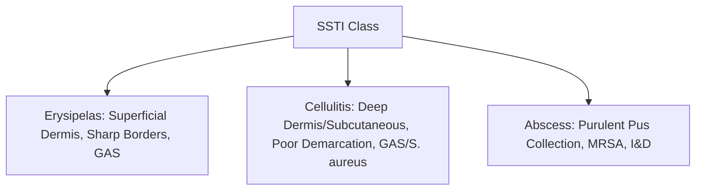

---
tags:
  - internalmedicine
  - surgery
  - disease
  - infectiousdisease
status: active
---

# 🦠 Skin and Soft Tissue Infection (การติดเชื้อที่ผิวหนังและเนื้อเยื่ออ่อน)

> **Definition**: A spectrum of infections involving the skin layers, subcutaneous tissues, or deep fascia, ranging from superficial infections to life-threatening necrotizing fascitis.

---

## 🦠 1. Non-Necrotizing Infections

Common superficial and deep soft tissue infections:

### A. Erysipelas
* **Pathophysiology**: Infection of the **superficial dermis** and cutaneous lymphatics.
* **Microbiology**: Almost exclusively ***Streptococcus pyogenes*** (Group A Strep - GAS).
* **Clinical**: Bright red, warm, edematous plaque with **sharp, raised, well-demarcated borders**. Classically on the face ("butterfly distribution") or lower extremities. Rapid onset of high fever and systemic symptoms.
* **Management**: Oral **Penicillin V** or Amoxicillin (mild); IV **Penicillin G** or Ceftriaxone (severe).

### B. Cellulitis
* **Pathophysiology**: Infection of the **deep dermis** and subcutaneous tissue.
* **Microbiology**: ***Streptococcus pyogenes*** (causes diffuse, rapidly spreading, non-purulent infection) or ***Staphylococcus aureus*** (often localized, purulent, associated with wound/entry site).
* **Clinical**: Spreading erythema, warmth, edema, and pain. **Borders are flat and poorly demarcated/ill-defined**. May see lymphangitic streaking (red lines traveling toward regional lymph nodes).
* **Management**:
  * **Non-purulent (Empiric GAS)**: Oral **Cephalexin** 500 mg qid OR Dicloxacillin 500 mg qid for 5-7 days. (IV Cefazolin if hospitalized).
  * **Purulent / MRSA risk**: Add oral **TMP-SMX** or Clindamycin or Doxycycline.

### C. Cutaneous Abscess, Furuncle, and Carbuncle
* **Pathophysiology**: Furuncle is infection of a single hair follicle extending into deep dermis. Carbuncle is a cluster of coalesced furuncles. Abscess is a localized collection of pus.
* **Microbiology**: Mostly ***Staphylococcus aureus*** (high prevalence of Community-Associated MRSA).
* **Clinical**: Tender, fluctuant, erythematous nodule, often with a central pustule.
* **Management**:
  * **First-line (Definitive)**: **Incision and Drainage (I&D)**. (Often sufficient alone for simple uncomplicated abscesses).
  * **Adjunctive Antibiotics**: Add oral antibiotics (targeting MRSA: **TMP-SMX DS** 1-2 tablets bid, or Clindamycin, or Doxycycline for 5 days) only if: systemic signs of infection (fever, tachycardia), immunocompromised, multiple lesions, or failed initial drainage.

---

## 🦠 2. Necrotizing Fasciitis (Surgical Emergency)

* **Definition**: Rapidly progressive, destructive infection of the subcutaneous tissues and deep fascia.
* **Classification**:
  * **Type I (Polymicrobial, $70–80\%$ of cases)**: Mixed aerobes and anaerobes (*E. coli*, *Klebsiella*, *Bacteroides* spp., streptococci). Common in elderly, diabetics, post-operative, or patients with peripheral vascular disease. *Includes **Fournier's Gangrene** (necrotizing fasciitis of the perineum/scrotum).*
  * **Type II (Monomicrobial)**: Driven by ***Streptococcus pyogenes*** (Group A Strep; "flesh-eating bacteria") with or without *S. aureus*. Can occur in young, healthy individuals after minor trauma.

### Clinical Manifestations
* **Early Sign (Crucial)**: **Severe pain out of proportion to physical exam findings**.
* Rapidly expanding erythema, warmth, and hard, woody swelling.
* **Late Signs**: **Violaceous/purple bullae** (fluid-filled blisters), **cutaneous anesthesia** (necrosis of superficial nerves), **crepitus** (gas in tissues; Type I), skin necrosis/sloughing, and rapid progression to septic shock.

### Investigations
* **Clinical Diagnosis**: Do NOT delay surgery for imaging or lab results.
* **LRINEC Score** (Lab Risk Indicator for Necrotizing Fasciitis): Evaluates CRP, WBC, Hemoglobin, Sodium, Creatinine, and Glucose. A score $\ge 6$ raises suspicion.
* **Imaging (CT Abdomen/Pelvis/Extremity)**: Shows fascial thickening, fluid collections, and **gas in soft tissues** (highly specific for Type I).

### Management
* **Step 1: Emergency Surgical Debridement (Definitive/Life-Saving)**: Immediate, aggressive surgical incision and removal of all necrotic fascia and skin. Repetitive debridements are often required.
* **Step 2: Empiric Broad-Spectrum IV Antibiotics**:
  * **MRSA cover**: **Vancomycin** 15-20 mg/kg IV.
  * **Gram-negative/Pseudomonas/Anaerobe cover**: **Piperacillin-Tazobactam** 4.5 g IV q6h OR Meropenem 1 g IV q8h.
  * **Toxin inhibition**: **Add Clindamycin** 600-900 mg IV q8h.
    * > [!IMPORTANT]
      > **Clindamycin Rationale**: Clindamycin is a protein synthesis inhibitor. In toxic Gram-positive infections (GAS, MRSA), it **shuts down bacterial ribosome translation, halting the production of pyrogenic exotoxins** and superantigens responsible for Toxic Shock Syndrome and rapid tissue destruction.

---

## 💡 Clinical Pearls

* > [!IMPORTANT]
  > **Distinguishing Erysipelas from Cellulitis**:
  > * **Erysipelas**: Dermal involvement, sharp borders, raised, facial/ear involvement common (milian's ear sign: ear has no subcutaneous tissue, so infection here is erysipelas, not cellulitis).
  > * **Cellulitis**: Subcutaneous involvement, flat, diffuse, ill-defined borders, ear involvement rare.
* > [!WARNING]
  > **Early Necrotizing Fasciitis Pitfall**: Early necrotizing fasciitis mimics simple cellulitis. The key differentiating clue is **exquisite tenderness extending beyond the border of apparent erythema**, and **severe pain that does not respond to standard analgesics**. If suspected, consult surgery immediately.
* > [!TIP]
  > **Bite Wounds**: Human or animal bites require prophylactic antibiotics. Use **Amoxicillin-Clavulanate** (Augmentin) to cover oral flora (including *Eikenella corrodens* in humans, and *Pasteurella multocida* in cats/dogs).

---

## 🔗 Related Notes
* [[Septic Arthritis]]
* [[Septicemia]]
* [[05 Medication Summary]]
