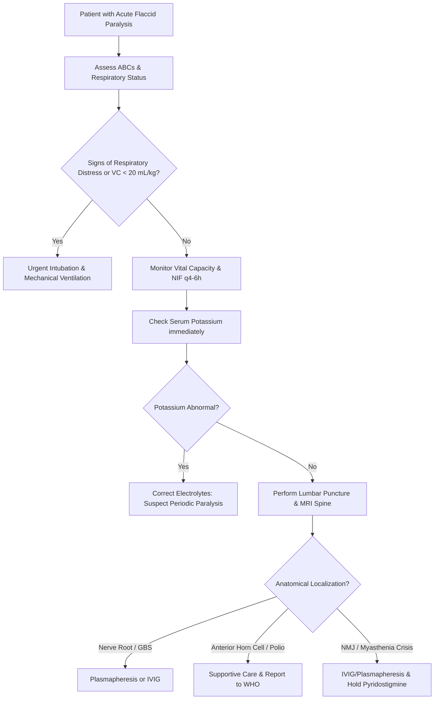

---
tags:
  - internalmedicine
  - disease
  - neurology
status: active
---

## type: disease

# Definition
Acute flaccid paralysis (AFP) is a clinical syndrome characterized by the rapid onset of weakness in one or more limbs, accompanied by flaccid muscle tone (hypotonia) and diminished or absent deep tendon reflexes (hyporeflexia or areflexia) in the affected limbs, not due to severe trauma. It represents the classic manifestation of a lower motor neuron (LMN) lesion and is a critical syndromic marker used for global poliovirus surveillance.

# Epidemiology
* **Surveillance Value**: Under WHO guidelines, surveillance of non-polio AFP (with a target rate of $\ge 1$ or $2$ per 100,000 children under 15 years) is used to verify a country's polio-free status.
* **Incidence & Cause**: Globally, **Guillain-Barré Syndrome (GBS)** is now the most common cause of non-polio AFP. Enteroviral infections (EV-D68, EV-A71) also cause sporadic seasonal outbreaks.

# Etiology
AFP can be etiologically localized to any component of the lower motor unit:

| Anatomical Site | Pathological Process | Primary Etiologies |
| :--- | :--- | :--- |
| **Anterior Horn Cell** | Infection / Inflammation | **[[Poliomyelitis]]** (Poliovirus), Non-polio enteroviruses (EV-D68, EV-A71), West Nile Virus, Rabies |
| **Nerve Roots / Peripheral Nerves** | Demyelination / Axonopathy | **[[Guillain-Barre Syndrome]]**, Tick paralysis, Diphtheria neuropathy, Critical illness polyneuropathy |
| **Neuromuscular Junction** | Receptor blockade / Toxin | **[[Myasthenia Gravis]]** (Myasthenic crisis), Botulism, Organophosphate poisoning, Elapid snakebite (neurotoxic) |
| **Muscle** | Channelopathy / Necrosis | **Hypokalemic periodic paralysis**, Hyperkalemic periodic paralysis, Polymyositis, Dermatomyositis, Rhabdomyolysis |

# Pathophysiology
1. **Interruption of the Motor Unit**: Dysfunction at any point along the lower motor neuron pathway (motor neuron soma, axon, NMJ, or muscle fiber membrane) interrupts the transmission of action potentials.
2. **Loss of Muscle Tone (Flaccidity)**: Because the resting muscle tone is maintained by continuous LMN reflex arcs, any disruption in these arcs leads to immediate loss of muscle resistance (hypotonia).
3. **Loss of Reflexes (Reflexia)**: The afferent-efferent monosynaptic stretch reflex loop is broken, resulting in hyporeflexia or areflexia.
4. **Denervation Atrophy**: Over weeks, the lack of trophic factors normally supplied by the motor nerve terminal causes rapid, severe muscle atrophy.

# Clinical Manifestations

## Symptoms
* **Onset**: Rapid onset of weakness, progressing from mild motor impairment to maximal paralysis within hours to a few days (typically $<4$ weeks).
* **Pattern of Weakness**:
  * *Ascending*: Starts in lower extremities and moves upward (classic for GBS).
  * *Descending*: Starts with cranial nerves/bulbar muscles and moves downward (classic for Botulism).
  * *Asymmetrical*: Typically localized to specific muscle groups, spare sensation (classic for Poliomyelitis).
* **Bulbar/Respiratory Symptoms**: Difficulty swallowing (dysphagia), slurred speech (dysarthria), weak voice (dysphonia), and shortness of breath (dyspnea) indicate bulbar and respiratory muscle involvement.
* **Sensory Symptoms**: Numbness, tingling, or paresthesias point to a neuropathic/radicular cause (GBS) and are absent in pure motor neuron, NMJ, or muscle pathologies.

## Physical Examination
* **Motor Exam**: 
  * Flaccid tone (floppiness on passive movement).
  * Marked muscle weakness (proximal vs. distal depending on etiology).
  * Absence of spasticity or rigid resistance.
* **Reflexes**: Deep tendon reflexes (biceps, triceps, patellar, Achilles) are absent ($0$) or severely diminished ($1+$). Babinski sign is **absent** (flexor plantar response).
* **Sensory Exam**: Intact in anterior horn cell, NMJ, and muscle diseases. Sensory levels or distal stocking-glove sensory loss are present in polyneuropathies/radiculopathies.
* **Autonomic Exam**: Fluctuating blood pressure, tachy- or bradyarrhythmias, pupillary abnormalities (mydriasis in botulism), and urinary retention (GBS).

---

# Differential Diagnosis
* **Acute Spinal Cord Compression**: Secondary to tumor, epidural abscess, or trauma. Early stage presents with **spinal shock** (flaccid tone and areflexia). However, it is distinguished by a **clear sensory level**, early bowel/bladder dysfunction, and eventual development of upper motor neuron signs (hyperreflexia, spasticity, Babinski sign).
* **Acute Transverse [[Myelitis]]**: Inflammatory demyelination of the spinal cord. Presents with paraparesis, sensory level, and autonomic dysfunction.
* **Conversion Disorder / Functional Neurological Symptom Disorder**: Weakness does not follow anatomical localization, reflexes are preserved, Hoover's sign is positive.

---

# Investigations

## Laboratory
* **Serum Electrolytes**: Serum **Potassium** is critical to check immediately (hypokalemia in periodic paralysis; hyperkalemia in renal failure).
* **Creatine Kinase (CK)**: Markedly elevated in rhabdomyolysis or inflammatory myopathies.
* **CSF Analysis**:
  * **Albuminocytologic dissociation** (elevated protein with normal WBC count) is diagnostic for GBS (typically after week 1).
  * **Lymphocytic pleocytosis** with elevated protein suggests viral myelitis (Polio, Enterovirus).
* **Stool Cultures**: **WHO Polio Surveillance Protocol**: Obtain two stool specimens collected at least 24 hours apart within 14 days of onset of paralysis to rule out poliovirus.
* **Toxicology Screen**: Organophosphate levels (cholinesterase activity) or botulinum toxin assays if history suggests exposure.

## Imaging
* **MRI of Spine (with contrast)**:
  * May show enhancement of the anterior horn cells (polio/enterovirus) or enhancement of the cauda equina/spinal nerve roots (GBS).
  * Essential to rule out compressive myelopathy.

## Special Tests
* **[[EMG/NCS]]**:
  * *Neuropathy (GBS)*: Shows demyelinating features (delayed conduction velocity, prolonged F-wave latency) or axonal loss.
  * *NMJ (Myasthenia/Botulism)*: Decremental response on Repetitive Nerve Stimulation (RNS) in MG; incremental response in Botulism.
  * *Myopathy*: Short-duration, low-amplitude motor unit action potentials (MUAPs).

---

# Diagnostic Criteria
Syndromic diagnosis is established by:
1. Rapid onset of progressive motor weakness.
2. Flaccid muscle tone.
3. Decreased or absent deep tendon reflexes in the affected limbs.
4. Exclusion of trauma or chronic causes.

---

# Management

## Initial Management
* **Airway & Respiratory Monitoring**:
  * **The Single Most Important Step**: Regularly monitor respiratory parameters (Vital Capacity [VC], Negative Inspiratory Force [NIF]).
  * **Intubation Criteria**: **"20/30/40 Rule"** (Vital Capacity $<20$ mL/kg, NIF $< -30$ cm H2O, or Max Expiratory Pressure $< 40$ cm H2O) warrants prophylactic intubation before clinical signs of diaphragmatic exhaustion or carbon dioxide retention occur.
* **Cardiovascular & Autonomic Care**: Continuous ECG monitoring for autonomic instability (arrhythmias, severe labile hypertension/hypotension).
* **Electrolyte Correction**: If hypokalemia is present, administer IV potassium replacement immediately.

## Definitive Management
* **Guillain-Barré Syndrome**: **IVIG (0.4 g/kg/day for 5 days)** or **Plasmapheresis (5-6 exchanges over 2 weeks)**. Do not combine them; corticosteroids are ineffective.
* **Myasthenic Crisis**: Plasmapheresis or IVIG, temporarily discontinue acetylcholinesterase inhibitors (to reduce airway secretions), and administer corticosteroids under close monitoring.
* **Botulism**: Administer equine-derived heptavalent botulinum antitoxin early.
* **Organophosphate Poisoning**: Give **Atropine** (doubling doses until airway secretions dry up) and **Pralidoxime (2-PAM)**.
* **Poliomyelitis**: Strict droplet isolation, supportive care (analgesics, positioning), and physical therapy. Avoid intramuscular injections during the acute phase (provocation paralysis).

---

# Complications
* **Respiratory Failure**: Widespread paralysis of intercostal muscles and diaphragm.
* **Aspiration Pneumonia**: Due to loss of bulbar reflexes (gag and swallow).
* **Thromboembolism**: Deep vein thrombosis (DVT) and pulmonary embolism (PE) secondary to flaccid immobility (warrants prophylactic low-molecular-weight heparin).
* **Joint Contractures & Pressure Ulcers**: Prevented by passive range-of-motion exercises and frequent turning.

# Prognosis
* **Hypokalemic Periodic Paralysis**: Excellent; rapid, complete recovery after normalizing potassium.
* **Guillain-Barré Syndrome**: $80\%$ of patients make a full or near-full recovery; $15\%$ have residual deficits; $5\%$ mortality despite ICU care.
* **Poliomyelitis**: Residual permanent flaccid paralysis is common in those with paralytic polio; post-polio syndrome may develop decades later.

# Clinical Pearls
* > [!WARNING]
  > **Spinal Shock Pitfall**: Do not assume all flaccid, areflexic paralysis is LMN. Acute spinal cord injury or transverse myelitis can present as flaccid paralysis during the first few days due to "spinal shock." Check for a **sensory level** and **urinary retention** to differentiate.
* > [!TIP]
  > **DVT Prophylaxis**: Patients with AFP are at extremely high risk for thromboembolism because they lack the "muscle pump" that returns venous blood. Active LMWH and sequential compression devices (SCDs) should be started immediately.

---

# Related Notes
* [[Muscle Weakness]]
* [[Numbness]]
* [[Poliomyelitis]]
* [[Myelitis]]
* [[Guillain-Barre Syndrome]]
* [[Myasthenia Gravis]]
* [[CSF Analysis]]
* [[Lumbar Puncture]]
* [[EMG/NCS]]
* [[Respiratory Failure]]
* [[Coma]]
