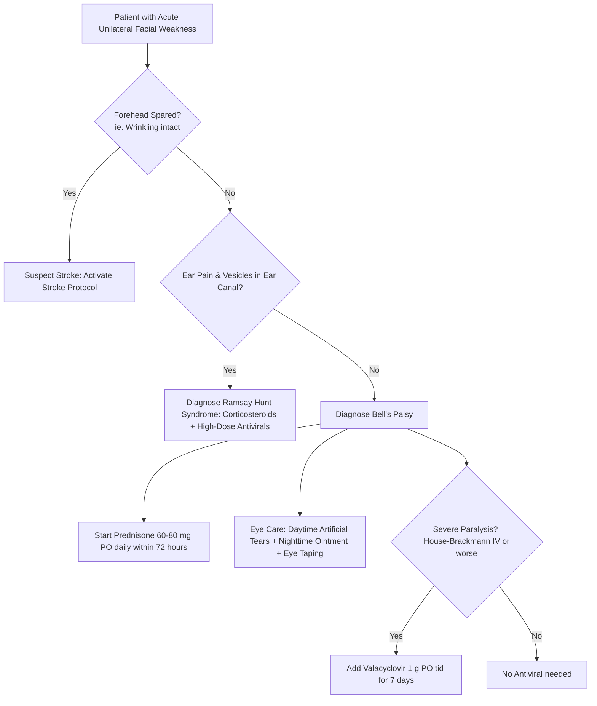

---
tags:
  - internalmedicine
  - disease
  - neurology
status: active
---

## type: disease

# Definition
Bell's palsy is an acute, unilateral, lower motor neuron (LMN) facial nerve (cranial nerve VII) paralysis of idiopathic etiology. It is the most common cause of acute facial paralysis, believed to result from viral-induced inflammation and swelling of the nerve within the narrow bony facial canal of the temporal bone.

# Epidemiology
* **Incidence**: Approximately 15 to 30 cases per 100,000 population annually.
* **Risk Factors**: Risk is significantly higher in pregnant women (especially during the third trimester or early postpartum), patients with Diabetes Mellitus, and those recovering from upper respiratory tract infections.
* **Recurrence**: Occurs in $7-10\%$ of patients.

# Etiology
By definition, Bell's palsy is idiopathic. However, strong clinical and molecular evidence links the majority of cases to the **reactivation of Herpes Simplex Virus type 1 (HSV-1)** or, less frequently, Varicella-Zoster Virus (VZV) latent in the geniculate ganglion.

# Pathophysiology
1. **Viral Reactivation**: Reactivation of latent HSV-1 in the geniculate ganglion triggers an inflammatory immune response.
2. **Edema & Compression**: The inflammatory cascade causes swelling of the facial nerve.
3. **Ischemic Conduction Block**: Because the facial nerve travels through the **facial canal** (fallopian canal)—a long, rigid, narrow bony channel in the temporal bone—edema leads to mechanical entrapment, lymphatic obstruction, ischemia, and subsequent nerve conduction block or axonal degeneration.

```
┌────────────────────────────────────────────────────────┐
│           REACTIVATION OF LATENT HSV-1 / VZV           │
└───────────────────────────┬────────────────────────────┘
                            │ (In Geniculate Ganglion)
                            ▼
               Facial Nerve Inflammation
                            │
                            ▼
            Facial Nerve Edema / Swelling
                            │ (Within Narrow Facial Canal)
                            ▼
          Mechanical Compression & Ischemia
                            │
                            ▼
        LMN Conduction Block & Axonal Injury
```

# Clinical Manifestations

## Symptoms
* **Onset**: Abrupt onset of unilateral facial weakness, typically peaking within $24 - 72$ hours.
* **Autonomic & Sensory Associated Features**:
  * Retroauricular pain (pain behind the ear, often preceding the weakness by 1-2 days).
  * **Dry eye** (ipsilateral loss of parasympathetic lacrimation).
  * **Hyperacusis** (sensitivity to loud sounds in the ipsilateral ear due to paralysis of the stapedius muscle).
  * **Dysgeusia** (loss of taste on the anterior two-thirds of the tongue, due to involvement of the chorda tympani branch).
  * Drooling from the corner of the mouth.

## Physical Examination
* **Lower Motor Neuron VII Paralysis**:
  * The **entire half of the face is paralyzed**, involving both upper and lower facial muscles.
  * *Clinical signs*: Forehead wrinkles are absent when looking up; unable to close the ipsilateral eye; drooping of the mouth corner; flattened nasolabial fold.
* **Bell's Phenomenon**:
  * Upon attempting to close the paralyzed eyelid, the eyeball rolls upward and outward, exposing the sclera.
* **The UMN vs. LMN Facial Nerve Rule**:
  * > [!IMPORTANT]
    > **Forehead Sparing (Stroke vs. Bell's)**: 
    > * **LMN Lesion (Bell's Palsy)**: The lesion is in the facial nerve nucleus or peripheral nerve. The **entire half of the face is weak, including the forehead** (unable to wrinkle forehead or close eye).
    > * **UMN Lesion (Stroke / Tumor)**: The lesion is in the contralateral motor cortex or corticobulbar tract. The **forehead is spared** (can wrinkle forehead normally) because the upper face receives bilateral cortical innervation, whereas the lower face receives only contralateral innervation.
* **Sensation**: Sensation of the face is completely **normal** (as CN V is uninvolved).

---

# Differential Diagnosis
* **Acute Ischemic Stroke / TIA**: Presents with unilateral facial weakness but **spares the forehead** (UMN pattern) and is typically accompanied by hemiplegia, aphasia, or other focal UMN signs.
* **Ramsay Hunt Syndrome (Herpes Zoster Oticus)**:
  * Caused by **Varicella-Zoster Virus reactivation** in the geniculate ganglion.
  * Distinguished by: severe ear pain, **vesicular eruption** in the external auditory canal, concha, or palate, and frequent co-existing vestibular symptoms (vertigo, **[[Hearing Loss]]**). Much poorer recovery rate than Bell's palsy.
* **Lyme Disease (Lyme Neuroborreliosis)**: Common cause of facial palsy in endemic areas. Frequently presents with **bilateral facial nerve palsy** (which is extremely rare in Bell's palsy) and a history of erythema migrans rash.
* **Otitis Media / Cholesteatoma**: Direct infectious extension into the facial canal.

---

# Investigations
* **Diagnostic Workup**: Bell's palsy is a **clinical diagnosis**. Routine lab tests or imaging are **not** recommended.
* **Indications for MRI Brain (with contrast)**:
  * Gradual progression of facial weakness over $>3$ weeks (suspect tumor like facial schwannoma or meningioma).
  * No signs of clinical recovery after 3 months.
  * Involvement of other cranial nerves (e.g., CN V numbness, CN VIII hearing loss).
* **Lyme Serology**: Recommended in patients living in or visiting Lyme-endemic areas.

---

# Diagnostic Criteria
Clinically diagnosed based on an acute-onset, isolated, unilateral lower motor neuron facial nerve palsy peaking within 72 hours, with no other cranial nerve deficits or systemic signs.

---

# Management



## Initial Management (Within 72 Hours)
* **Oral Corticosteroids (Gold Standard)**:
  * **Prednisone 60 - 80 mg PO daily for 5 days**, followed by a 5-day taper.
  * Must be initiated **within 72 hours** of symptom onset to be effective. (Increases the rate of complete recovery, reduces nerve edema, and prevents axonal degeneration).
* **Antiviral Therapy**:
  * Antivirals alone have no benefit.
  * Addition of **Valacyclovir (1 g PO tid for 7 days)** or Acyclovir (400 mg 5 times daily) to Prednisone is recommended **only for patients with severe paralysis** at presentation (defined as House-Brackmann Grade IV or worse, characterized by incomplete eye closure and severe weakness at rest).
* **Corneal Protection (Critical Step)**:
  * > [!IMPORTANT]
    > **Eye Care Protocol**: Inability to close the eye leads to corneal exposure, drying, and keratitis. To prevent permanent visual loss:
    > 1. Apply **preservative-free artificial tears** during the day (every 1-2 hours).
    > 2. Apply **lubricating ointment** at bedtime.
    > 3. **Tape the eyelid closed** or wear an eye patch during sleep to protect the cornea.

## Definitive Management
* For patients with incomplete recovery: facial physical therapy and neuromuscular re-education.
* In rare cases of severe permanent weakness: surgical brow lifts or gold-weight eyelid implants.

---

# Complications
* **Corneal Ulceration & Keratitis**: Due to prolonged drying (can cause permanent blindness).
* **Synkinesis (Aberrant Regeneration)**:
   * During nerve recovery, growing axons misroute to incorrect facial muscles.
   * Clinically presents as: blinking causes the corner of the mouth to twitch, or eating triggers unilateral tearing (**"Crocodile Tears" / Gustatoly Lacrimation**).
* **Permanent Facial Weakness** & contractures.

# Prognosis
* **Excellent**: Over $70 - 80\%$ of untreated patients make a complete recovery. With early Prednisone therapy within 72 hours, the complete recovery rate rises to **$>90\%$**.
* **Timeline**: Recovery typically begins within 2 weeks and reaches maximum recovery in 3 to 6 months.

# Clinical Pearls
* > [!IMPORTANT]
  > **Ramsay Hunt Alert**: Always inspect the external auditory canal and the palate for **vesicular lesions** in any patient presenting with acute facial nerve palsy. Missing Ramsay Hunt syndrome and failing to treat with high-dose antivirals can lead to permanent hearing loss and facial paralysis.
* > [!TIP]
  > **House-Brackmann Scale**: Used to grade severity. Grade I is normal; Grade IV is moderate-to-severe weakness (asymmetry at rest, incomplete eye closure); Grade VI is total paralysis.

---

# Related Notes
* [[Facial Nerve Palsy]]
* [[Cerebrovascular Disease]]
* [[Hearing Loss]]
* [[Dizziness]]
* [[MRI Brain]]
* [[CT Brain]]
