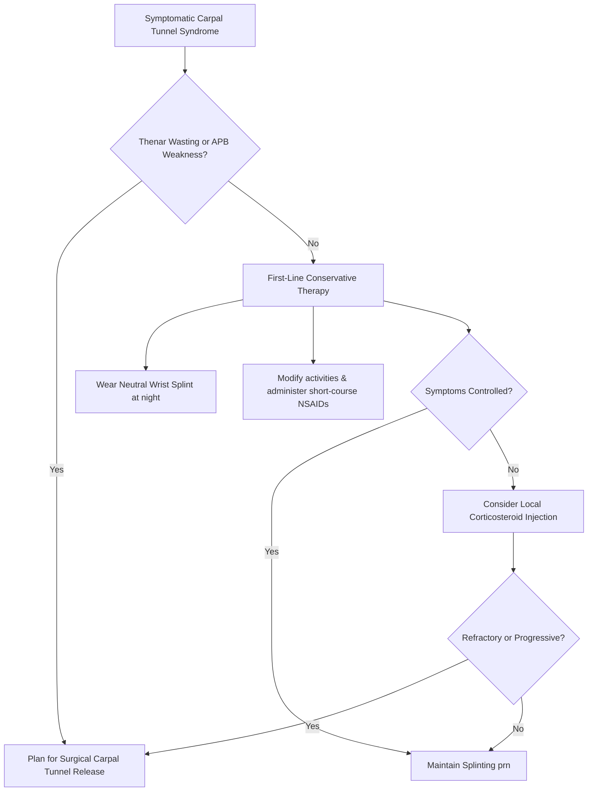

---
tags:
  - internalmedicine
  - disease
  - neurology
  - orthopedics
status: active
---

## type: disease

# Definition
Carpal Tunnel Syndrome (CTS) is the most common entrapment neuropathy of the upper extremity. It is caused by mechanical compression and microvascular ischemia of the **median nerve** as it passes through the carpal tunnel at the wrist.

# Epidemiology
* **Prevalence**: Affects approximately $1 - 5\%$ of the general population, with a lifetime risk of $10\%$.
* **Demographics**: Considerably more common in females (3:1 ratio), typically presenting between the ages of 40 and 60.
* **Risk Occupations**: High association with occupations involving repetitive hand/wrist movements, high-force gripping, or vibration exposure (e.g., keyboard users, assembly line workers, musicians).

# Etiology & Risk Factors
Any condition that decreases the size of the carpal tunnel or increases the volume of its contents can cause CTS:
* **Idiopathic**: Most common.
* **Repetitive Trauma**: Occupational wrist flexion/extension.
* **Fluid Retention**: **Pregnancy** (highly common, typically resolves postpartum), oral contraceptive use, congestive heart failure.
* **Endocrine**: **Hypothyroidism** (deposition of mucopolysaccharides), **Diabetes Mellitus**, **Acromegaly** (soft tissue hypertrophy).
* **Inflammatory / Rheumatologic**: **Rheumatoid Arthritis** (tenosynovitis of the flexor tendons).
* **Infiltrative**: **Amyloidosis** (beta-2 microglobulin in long-term hemodialysis), multiple myeloma.
* **Anatomical**: Carpal bone fractures/dislocations (e.g., lunate dislocation), ganglion cysts.

# Pathophysiology
1. **Anatomy of the Tunnel**:
   * The carpal tunnel is a rigid, narrow osteofibrous space. The posterior and lateral borders are formed by the **carpal bones** (scaphoid, lunate, triquetrum, pisistru). The roof is formed by the thick, inelastic **transverse carpal ligament (flexor retinaculum)**.
   * The tunnel contains: **1 median nerve** and **9 flexor tendons** (4 flexor digitorum superficialis, 4 flexor digitorum profundus, 1 flexor pollicis longus).
2. **Compression Mechanism**:
   * Repetitive motion, synovitis, or fluid retention increases hydrostatic pressure within the tunnel.
   * High pressure ($>30$ mmHg; normal is $<10$ mmHg) compresses the low-pressure venules of the median nerve, leading to **congestive microvascular ischemia** and localized axonal edema.
3. **Demyelination & Axon Loss**:
   * Chronic compression causes focal demyelination of the median nerve at the wrist, which slows nerve conduction.
   * Prolonged ischemia leads to axonal degeneration, causing permanent sensory loss and thenar muscle atrophy.

```
┌────────────────────────────────────────────────────────┐
│      VOLUME INCREASE / TUNNEL NARROWING (PRESSURE >30) │
└───────────────────────────┬────────────────────────────┘
                            │
                            ▼
          Venous Congestion & Ischemia of Median Nerve
                            │
                            ▼
         Focal Demyelination (Nerve Conduction Slowing)
                            │
                            ▼
             Axonal Loss (Thenar Atrophy & Numbness)
```

# Clinical Manifestations

## Symptoms
* **Sensory (Classic)**:
  * Numbness, paresthesias (tingling), and burning pain in the median nerve distribution: palmar aspect of the **thumb, index, middle, and radial half of the ring finger**.
  * **Night Pain**: Symptoms classically **worsen at night** or early morning because patients sleep with their wrists in a flexed position, which increases carpal tunnel pressure.
  * **The Flick Sign**: Patients are often awakened by pain/numbness and report shaking their hands and wrists (like shaking a thermometer) to relieve symptoms.
* **Motor**:
  * Dropping objects, loss of hand dexterity (difficulty buttoning shirts, opening jars).
  * Pain may radiate proximally into the forearm or shoulder (but sensory deficits never extend proximal to the wrist).

## Physical Examination
* **Sensory Exam**:
  * Decreased light touch and two-point discrimination on the tips of digits 1, 2, 3, and the radial half of 4.
  * > [!IMPORTANT]
    > **Palmar Sparing Rule**: Sensation on the **thenar eminence (palm)** is classically **spared** in Carpal Tunnel Syndrome. This is because the palmar cutaneous branch of the median nerve branches off *proximal* to the wrist and travels *superficial* to the flexor retinaculum, sparing it from compression.
* **Motor Exam**:
  * Weakness of **thumb abduction** (Abductor Pollicis Brevis - APB) and **thumb opposition** (Opponens Pollicis).
  * **Thenar Muscle Wasting (Atrophy)**: Flattening of the thenar eminence (a late, irreversible sign of chronic compression).
* **Provocative Maneuvers**:
  * **Phalen's Test**: The patient holds their wrists in complete, unforced flexion (dorsa of hands pressed together) for 60 seconds. A positive test is the reproduction of paresthesias in the median nerve distribution.
  * **Tinel's Sign**: Percussion over the course of the median nerve at the flexor retinaculum reproduces tingling/shocks in the fingers (positive sign).
  * **Durkan's Compression Test**: The clinician applies direct manual pressure over the carpal tunnel for 30 seconds. (The **most sensitive and specific** physical test for CTS).

---

# Differential Diagnosis
* **Cervical Radiculopathy (C6 nerve root)**: Presents with sensory loss in the thumb and index finger. Differentiated by: presence of neck pain radiating down the arm, sensory loss extending *proximal* to the wrist (lateral forearm), weakness of biceps/brachioradialis, and **diminished biceps reflex**.
* **Pronator Teres Syndrome**: Compression of the median nerve in the forearm by the pronator teres muscle. Unlike CTS, it causes **sensory loss over the thenar eminence (palm)** and pain is exacerbated by resisted forearm pronation.
* **De Quervain's Tenosynovitis**: Inflammatory pain over the radial styloid process. Sensation is normal; positive **Finkelstein's test** (radial wrist pain when flexing the thumb into the fist and deviating the wrist ulnarly).

---

# Investigations

## Laboratory
* **Screening Panel**: Ordered if systemic etiology is clinically suspected:
  * **TSH**: Screen for hypothyroidism.
  * **Fasting Glucose / HbA1c**: Screen for diabetes.
  * **Rheumatoid Factor / anti-CCP**: Screen for rheumatoid arthritis.

## Special Tests
* **[[EMG/NCS]] (Gold Standard Confirmation)**:
  * **Sensory NCS**: Shows prolonged distal sensory latency (slowed conduction across the wrist) in the median nerve, while the ulnar nerve is normal.
  * **Motor NCS**: Shows prolonged distal motor latency to the abductor pollicis brevis.
  * **EMG**: Needle examination of the abductor pollicis brevis shows signs of active denervation (fibrillation potentials, positive sharp waves) in severe cases, confirming axonal loss.

---

# Diagnostic Criteria
Diagnosis is clinically suspected based on nocturnal paresthesias in digits 1-3, palmar sparing, positive provocative tests, and confirmed objectively by prolonged distal latencies on Nerve Conduction Studies.

---

# Management



## Initial Management (Conservative)
* **Wrist Splinting (First-line)**:
  * Wear a neutral-position (0 degrees) wrist splint **strictly at night** for at least 4 to 6 weeks. This prevents wrist flexion during sleep, minimizing pressure in the carpal tunnel.
* **Activity Modification**: Avoid repetitive wrist flexion/extension and vibrating tools.
* **Local Corticosteroid Injection**:
  * Injection of Methylprednisolone ($20 - 40$ mg) mixed with lidocaine directly into the carpal tunnel.
  * Provides rapid, significant temporary relief ($75\%$ improvement) but symptoms frequently recur within 12 months. Useful as a bridge or in pregnancy.
* **Oral Medications**: NSAIDs (ibuprofen) or short-course oral prednisone can relieve acute swelling, but have no long-term benefit.

## Definitive Management (Surgical)
* **Surgical Carpal Tunnel Release**:
  * *Indications*: Progressive thenar muscle atrophy/weakness, severe denervation on EMG, or failure of conservative therapy.
  * *Procedure*: Complete division of the **transverse carpal ligament (flexor retinaculum)** to decompress the carpal tunnel. Can be done via open incision or endoscopically.
  * *Efficacy*: High success rate ($>90\%$), with immediate relief of nocturnal pain. Sensory and motor recovery may take months and is incomplete if severe axonal loss was present.

---

# Complications
* **Permanent Thenar Wasting & Sensory Loss**: Irreversible loss of fine motor coordination and tactile sensation in the hand.
* **Pillar Pain**: Post-surgical tenderness in the thenar/hypothenar eminences near the surgical scar.
* **Complex Regional Pain Syndrome (CRPS)**: (Rare post-surgical complication).

# Prognosis
* Excellent for early-stage CTS treated with splints or surgery.
* CTS of pregnancy has an excellent prognosis, typically resolving completely within 2-4 weeks postpartum.

# Clinical Pearls
* > [!IMPORTANT]
  > **The Palm-Sparing Clue**: If a patient complains of numbness in their thumb and index finger, and has sensory loss *on the palm (thenar eminence)*, this is **not** Carpal Tunnel Syndrome. The median nerve palm branch travels outside the tunnel. Suspect **Pronator Teres Syndrome** or **C6 Radiculopathy**.
* > [!TIP]
  > **Keyboard Ergonomics**: Encourage patients to adjust keyboard height so their wrists remain in a neutral, straight position rather than extended or flexed during typing.

---

# Related Notes
* [[Entrapment Neuropathy]]
* [[Polyneuropathy]]
* [[EMG/NCS]]
* [[Numbness]]
* [[Muscle Weakness]]
