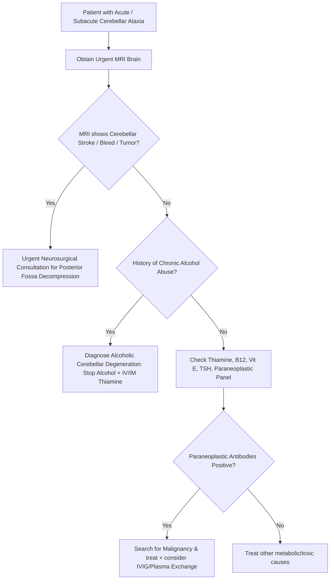

---
tags:
  - internalmedicine
  - disease
  - neurology
status: active
---

## type: disease

# Definition
Acquired cerebellar ataxia is a group of non-genetic disorders characterized by the acute or subacute onset of cerebellar dysfunction (including gait instability, limb incoordination, intention tremor, dysarthria, and nystagmus). It is caused by structural, toxic, metabolic, infectious, or autoimmune insults to the cerebellum or its connections.

# Etiology
Acquired cerebellar ataxias are classified by etiology:

1. **Toxic-Metabolic (Most Common)**:
   * **Alcoholic Cerebellar Degeneration**: Caused by chronic alcohol abuse. Direct neurotoxicity of ethanol combined with thiamine deficiency.
   * **Wernicke's Encephalopathy**: Thiamine ($B_1$) deficiency (ataxia, confusion, ophthalmoplegia; detailed in **[[Vitamin Deficiency Neuropathy]]**).
   * **Drugs**: Phenytoin toxicity (acute or chronic), lithium, chemotherapy (cytarabine).
   * Heavy metals (lead, mercury).
2. **Vascular (Acute Emergency)**:
   * Cerebellar ischemic stroke or cerebellar hemorrhage.
3. **Autoimmune & Paraneoplastic**:
   * **Paraneoplastic Cerebellar Degeneration (PCD)**: Autoimmune destruction of Purkinje cells mediated by onconeural antibodies (e.g., **Anti-Yo** in ovarian/breast cancer; **Anti-Hu** in small cell lung cancer; **Anti-Ri**).
   * **Gluten Ataxia**: Immune-mediated ataxia associated with anti-gliadin antibodies (with or without enteropathy).
4. **Infectious / Post-Infectious**:
   * **Acute Cerebellitis**: Post-viral autoimmune cerebellitis in children (classically following Varicella/chickenpox).
   * Creutzfeldt-Jakob Disease (prion disease; rapid progression).
5. **Structural / Compressive**:
   * Cerebellar tumors (e.g., medulloblastoma, astrocytoma, metastases) or posterior fossa lesions.
   * **Chiari Malformation**: Herniation of cerebellar tonsils through the foramen magnum.

# Pathophysiology
* **Anatomy of Dysfunction**:
  * The cerebellum is divided into functional zones that coordinate different motor tasks:
    * **Vermis (Midline)**: Coordinates axial stability, trunk control, and gait.
    * **Cerebellar Hemispheres (Lateral)**: Coordinates motor planning and fine coordination of ipsilateral limbs.
    * **Vestibulocerebellum (Flocculonodular lobe)**: Regulates balance and eye movements.
* **Mechanism of Alcoholic Degeneration**:
  * Chronic ethanol exposure and thiamine deficiency cause selective **atrophy and loss of Purkinje cells in the anterior superior vermis**.
  * This leads clinically to **gait and trunk ataxia**, with relative sparing of speech, arm coordination, and eye movements.
* **Mechanism of Stroke / Herniation**:
  * Cerebellar stroke or edema within the small, rigid posterior fossa can compress the 4th ventricle, causing acute obstructive **[[Hydrocephalus]]**, or compress the brainstem, leading to rapid coma and respiratory arrest.

# Clinical Manifestations

## Symptoms
* **Gait Instability**: Feeling "drunk," veering to one side while walking, frequent falls.
* **Limb Incoordination**: Clumsiness, difficulty buttoning shirts, writing, or using utensils.
* **Scanning Speech**: Slow, slurred, hesitating speech with irregular emphasis on syllables.
* **Visual Disturbances**: Vertigo, oscillopsia (feeling that the environment is shaking).

## Physical Examination
* **Gait Ataxia**: Wide-based, unsteady, staggering gait. **Tandem gait** (heel-to-toe walking) is severely impaired.
  > [!IMPORTANT]
    > **Romberg Sign in Ataxia**: 
    > * **Sensory Ataxia** (Neuropathy/Posterior column disease): Romberg sign is **positive** (patient is stable with eyes open, but falls immediately upon closing eyes, due to loss of proprioceptive input).
    > * **Cerebellar Ataxia**: Romberg sign is **negative** (patient is unsteady and sways with eyes open, and closing eyes does not significantly change the level of instability, because the central coordinator is damaged).
* **Limb Ataxia (Ipsilateral to the Lesion)**:
  * **Dysmetria**: Over-shooting or under-shooting target on the finger-to-nose and heel-to-shin tests.
  * **Intention Tremor**: A coarse kinetic tremor that increases in amplitude as the limb approaches its target.
  * **Dysdiadochokinesia**: Inability to perform rapid, alternating movements (e.g., patting the thigh back and forth).
* **Ocular Findings**:
  * **Gaze-Evoked Nystagmus**: Rhythmic eye beating, classically horizontal, beating toward the direction of gaze.
  * Saccadic pursuit (choppy tracking).
* **Hypotonia**: Decreased muscle resistance and pendular reflexes (e.g., knee jerk swings back and forth like a pendulum).

---

# Differential Diagnosis
* **[[Cerebellar Ataxia Hereditary]]**: Differentiated by: insidious, slowly progressive onset (years), family history, and genetic markers.
* **Sensory Ataxia (Large-fiber [[Polyneuropathy]] / B12 Deficiency)**: Presents with unsteady gait, but has **positive Romberg sign**, loss of vibration/proprioception, and absent reflexes. No nystagmus or dysarthria.

---

# Investigations

## Imaging
* **[[MRI Brain]] (Gold Standard)**:
  * Highly sensitive for the posterior fossa. Shows cerebellar ischemic stroke, cerebellar hemorrhage, cerebellar tumors, or focal vermian atrophy (alcoholic degeneration).
  * CT Brain is poor at imaging the posterior fossa due to bone artifact.

## Laboratory
* **Routine Screens**: TSH, Vitamin B12, Thiamine ($B_1$), Vitamin E levels.
* **Paraneoplastic Autoantibody Panel**: Order if subacute progressive ataxia is present with no clear cause (anti-Yo, anti-Hu, anti-Ri).
* **Celiac Panel**: Anti-gliadin IgG/IgA to screen for gluten ataxia.
* **Toxicology Screen**: Screen for phenytoin, lithium, or heavy metal levels.

## Special Tests
* **[[CSF Analysis]]**: Indicated if infectious cerebellitis or paraneoplastic etiology is suspected.

---

# Diagnostic Criteria
Clinically diagnosed based on objective cerebellar motor signs (gait ataxia, dysmetria, nystagmus), with MRI showing cerebellar lesions/atrophy, or labs identifying toxic, metabolic, or autoimmune etiologies.

---

# Management

## Initial Management
* **Verify Airway & Brainstem Compression**: If cerebellar stroke or hemorrhage is present on MRI, monitor GCS and pupils closely. Massive edema can compress the brainstem; prepare for **urgent decompressive suboccipital craniectomy** (neurosurgery).
* **Thiamine Replacement**: If Wernicke's encephalopathy is suspected, initiate high-dose IV thiamine immediately (detailed in **[[Vitamin Deficiency Neuropathy]]**).

## Definitive Management
* **Alcoholic Cerebellar Degeneration**:
  * Strict alcohol cessation.
  * Long-term thiamine and nutritional supplementation.
  * Intensive physical therapy for gait training and balance.
* **Paraneoplastic Cerebellar Degeneration**:
  * Prompt search for and treatment of the underlying primary malignancy (resection, chemotherapy).
  * Immunotherapy: Intravenous Immunoglobulins (IVIG), plasma exchange, or corticosteroids. (Note: Neurological recovery is often poor because Purkinje cell loss is irreversible).
* **Gluten Ataxia**: Strict gluten-free diet, even in the absence of intestinal symptoms on biopsy.

---

# Complications
* **Brainstem Herniation & Hydrocephalus**: Life-threatening complications of acute cerebellar stroke/hemorrhage.
* **Falls and Fractures**: Due to gait instability.
* **Aspiration Pneumonia**: Due to severe cerebellar dysarthria and bulbar dysfunction.

# Prognosis
* Toxic-metabolic ataxias (alcohol, thiamine) can stabilize or partially recover if treated early.
* Paraneoplastic cerebellar degeneration has a poor neurological prognosis, with permanent, severe disability.
* Acute post-viral cerebellitis in children has an excellent prognosis, with complete spontaneous recovery in $>90\%$ of cases.

# Clinical Pearls
* > [!IMPORTANT]
  > **The Romberg Ataxia Rule**: Never state that a patient with cerebellar disease has a "positive Romberg." Romberg's test evaluates **proprioception**, not cerebellar function. Cerebellar patients are unsteady whether their eyes are open or closed.
* > [!TIP]
  > **Tandem Gait Sensitivity**: Tandem gait (heel-to-toe walking) is the most sensitive physical test for detecting mild cerebellar vermis dysfunction. A patient may walk normally in a straight line but fail completely when asked to perform a tandem walk.

---

# Related Notes
* [[Cerebellar Ataxia Hereditary]]
* [[Cerebrovascular Disease]]
* [[Vitamin Deficiency Neuropathy]]
* [[Hydrocephalus]]
* [[Tremor]]
* [[Dizziness]]
* [[MRI Brain]]
* [[CT Brain]]
* [[CSF Analysis]]
* [[Lumbar Puncture]]
