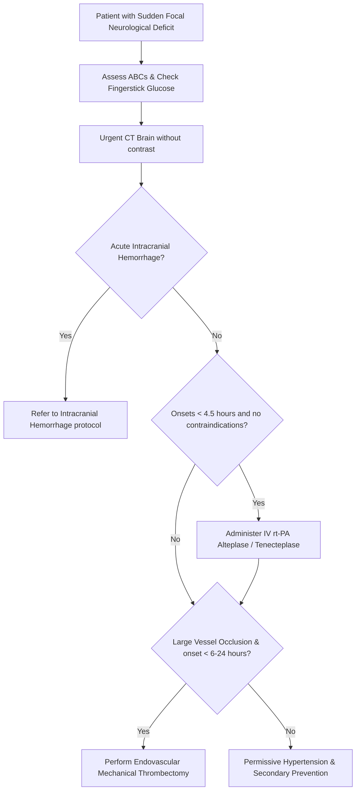

---
tags:
  - internalmedicine
  - disease
  - neurology
status: active
---

## type: disease

# Definition
Cerebrovascular disease refers to a group of conditions that affect the blood vessels supplying the brain, leading to a disruption of cerebral blood flow. It clinically manifests as **Ischemic Stroke**, **Transient Ischemic Attack (TIA)**, or **Hemorrhagic Stroke** (such as intracerebral or subarachnoid hemorrhage, detailed in [[Intracranial Hemorrhage]]).

# Epidemiology
* **Global Impact**: A leading cause of death and the primary cause of long-term adult disability worldwide.
* **Ischemic vs. Hemorrhagic**: Ischemic strokes account for approximately $85\%$ of all cases, while hemorrhagic strokes account for $15\%$.
* **Risk Factors**: 
  * *Non-modifiable*: Age, male sex, family history.
  * *Modifiable*: Hypertension (most important), smoking, Diabetes Mellitus, hyperlipidemia, physical inactivity, and Atrial Fibrillation (major cause of cardioembolic stroke).

# Etiology (TOAST Classification)
Ischemic stroke etiologies are categorized by the TOAST (Trial of Org 10172 in Acute Stroke Treatment) criteria:
1. **Large-Artery Atherosclerosis ($20\%$)**: Stenosis or occlusion of major vessels (e.g., internal carotid artery, middle cerebral artery, vertebral arteries) due to plaque rupture or thrombosis.
2. **Cardioembolism ($25\%$)**: Emboli originating from the heart. The most common cause is **Atrial Fibrillation**. Other causes include mechanical heart valves, dilated cardiomyopathy, infective endocarditis, and mural thrombi post-MI.
3. **Small-Vessel Occlusion / Lacunar Stroke ($25\%$)**: Infarction of small, deep penetrating arteries (e.g., lenticulostriate arteries) typically caused by lipohyalinosis and microatheroma secondary to chronic hypertension or diabetes.
4. **Stroke of Other Determined Etiology ($5\%$)**: Non-atherosclerotic vasculopathies (e.g., arterial dissection, vasculitis, fibromuscular dysplasia, Moyamoya disease, hypercoagulable states).
5. **Stroke of Undetermined Etiology (Cryptogenic) ($25\%$)**: No clear cause identified despite exhaustive evaluation.

# Pathophysiology
1. **The Ischemic Cascade**: Occlusion of a cerebral artery drops cerebral blood flow (CBF). A severe reduction ($<10-15$ mL/100g/min) leads to rapid depletion of adenosine triphosphate (ATP), failure of membrane sodium-potassium ATPase pumps, massive intracellular calcium influx, release of toxic glutamate, and cell death (**Ischemic Core**).
2. **The Ischemic Penumbra**: Surrounding the core is a region of hypoperfused but functionally silent and metabolically viable tissue. This is the **penumbra**. Without timely reperfusion, the penumbra recruits into the core.
3. **Transient Ischemic Attack (TIA)**: Transient episode of neurological dysfunction caused by focal brain, spinal cord, or retinal ischemia, **without acute infarction** on neuroimaging. Symptoms typically resolve within 1 hour.

```
                  ┌───────────────────────────────┐
                  │    CEREBRAL ARTERY OCCLUSION   │
                  └───────────────┬───────────────┘
                                  │
          ┌───────────────────────┴───────────────────────┐
          ▼                                               ▼
┌──────────────────┐                             ┌──────────────────┐
│  ISCHEMIC CORE   │                             │ISCHEMIC PENUMBRA │
│(CBF <10 mL/min)  │                             │ (CBF 15-20 mL/min│
└─────────┬────────┘                             └────────┬─────────┘
          │                                               │
    Cellular Death                                  Viable Tissue
   (Irreversible)                                  (Reversible with
                                                      Reperfusion)
```

# Clinical Manifestations

## Symptoms
Onset is characteristically **sudden and focal**. Symptoms correspond directly to the affected vascular territory:

* **Anterior Cerebral Artery (ACA) Syndrome**:
  * Contralateral motor and sensory deficits affecting the **lower extremity more than the upper extremity/face**.
  * Abulia (lack of initiative), urinary incontinence, and primitive reflexes (grasp/suck).
* **Middle Cerebral Artery (MCA) Syndrome** (Most common):
  * Contralateral motor and sensory deficits affecting the **upper extremity and face more than the lower extremity**.
  * Contralateral homonymous hemianopia.
  * **Dominant Hemisphere (usually Left)**: Aphasia (Broca's motor, Wernicke's sensory, or Global).
  * **Non-dominant Hemisphere (usually Right)**: Hemispatial neglect, anosognosia (denial of illness), and apraxia.
* **Posterior Cerebral Artery (PCA) Syndrome**:
  * Contralateral homonymous hemianopia (often with **macular sparing**).
  * Alexia without agraphia (if dominant occipital lobe and splenium of corpus callosum are affected).
  * Contralateral hemisensory loss and thalamic pain syndrome.
* **Vertebrobasilar (Brainstem/Cerebellum) Syndrome**:
  * **Crossed Signs**: Ipsilateral cranial nerve palsies with contralateral hemiparesis/hemisensory loss.
  * The "D's": Vertigo, **[[Dizziness]]**, Dysarthria, Dysphagia, Diplopia, and Dysmetria (ataxia).
  * **Locked-In Syndrome**: Complete ventral pontine infarction (basilar artery occlusion) spares consciousness and vertical eye movements but causes complete paralysis of all other muscles.
* **Lacunar Syndromes** (Small deep infarcts):
  * *Pure Motor Hemiparesis* (posterior limb of internal capsule).
  * *Pure Sensory Stroke* (ventral posterolateral nucleus of the thalamus).
  * *Clumsy Hand-Dysarthria* (paramedian pons).
  * *Ataxic Hemiparesis* (pons or internal capsule).
  * **Note**: Lacunar strokes are distinguished by the **complete absence of cortical signs** (no aphasia, no neglect, no visual field cuts).

## Physical Examination
* **Neurological Assessment**: 
  * Calculate the **NIHSS Score** (National Institutes of Health Stroke Scale) to quantify severity (ranges $0-42$).
  * Test for facial asymmetry, arm drift, dysarthria (speech slurring), aphasia, neglect, and visual fields.
* **Cardiovascular**:
  * Palpate pulse for irregularity (Atrial Fibrillation).
  * Auscultate for carotid bruits (carotid stenosis) and cardiac murmurs (valvular disease).

---

# Differential Diagnosis
* **[[Intracranial Hemorrhage]]**: Clinically indistinguishable from ischemic stroke; requires an immediate **non-contrast CT Brain** to differentiate.
* **Todd's Paralysis**: Post-ictal transient focal weakness following a focal **[[Convulsion]]**.
* **[[Hypoglycemia]]**: Can present with focal neurological deficits mimicking a stroke. (Always check glucose first!).
* **Hemiplegic Migraine**: Headache preceded by unilateral motor weakness as part of a migraine aura.
* **Brain Tumor / Brain Abscess**: Subacute or progressive onset of focal deficits rather than sudden.

---

# Investigations

## Laboratory
* **Fingerstick Blood Glucose**: **Mandatory prior to initiating thrombolysis** to rule out hypoglycemia.
* **Coagulation Profile ([[Coagulation Profile]])**: PT, INR, PTT. Essential for patients taking anticoagulants.
* **Complete Blood Count ([[CBC]]) & Platelet Count**: Rule out thrombocytopenia (contraindication to thrombolysis).
* **Cardiac Biomarkers (Troponin)**: Assess for concurrent myocardial infarction (often co-exists or triggers stroke).

## Imaging
* **[[CT Brain]] (without contrast)**:
  * **The most important initial imaging**. Highly sensitive for detecting acute hemorrhage (appears hyperdense/white). In acute ischemic stroke, the CT is usually **completely normal** within the first few hours (though early signs like hyperdense MCA sign or loss of insular ribbon may be seen).
* **CT Angiography (CTA) of Head and Neck**:
  * Indicated immediately to detect **Large Vessel Occlusion (LVO)** in the cerebral vasculature (e.g., terminal ICA or M1 segment of MCA) and assess for carotid artery stenosis.
* **[[MRI Brain]] (with Diffusion-Weighted Imaging [DWI])**:
  * **The most sensitive imaging for acute ischemia**. DWI shows restricted diffusion (hyperintense/bright signal) within minutes of vessel occlusion, representing cytotoxic edema.

## Special Tests
* **[[ECG]] & Telemetry**:
  * Screen for silent or paroxysmal **Atrial Fibrillation**.
* **Transthoracic / Transesophageal Echocardiography (TTE/TEE)**:
  * Detect intracardiac thrombus, patent foramen ovale (PFO), or valvular vegetations.
* **Carotid Duplex Ultrasound**:
  * Screen for internal carotid artery stenosis in patients who are candidates for carotid interventions.

---

# Diagnostic Criteria
Diagnosis is established by a sudden onset of focal neurological deficits corresponding to a specific vascular territory, with a non-contrast CT Brain ruling out hemorrhage, and DWI MRI showing restricted diffusion or symptoms resolving within 24 hours with no infarct (TIA).

---

# Management



## Initial Management (Acute Stroke Protocol)
* **Airway Preservation**: Supplement oxygen if $SpO_2 < 94\%$. Intubate if GCS $\le 8$ or bulbar palsy threatens airway.
* **Intravenous Thrombolysis (rt-PA / Alteplase or Tenecteplase)**:
  * *Indication*: Acute ischemic stroke with measurable deficit.
  * *Time Window*: Must be administered within **4.5 hours** of symptom onset (or last known well).
  * *Dose*: Alteplase 0.9 mg/kg IV (maximum 90 mg; 10% given as a bolus over 1 minute, remaining 90% infused over 60 minutes).
  * *Blood Pressure Target*: **BP must be $< 185/110$ mmHg before starting rt-PA**, and maintained $< 180/105$ mmHg for at least 24 hours post-infusion using IV Labetalol or Nicardipine.
  * *Absolute Contraindications*: History of prior intracranial hemorrhage, active internal bleeding, platelet count $< 100,000/\mu$L, current use of oral anticoagulants with INR $>1.7$, LMWH within 24 hours, head trauma or stroke within 3 months, or intracranial neoplasm/aneurysm.
* **Endovascular Thrombectomy (EVT)**:
  * *Indication*: Large vessel occlusion (terminal ICA or MCA M1 segment).
  * *Time Window*: Within **6 hours** of onset. Can be extended up to **24 hours** in selected patients with clinical-imaging mismatch (large penumbra, small infarct core) on CT perfusion or MRI.
* **BP Management in Non-Reperfusion Candidates**:
  * Do not lower blood pressure unless it exceeds **220/120** mmHg. Lowering BP prematurely reduces perfusion through collateral vessels, expanding the ischemic core (**Permissive Hypertension**). If BP $> 220/120$, lower by 15% over the first 24 hours using IV labetalol.

## Definitive Management (Secondary Prevention)
* **Antiplatelet Therapy**:
  * If rt-PA was given, wait 24 hours and obtain a follow-up CT Brain to rule out hemorrhagic transformation before starting antiplatelets.
  * If rt-PA was not given, start **Aspirin 160-325 mg PO daily** within 24-48 hours.
  * **Dual Antiplatelet Therapy (DAPT)**: **Aspirin + Clopidogrel** for **21 days** is indicated for patients with a minor ischemic stroke ($NIHSS \le 3$) or high-risk TIA (defined by an $ABCD^2$ score $\ge 4$) presenting within 24 hours.
* **Anticoagulation**:
  * Indicated for **cardioembolic stroke** (Atrial Fibrillation). Start Direct Oral Anticoagulants (DOACs like Apixaban, Rivaroxaban) or Warfarin. (The timing of initiation depends on the size of the infarct to minimize risk of hemorrhagic transformation).
* **Lipid Management**:
  * High-intensity statin (**Atorvastatin 80 mg PO daily** or Rosuvastatin 20-40 mg) targeting LDL-C $< 70$ mg/dL (or a $50\%$ reduction).
* **Surgical Interventions**:
  * **Carotid Endarterectomy (CEA) / Carotid Stenting**: Recommended for symptomatic ipsilateral carotid stenosis of $70-99\%$, performed within 2 weeks of the index event.

---

# Complications
* **Hemorrhagic Transformation**: Bleeding into the ischemic territory, particularly common in large embolic strokes or following thrombolysis.
* **Cerebral Edema (Malignant MCA Syndrome)**: Massive swelling of the infarcted hemisphere. Peak edema occurs at $3-5$ days and can cause midline shift and brain herniation. Requires **urgent decompressive hemicraniectomy** in patients under 60.
* **Aspiration Pneumonia**: Due to dysphagia (must keep patient NPO and perform a swallow screen prior to oral intake).
* **Post-Stroke Depression**: Highly prevalent; screen and treat with SSRIs.

# Prognosis
* Reperfusion therapy (rt-PA/thrombectomy) significantly increases the likelihood of a disability-free recovery.
* Recurrence risk is highest in the first few weeks after a TIA or minor stroke, emphasizing the need for rapid secondary prevention.

# Clinical Pearls
* > [!IMPORTANT]
  > **Time is Brain**: Every minute an ischemic stroke is untreated, the brain loses approximately 1.9 million neurons. Never delay a CT scan or neurology consult for non-essential lab work.
* > [!WARNING]
  > **No Heparin in Acute Stroke**: Intravenous Heparin has **no role** in the acute management of ischemic stroke and increases the risk of symptomatic intracranial hemorrhage.
* > [!TIP]
  > **The Swallow Screen Rule**: All stroke patients must be kept strictly **NPO** (Nil Per Os) until a bedside swallow screen has been performed and passed to prevent aspiration pneumonia.

---

# Related Notes
* [[Intracranial Hemorrhage]]
* [[Coma]]
* [[Convulsion]]
* [[Parkinsonism]]
* [[Alzheimer Disease]]
* [[CT Brain]]
* [[MRI Brain]]
* [[ECG]]
* [[Echocardiography]]
* [[Coagulation Profile]]
* [[CBC]]
* [[Muscle Weakness]]
* [[Numbness]]
* [[Dizziness]]
* [[Syncope]]
