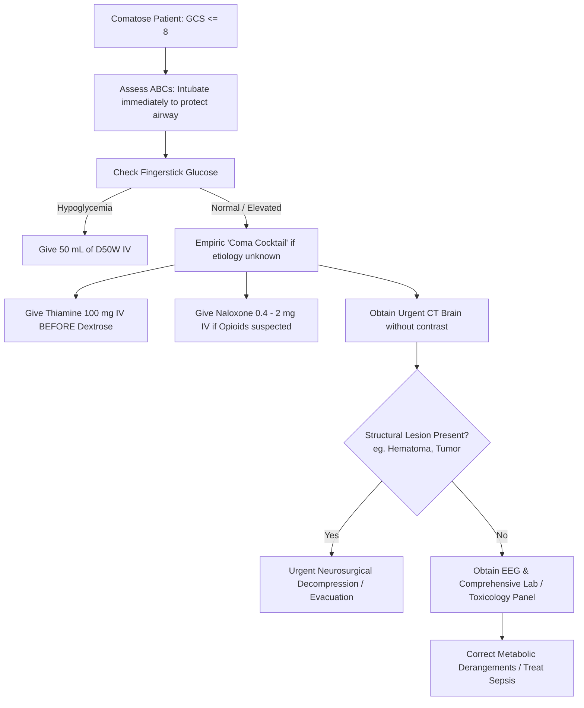

---
tags:
  - internalmedicine
  - disease
  - neurology
  - emergencymedicine
status: active
---

# 🧠 Coma (ภาวะหมดสติ / โคม่า)

> **Definition**: Coma is a state of profound, prolonged unconsciousness characterized by the complete absence of both wakefulness (arousal) and awareness (cognition). The patient remains unresponsive to all external stimuli, including vigorous verbal and painful commands, and cannot be aroused. It is defined clinically by a Glasgow Coma Scale (GCS) score of 8 or less.

---

## 🚨 Why It Is An Emergency
Coma represents acute brain failure. The loss of cortical and brainstem functions leads to the loss of protective airway reflexes (cough, gag). This puts the patient at immediate risk of airway occlusion, fatal aspiration, and hypoxemic respiratory arrest. Brain stem compression from herniation can cause rapid cardiovascular collapse.

---

## 📊 Epidemiology
* Coma is a neurological emergency representing approximately $10\%$ of all emergency department presentations and up to $15\%$ of intensive care unit (ICU) admissions.
* Prognosis and incidence vary widely based on the underlying etiology (traumatic vs. non-traumatic, metabolic vs. structural).

---

## 🦠 Etiology & Causes

### The AEIOU-TIPS Mnemonic
```
Coma Etiologies (AEIOU-TIPS)
└── A - Alcohol / Acidosis (Metabolic)
└── E - Endocrine / Electrolytes (Hyponatremia, Myxedema) / Encephalopathy
└── I - Insulin (Hypoglycemia - check sugar first!) / Infection (Meningitis, Sepsis)
└── O - Opiates / Oxygen (Severe Hypoxia) / Overdose
└── U - Uremia (Renal Failure)
└── T - Trauma (Epidural/Subdural hematoma) / Tumor
└── I - Ischemia (Stroke, Basilar occlusion)
└── P - Poisoning (Toxic alcohols, Carbon monoxide) / Psychogenic
└── S - Seizure (Status epilepticus / post-ictal) / Shock
```

### Pathological Classification
```
                            ┌────────────────────────┐
                            │    ETIOLOGY OF COMA    │
                            └───────────┬────────────┘
                                        │
             ┌──────────────────────────┴──────────────────────────┐
             ▼                                                     ▼
 ┌─────────────────────────┐                           ┌─────────────────────────┐
 │       STRUCTURAL        │                           │  METABOLIC / DIFFUSE    │
 └────────────┬────────────┘                           └────────────┬────────────┘
              │                                                     │
              ├─ Intracranial Hemorrhage                            ├─ Hypoxia / Ischemia (Cardiac Arrest)
              ├─ Ischemic Stroke (Basilar occlusion)                 ├─ Hypoglycemia / Diabetic Crises
              ├─ Brain Abscess / Tumor                              ├─ Uremic / Hepatic Encephalopathy
              └─ Traumatic Brain Injury                             └─ Intoxications (Opioids, Sedatives)
```

1. **Structural Brain Lesions ($~30\%$)**:
   * **[[Intracranial Hemorrhage]]**: Epidural, subdural, intracerebral, or subarachnoid hemorrhage.
   * **[[Cerebrovascular Disease]]**: Large hemispheric ischemic stroke with mass effect, or brainstem stroke (especially basilar artery occlusion).
   * **CNS Infections**: **[[Brain Abscess]]**, large tuberculoma, or severe meningitis/encephalitis.
   * **Mass Lesions**: Brain tumors with herniation.
2. **Diffuse Encephalopathies & Toxic-Metabolic States ($~70\%$)**:
   * **Anoxic-Ischemic Encephalopathy**: Following cardiac arrest or severe hypoxia.
   * **Metabolic**: **[[Hypoglycemia]]** (always rule out first), **[[Hyperglycemic Crisis]]** (DKA, HHS), uremic encephalopathy, hepatic encephalopathy, severe electrolyte disorders (hyponatremia, hypercalcemia).
   * **Toxic / Drug Overdose**: Alcohol, opioids, benzodiazepines, barbiturates, carbon monoxide, tricyclic antidepressants.
   * **Infectious/Systemic**: **[[Sepsis]]**, severe hypothermia or hyperthermia.
   * **Epileptic**: Non-convulsive status epilepticus or post-ictal state following a generalized **[[Convulsion]]**.

---

## 🧠 Pathophysiology
To maintain normal consciousness, two components must function intact:
1. **The Ascending Reticular Activating System (ARAS)**: A network of neurons located in the brainstem (upper pons and midbrain) that projects to the thalamus and cortex, responsible for **arousal (wakefulness)**.
2. **The Bilateral Cerebral Cortex**: Responsible for **awareness (cognition and content of consciousness)**.

Therefore, coma is physiologically produced by one of three mechanisms:
* **Bilateral diffuse cerebral hemispheric dysfunction** (typically due to global toxic, metabolic, or hypoxic insult).
* **Focal brainstem lesion** disrupting the ARAS (e.g., pontine hemorrhage, midbrain stroke).
* **Mass effect leading to herniation**, which secondarily compresses the brainstem and ARAS (e.g., uncal or central herniation).

---

## 🩺 Immediate Assessment (Emergency Protocol)

### Airway
* **Assess Patency**: Check for tongue obstruction, pooled secretions, or vomitus.
* **Determine GCS**: **A Glasgow Coma Scale (GCS) score $\le 8$ is the universal indicator for immediate endotracheal intubation** to protect the airway.

### Breathing
* **Assess Ventilation**: Look for respiratory depression (bradypnea, shallow breathing) or abnormal breathing patterns:
  * *Cheyne-Stokes*: Alternating hyperpnea and apnea (indicates bilateral hemispheric or diencephalic injury).
  * *Central Neurogenic Hyperventilation*: Deep, rapid breathing (indicates midbrain/upper pontine lesion).
  * *Apneustic*: Prolonged inspiratory pauses (indicates pons lesion).
  * *Ataxic Breathing*: Completely irregular breathing (indicates medulla lesion; pre-terminal).
* Measure $SpO_2$ and $EtCO_2$. Provide supplemental oxygen.

### Circulation
* **Assess for Cushing's Triad** (Sign of high intracranial pressure and impending herniation):
  1. **Hypertension** (widened pulse pressure).
  2. **Bradycardia**.
  3. **Irregular Respirations**.
* Assess heart rate, BP, and distal perfusion. Secure IV access immediately.

---

## 🔍 Structured Coma Examination

### 1. Glasgow Coma Scale (GCS) Assessment
* **Eye Opening (E)**: 4 = Spontaneous, 3 = To speech, 2 = To pain, 1 = None.
* **Verbal Response (V)**: 5 = Oriented, 4 = Confused, 3 = Inappropriate words, 2 = Incomprehensible sounds, 1 = None.
* **Motor Response (M)**: 6 = Obeys commands, 5 = Localizes pain, 4 = Flexion/Withdrawal, 3 = Decorticate posturing, 2 = Decerebrate posturing, 1 = None.
* **GCS $\le 8$ defines coma.**

### 2. Brainstem Reflexes (Key Brainstem Localizer)
* **Pupillary Reflex**:
  * *Pinpoint pupils ($<2$ mm, reactive)*: Pontine lesion (loss of sympathetic pathway), opioid overdose, or organophosphate poisoning.
  * *Unilateral dilated, fixed pupil ($>6$ mm)*: **Uncal herniation** compressing the ipsilateral CN III (blown pupil - emergency!).
  * *Bilateral dilated, fixed pupils*: Severe anoxia, brain death, or anticholinergic toxicity.
  * *Midposition, fixed pupils (3-5 mm)*: Midbrain lesion (loss of both sympathetic and parasympathetic pathways).
* **Oculocephalic Reflex (Doll's Eyes)**:
  * Rotate the head horizontally. In an intact brainstem, the eyes deviate conjugately in the opposite direction of head rotation. If the eyes remain fixed mid-position ("frozen"), it indicates brainstem dysfunction. *(Contraindicated if cervical spine injury is not ruled out)*.
* **Oculovestibular Reflex (Cold Caloric Test)**:
  * Elevate head to 30 degrees and irrigate the external auditory canal with ice water. In a comatose patient with an intact brainstem, the eyes conjugately deviate **toward** the irrigated ear.
* **Corneal and Gag Reflexes**: Assess CN V/VII and CN IX/X respectively. Loss indicates lower brainstem dysfunction.

### 3. Motor Responses
* **Decorticate Posturing (Flexion)**: Adduction and internal rotation of the shoulders, flexion of the elbows, wrists, and fingers, with extension of the lower extremities. Suggests a lesion above the red nucleus (cerebral hemispheres, internal capsule, or diencephalon).
* **Decerebrate Posturing (Extension)**: Extension, adduction, and hyperpronation of the upper limbs, with extension of the lower limbs. Indicates a lesion at or below the red nucleus (midbrain or pons) and carries a worse prognosis.

---

## 📂 Differential Diagnosis
* **Locked-In Syndrome**: Caused by infarction or demyelination of the ventral pons (e.g., basilar artery stroke or central pontine myelinolysis). The patient is **fully awake and aware** but paralyzed in all four limbs and lower cranial nerves. They can only communicate via vertical eye movements and blinking. Do not mistake for coma!
* **Akinetic Mutism**: The patient is awake but lacks any drive to move or speak, typically due to bilateral frontal lobe damage.
* **Vegetative State**: Awake but unaware; intact sleep-wake cycles and eye opening, but no purposeful interaction.
* **Brain Death**: Irreversible loss of all clinical functions of the brain, including the brainstem. Requires formal, documented apnea testing and absence of all brainstem reflexes.

---

## 🧪 Investigations

### First-line Screening (Within Minutes)
* **Fingerstick Blood Glucose**: **First step in all comatose patients** to immediately rule out hypoglycemia.
* **Arterial Blood Gas ([[ABG]])**: Checks for hypoxia, hypercapnia ($CO_2$ narcosis), and metabolic acidosis (lactic acidosis, DKA, toxin-induced).
* **Serum Electrolytes**: Specifically Sodium (hyponatremia, hypernatremia) and Calcium (hypercalcemic crisis).
* **Renal and Liver Function Tests ([[Renal Function Test]], [[Liver Function Test]])**: Check BUN/Creatinine (uremia) and Ammonia/AST/ALT (hepatic encephalopathy).
* **Toxicology Screen**: Urine and serum screening for acetaminophen, salicylates, opioids, benzodiazepines, and alcohol.

### Imaging & Diagnostics
* **[[CT Brain]] (without contrast)**:
  * **Urgent first-line imaging** to identify structural causes: hemorrhage, tumor, edema, or signs of herniation.
* **[[MRI Brain]]**:
  * Indicated if CT is negative and basilar artery stroke, brainstem encephalitis, or early diffuse anoxia is suspected.
* **[[EEG]] (Electroencephalography)**:
  * **Mandatory** if the etiology remains unexplained to rule out **non-convulsive status epilepticus (NCSE)**.
* **[[Lumbar Puncture]] & [[CSF Analysis]]**:
  * Indicated if meningitis or encephalitis is suspected. Must obtain CT Brain first to rule out mass effect/herniation risk.

---

## Diagnostic Criteria
Coma is diagnosed clinically based on:
1. GCS score $\le 8$.
2. Absence of purposeful motor response to painful stimuli.
3. Absence of eye-opening and verbalization.

---

## 🏥 Management

### Emergency Protocol Flowchart


### Initial Management (The Emergency Bundle)
* **Airway & Breathing**:
  * **Intubate immediately** if GCS $\le 8$ to protect the airway from aspiration. Administer supplemental oxygen.
* **Circulation**: Maintain adequate mean arterial pressure (MAP $\ge 65$ mmHg, or higher if elevated ICP is suspected to maintain cerebral perfusion pressure).
* **Empiric Resuscitative Therapy ("Coma Cocktail")**:
  * **Thiamine**: **Always administer Thiamine 100 mg IV before or concurrently with Dextrose** in patients with suspected malnutrition or alcoholism to prevent precipitating acute Wernicke's encephalopathy.
  * **Dextrose**: If hypoglycemia is confirmed or suspected, administer $50$ mL of $50\%$ Dextrose ($D_{50}W$) IV.
  * **Naloxone**: If opioid overdose is suspected, administer $0.4 - 2$ mg IV.
  * **Flumazenil**: *Contraindicated* in general undiagnosed comas due to the risk of precipitating severe, refractory seizures in patients with chronic benzodiazepine use or TCA overdose.

### Definitive Management
* **Structural Causes & Intracranial Hypertension**:
  * If CT shows mass effect or herniation, immediately initiate ICP-lowering measures: elevate head of bed to 30 degrees, hyperventilate (target $PaCO_2$ $30-35$ mmHg temporarily), and administer **Mannitol** or **Hypertonic Saline** (3%). Consult neurosurgery immediately for surgical decompression or hematoma evacuation.
* **Metabolic/Toxic Causes**:
  * Correct electrolyte imbalances slowly.
  * Treat hepatic encephalopathy with **Lactulose** and **Rifaximin**.
  * Initiate hemodialysis for severe uremia or dialyzable toxins (ethylene glycol, methanol, lithium).
* **Infectious Causes**:
  * IV acyclovir for HSV encephalitis or broad-spectrum antibiotics/dexamethasone for bacterial meningitis.
* **Non-Convulsive Status Epilepticus (NCSE)**:
  * Treat with IV Benzodiazepines (Lorazepam) followed by IV anticonvulsants (Levetiracetam, Valproate).

---

## 📊 Monitoring
* **GCS & Neurologic Checks**: Assess hourly.
* **Pupillary Reflexes**: Monitor for changes in pupil size and reactivity.
* **Cardiorespiratory**: Continuous pulse oximetry, EtCO2, and ECG telemetry.
* **Intracranial Pressure (ICP)**: If an ICP monitor is placed (in ICU), target ICP $< 20-22$ mmHg and Cerebral Perfusion Pressure (CPP = MAP - ICP) of $60-70$ mmHg.

---

## 🫁 Complications & Prognosis
* **Brainstem Herniation**: Irreversible brainstem compression and death.
* **Aspiration Pneumonia**: Due to loss of airway protective reflexes.
* **Corneal Ulceration**: Due to incomplete eyelid closure (requires artificial tears and taping eyelids closed).
* **Deep Vein Thrombosis (DVT) & Pressure Ulcers**: Due to immobility and prolonged recumbency.
* **Prognosis**:
  * *Metabolic/Toxic Coma*: Generally carries a good prognosis if treated early.
  * *Traumatic Coma*: Prognosis depends on age and severity of primary brain injury.
  * *Anoxic Coma (Post-cardiac arrest)*: Poor prognosis if there is no pupillary or corneal reflex response at 72 hours, or if EEG shows burst suppression.

---

## 💡 Clinical Pearls

* > [!IMPORTANT]
  > **Thiamine Timing Rule**: Never give IV glucose to an alcoholic or malnourished comatose patient without giving **Thiamine** first or concurrently. Glucose administration consumes the remaining thiamine pyrophosphate cofactors, triggering acute, irreversible Wernicke's encephalopathy.
* > [!WARNING]
  > **Pupil Sparing in Metabolic Coma**: Pupillary light reflexes are **classically preserved in metabolic or toxic comas** (except in severe anticholinergic or opioid overdoses). If a comatose patient has fixed, unreactive pupils, suspect a **structural lesion** or **anoxic brain injury** until proven otherwise.
* > [!TIP]
  > **The Pinpoint Pupil Localizer**: Pinpoint pupils indicate either an overdose (opioids) or a structural lesion in the **pons** (pontine hemorrhage/infarction). Differentiate by administering Naloxone; if pupils remain pinpoint and patient remains comatose, obtain an immediate Head CT/MRI to look for a pontine lesion.

---

## 🔗 Related Notes
* [[Altered Consciousness]]
* [[Intracranial Hemorrhage]]
* [[Cerebrovascular Disease]]
* [[Meningitis]]
* [[Encephalitis]]
* [[Brain Abscess]]
* [[Hypoglycemia]]
* [[Hyperglycemic Crisis]]
* [[Sepsis]]
* [[CT Brain]]
* [[MRI Brain]]
* [[EEG]]
* [[CSF Analysis]]
* [[Lumbar Puncture]]
* [[ABG]]
* [[Renal Function Test]]
* [[Liver Function Test]]
