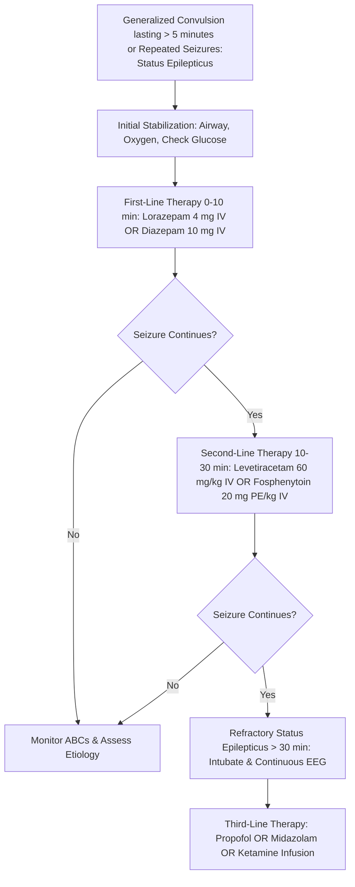

---
tags:
  - internalmedicine
  - disease
  - neurology
  - emergencymedicine
status: active
---

# 🧠 Convulsion & Status Epilepticus (อาการชักเกร็งเฉียบพลัน)

> **Definition**: A convulsion is a sudden, paroxysmal, involuntary episode of generalized motor activity (typically characterized by tonic, clonic, or tonic-clonic movements) caused by abnormal, excessive, and synchronous electrical discharges of cerebral cortical neurons.
> * **Status Epilepticus** is defined as continuous seizure activity lasting $\ge 5$ minutes, or recurrent seizures without recovery of consciousness between episodes.

---

## 🚨 Why It Is An Emergency
Status epilepticus is a neurological emergency. Continuous motor activity leads to respiratory compromise, severe hypoxemia, hyperthermia ($>41^\circ\text{C}$), rhabdomyolysis, and lactic acidosis. After 30 minutes of continuous seizure activity (**T2 threshold**), excitotoxic calcium influx triggers irreversible neuronal injury and brain death, even if motor activity is pharmacologically stopped.

---

## 📊 Epidemiology
* **Incidence**: The lifetime risk of experiencing at least one convulsion is approximately $5 - 10\%$.
* **Status Epilepticus**: Occurs in 10 to 40 per 100,000 population per year. It carries a high mortality rate ($20\%$), which increases with age and duration of the convulsion.

---

## 🦠 Etiology & Causes

### Seizure & Convulsion Triggers
```
Seizure & Convulsion Triggers
└── 1. Epilepsy-Related
    └── Subtherapeutic antiepileptic drug (AED) levels (non-adherence)
└── 2. Metabolic / Electrolyte Disturbances
    ├── Hypoglycemia (Check sugar first!)
    ├── Severe Hyponatremia (Sodium < 120 mEq/L)
    └── Hypocalcemia, Hypomagnesemia
└── 3. Central Nervous System Insults
    ├── Acute Stroke (Ischemic/Hemorrhagic)
    ├── Head Trauma (Epidural/Subdural hematomas)
    └── CNS Infections: Meningitis, Encephalitis, Brain Abscess
└── 4. Toxins / Withdrawal
    ├── Alcohol withdrawal (Delirium Tremens, rum fits)
    └── Benzodiazepine withdrawal, Cocaine, Tricyclic antidepressants
```

1. **Provoked (Acute Symptomatic) Causes**:
   * **Metabolic Derangements**: **[[Hypoglycemia]]** (always check first), **Hyponatremia** (rapid onset), Hypocalcemia, Hypomagnesemia, and Uremia or Hepatic Encephalopathy.
   * **Toxic/Drug-Related**: Cocaine, amphetamines, tricyclic antidepressants, organophosphates, or withdrawal from alcohol, benzodiazepines, or barbiturates.
   * **Infectious**: Meningitis, Encephalitis, or Brain Abscess.
   * **Structural CNS Damage**: Acute ischemic stroke, intracranial hemorrhage, traumatic brain injury.
   * **Systemic**: Eclampsia (pregnancy $>20$ weeks), malignant hypertension, hyperthermia.
2. **Unprovoked Causes**:
   * Idiopathic or genetic generalized epilepsy.
   * Remote structural lesions (e.g., old stroke scar, cortical dysplasia, post-traumatic glial scar, meningioma).

---

## 🧠 Pathophysiology
1. **Hyperexcitability & Desynchronization**: A state of electrical imbalance where there is an excess of excitatory neurotransmission (mediated by glutamate acting on NMDA/AMPA receptors) and/or a deficiency of inhibitory neurotransmission (mediated by $\gamma$-aminobutyric acid [GABA] acting on GABA-A receptors).
2. **Paroxysmal Depolarizing Shift (PDS)**: An individual cortical neuron undergoes sudden, prolonged depolarization, triggering a train of high-frequency action potentials.
3. **Synchronous Spread**: In a convulsion, this local depolarization spreads rapidly through synaptic and non-synaptic pathways across both cerebral hemispheres.
4. **Motor Manifestation**: The synchronous discharges travel down the corticospinal tract, resulting in:
   * **Tonic Phase**: Massive, continuous contraction of all skeletal muscles (due to sustained excitation).
   * **Clonic Phase**: Intermittent muscle contraction and relaxation (as inhibitory GABAergic pathways attempt to terminate the seizure, producing rhythmic jerking).
5. **Systemic Effects**: Massive sympathetic discharge leads to hypertension, tachycardia, hyperthermia, hyperglycemia, and lactic acidosis due to intense muscle contraction and hypoxia.

---

## 🩺 Immediate Assessment (Emergency Protocol)

### Airway
* Assess patency. Saliva, blood (from tongue biting), or gastric contents can cause airway obstruction or aspiration.
* **Do not force objects into the patient's mouth** (e.g., spoons, tongue depressors); this causes dental fractures, airway obstruction, and finger injuries to the staff.
* Suction the mouth gently after the tonic phase. Roll the patient into the **recovery position** (lateral decubitus) to allow secretions to drain.

### Breathing
* Look for chest rise. Breathing is typically impaired during a generalized seizure, leading to cyanosis and hypoxia.
* Measure $SpO_2$. Provide high-flow supplemental oxygen via non-rebreather mask.
* Monitor for respiratory depression or apnea, especially after administering high-dose benzodiazepines.

### Circulation
* Assess heart rate and blood pressure.
* **Bedside Glucose**: Perform an immediate fingerstick blood sugar test. **Hypoglycemia is a common, easily reversible cause of seizures.**
* **Secure IV Access**: Establish two patent IV lines. If IV access is impossible, prepare for intramuscular (IM) or intraosseous (IO) drug administration.

---

## 🔍 Clinical Manifestations & Recognition

### Seizure Thresholds & Stages
* **T1 Threshold (5 minutes)**: Time to initiate treatment. Any seizure lasting $>5$ minutes is unlikely to stop spontaneously.
* **T2 Threshold (30 minutes)**: Time when irreversible brain damage begins.
* **Aura (Focal Onset)**: Preceding focal symptoms (e.g., epigastric rising sensation, metallic taste, localized twitching) suggest a focal seizure with secondary generalization. Primary generalized convulsions occur without an aura.
* **Loss of Consciousness**: Abrupt and complete.
* **During the Convulsion**:
  * **Tonic Phase**: The body becomes rigid, the arms flexed or extended, legs extended. The jaw clenches, which may lead to **lateral tongue biting**. Contraction of thoracic muscles forces air through vocal cords, producing an "ictal cry." Respiration is impaired, leading to cyanosis.
  * **Clonic Phase**: Rhythmic, synchronous, bilateral jerking of the extremities, gradually slowing in frequency before stopping.
* **Post-Ictal Phase**:
  * Sterile, heavy breathing (stertorous breathing).
  * The patient is unresponsive, then enters a phase of confusion, lethargy, headache, and severe myalgias.
  * **Bowel/Bladder Incontinence**: Common during the seizure due to sphincter relaxation.
  * **Todd's Paralysis**: A transient, focal neurological deficit (most commonly hemiparesis) in the post-ictal phase that mimics an acute stroke. It resolves spontaneously within 2-24 hours.
* **Non-motor signs (Non-convulsive Status Epilepticus)**: Comatose patient with subtle facial twitching, eye deviation, or unexplained persistent altered consciousness (diagnosed via EEG).

---

## 📂 Differential Diagnosis

### Diagnostic Triage Table
| Condition | Distinguishing Clinical Features | Key Investigations |
| :--- | :--- | :--- |
| **Epileptic Seizure** | Tonic-clonic movements, **lateral tongue biting**, eyes open/deviated, prolonged postictal confusion. | Fingerstick glucose, VBG (lactate), EEG. |
| **Psychogenic Non-Epileptic Seizures (PNES)** | Out-of-phase limb movements, **eyes closed/resisting opening**, pelvic thrusting, preserved consciousness. | Normal postictal lactate, video-EEG monitoring. |
| **Convulsive [[Syncope]]** | Brief twitching ($<15$ seconds) during syncopal fall. **No postictal confusion** (immediate recovery). | Normal glucose, ECG (arrhythmia check). |
| **Decerebrate Posturing** | Rigid extension of limbs. Constant, non-rhythmic. Signs of high ICP (Cushing's triad). | Head CT (herniation). |

### Additional Mimics
* **Transient Ischemic Attack (TIA)**: Presents with "negative" symptoms (loss of motor/sensory function), whereas convulsions present with "positive" symptoms (active movements, twitching).
* **Hypoglycemic Encephalopathy**: Presents with confusion, sweating, and tremors, which can progress to convulsions. Differentiated by fingerstick glucose.

---

## 🧪 Investigations

### Laboratory
* **Fingerstick Blood Glucose**: **Mandatory immediately** for all patients.
* **Serum Electrolytes**: Checks for hyponatremia (sodium $<120$ mEq/L), hypocalcemia, and hypomagnesemia.
* **Anticonvulsant Levels**: (e.g., Phenytoin, Valproate, Carbamazepine) if the patient is already diagnosed with epilepsy to check compliance.
* **Arterial / Venous Blood Gas (ABG/VBG)**:
  * A generalized tonic-clonic seizure causes a massive transient lactic acidosis ($pH < 7.20$, lactate $> 10$ mmol/L) due to tissue hypoxia and muscle exertion.
  * > [!TIP]
    > **Lactic Acidosis Clue**: Post-ictal lactic acidosis resolves spontaneously within 60 minutes. If the lactate is normal immediately after a suspected generalized seizure, suspect PNES or syncope. If acidosis persists, suspect ongoing non-convulsive status epilepticus or severe systemic sepsis.
* **Urine Toxicology Screen**: Identify cocaine, amphetamines, or tricyclic antidepressants.

### Imaging
* **[[CT Brain]] (without contrast)**:
  * Indicated urgently if: first-ever convulsion, history of trauma, focal neurologic deficits, persistent altered consciousness (suspected non-convulsive status), or new-onset fever.
* **[[MRI Brain]]**:
  * Outpatient scan. Preferred for identifying subtle epileptogenic lesions (mesial temporal sclerosis, low-grade tumors, cortical dysplasia).

### Special Tests
* **[[EEG]] (Electroencephalography)**:
  * **Critical diagnostic test**. Demonstrates epileptiform activity (spikes, polyspikes, spike-and-wave complexes) and localizes focal vs. generalized epilepsy.
  * **Urgent Indication**: In a patient who does not regain consciousness after a convulsion, an urgent EEG is required to rule out **non-convulsive status epilepticus (NCSE)**.
* **[[Lumbar Puncture]] & [[CSF Analysis]]**:
  * Indicated if meningitis or encephalitis is suspected. Do not perform if signs of elevated ICP or mass effect are present on CT.

---

## Diagnostic Criteria
Diagnosis is clinical, based on a clear history of paroxysmal tonic-clonic motor activity with loss of consciousness and a post-ictal state. EEG provides supportive evidence of epileptiform discharges.

---

## 🏥 Management

### Status Epilepticus Flowchart


### Protocol & Timeline Details
```
Status Epilepticus Escaped Timeline
├── PHASE 1: Stabilization (0 - 5 minutes)
│   └── Protect patient from trauma; recovery position; give O2; check glucose (give D50W if low)
├── PHASE 2: First-Line (Benzodiazepines) (5 - 20 minutes)
│   ├── IV Lorazepam: 4 mg IV slowly over 2 minutes (preferred; repeat once in 5-10 min if needed) OR
│   ├── IV Diazepam: 10 mg IV slowly over 2 minutes OR
│   └── IM Midazolam: 10 mg IM (if no IV access)
├── PHASE 3: Second-Line (Intravenous AEDs) (20 - 40 minutes)
│   ├── IV Levetiracetam (Keppra): 60 mg/kg IV (max 4500 mg) infused over 15 minutes OR
│   ├── IV Valproate: 40 mg/kg IV (max 3000 mg; avoid in acute liver disease) OR
│   └── IV Fosphenytoin / Phenytoin: 20 mg PE/kg IV (Phenytoin requires slow infusion at <50 mg/min)
└── PHASE 4: Third-Line / Refractory (> 40 minutes)
    └── Refractory Status: Intubate, initiate infusion of PROPOFOL, MIDAZOLAM, or KETAMINE; continuous EEG
```

### Definitive Management
* **Provoked Convulsions**: Treat the underlying cause (e.g., correct hyponatremia slowly, administer dextrose, treat meningitis). Long-term Antiepileptic Drugs (AEDs) are usually **not** indicated.
* **Unprovoked / Epilepsy**: Initiate long-term maintenance Antiepileptic Drugs (e.g., Levetiracetam, Sodium Valproate, Lamotrigine) if there is a high risk of recurrence (e.g., abnormal EEG, abnormal MRI).

---

## 📊 Monitoring
* **Continuous Pulse Oximetry and Respiratory Rate**.
* **Electrocardiogram (ECG) Telemetry** (risk of arrhythmia during sympathetic surge).
* **Continuous EEG (cEEG)**: Mandatory in patients who do not wake up within 30-60 minutes after motor seizure control, to rule out **Non-convulsive Status Epilepticus (NCSE)**.

---

## 🫁 Complications & Prognosis
* **Hypoxic Brain Injury & Neuronal Death**: Due to prolonged apnea or prolonged excitotoxity ($>30$ minutes).
* **Aspiration Pneumonia**: Secondary to loss of airway protection.
* **Rhabdomyolysis**: Severe muscle breakdown leading to acute renal failure.
* **Hyperthermia & Cardiac Arrhythmias**: From extreme sympathetic surge.
* **Trauma**: Posterior shoulder dislocation, tongue lacerations, vertebral compression fractures.
* **Prognosis**: Excellent for provoked convulsions if corrected early. Epilepsy has a favorable prognosis: $70\%$ achieve seizure freedom with a single AED.

---

## 💡 Clinical Pearls

* > [!IMPORTANT]
  > **Tongue Biting Specificity**: Lateral tongue biting has a specificity of $>99\%$ (and border border specificity $>95\%$) for differentiating a true generalized convulsion from psychogenic non-epileptic seizures (PNES) and syncope. Tip-of-tongue biting is non-specific (often occurs in falls).
* > [!WARNING]
  > **Phenytoin Infusion Rule**: Never infuse Phenytoin faster than $50$ mg/min or dilute it in glucose solutions (it precipitates). Always monitor ECG and blood pressure during infusion, as the propylene glycol vehicle can cause hypotension, AV block, and bradycardia.
* > [!WARNING]
  > **Avoid Phenytoin in Lidocaine Toxicity**: If seizures are caused by local anesthetic toxicity (e.g., lidocaine overdose), do not use Phenytoin, as both block sodium channels and can exacerbate cardiotoxicity and heart block. Use benzodiazepines and lipid emulsion therapy.

---

## 🔗 Related Notes
* [[Seizure]]
* [[Epilepsy]]
* [[Meningitis]]
* [[Encephalitis]]
* [[Intracranial Hemorrhage]]
* [[Cerebrovascular Disease]]
* [[Coma]]
* [[Hypoglycemia]]
* [[EEG]]
* [[CT Brain]]
* [[MRI Brain]]
* [[ABG]]
* [[Electrolyte]]
* [[Lumbar Puncture]]
* [[CSF Analysis]]
