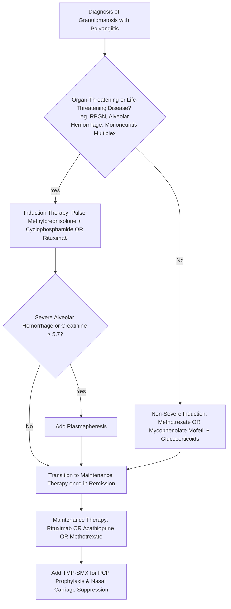

---
tags:
  - internalmedicine
  - disease
  - rheumatology
  - neurology
status: active
---

## type: disease

# Definition
Granulomatosis with Polyangiitis (GPA), formerly known as *Wegener's granulomatosis*, is a systemic, necrotizing, autoimmune vasculitis that affects small- to medium-sized blood vessels. It is characterized by the triad of necrotizing granulomatous inflammation of the upper and lower respiratory tracts, systemic necrotizing vasculitis, and pauci-immune necrotizing crescentic glomerulonephritis. It is strongly associated with antineutrophil cytoplasmic antibodies (ANCA), specifically targeting proteinase 3 (PR3-ANCA / c-ANCA).

# Epidemiology
* **Age & Sex**: Most commonly diagnosed in patients aged $40-65$ years, though it can occur at any age. It affects men and women equally.
* **Ethnicity**: Considerably more common in Caucasians of Northern European descent.

# Etiology
The precise cause of GPA is unknown. It is widely considered an autoimmune disease triggered by environmental exposures (e.g., silica dust, chronic nasal colonization with *Staphylococcus aureus*, viral infections) in genetically susceptible individuals (associated with HLA-DPB1 alleles).

# Pathophysiology
1. **ANCA-Mediated Neutrophil Activation**: In genetically predisposed individuals, exposure to a pathogen upregulates inflammatory cytokines (TNF-$\alpha$, IL-1), which "prime" neutrophils, causing them to express proteinase 3 (PR3) on their outer membranes.
2. **Autoantibody Binding**: Circulating **c-ANCA (PR3-ANCA)** autoantibodies bind to the exposed membrane PR3.
3. **Neutrophil Degranulation & Vasculitis**: This binding triggers neutrophil activation, causing them to adhere to vascular endothelial cells, undergo oxidative burst (releasing reactive oxygen species and proteolytic enzymes), and release **neutrophil extracellular traps (NETs)**. This causes necrotizing vasculitis of the vessel wall.
4. **Granuloma Formation**: T-cell-mediated delayed hypersensitivity responses lead to the formation of extravascular necrotizing granulomas in the surrounding tissues (primarily respiratory tract).
5. **Neurological Pathophysiology**:
   * **Mononeuritis Multiplex**: Vasculitis of the **vasa nervorum** (the small blood vessels supplying peripheral nerves) causes ischemic infarction of individual nerves, leading to sequential, asymmetric neuropathy.
   * **Cranial Neuropathies**: Direct granulomatous extension from the paranasal sinuses/orbits can compress cranial nerves (CN II, III, IV, VI, VII).
   * **Hypertrophic Pachymeningitis**: Granulomatous inflammation and thickening of the dura mater.

# Clinical Manifestations

## Symptoms
* **Constitutional**: Fever, unexplained weight loss, night sweats, and fatigue.
* **Upper Respiratory Tract ($>90\%$)**:
   * Chronic refractory sinusitis, nasal stuffiness, and purulent/bloody nasal discharge.
   * Nasal mucosal ulceration leading to septal perforation and **saddle-nose deformity**.
   * Otitis media, mastoiditis, and conductive or sensorineural hearing loss.
* **Lower Respiratory Tract ($85\%$)**:
   * Cough, dyspnea, pleuritic chest pain, and **[[Hemoptysis]]** (indicative of diffuse alveolar hemorrhage, a life-threatening emergency).
* **Renal ($70-80\%$)**:
   * Hematuria, oliguria, and edema. Often presents as Rapidly Progressive Glomerulonephritis (RPGN), which can progress to acute renal failure within days.
* **Neurological Manifestations ($20-50\%$)**:
   * **Mononeuritis Multiplex**: Sudden, painful, asymmetric sensory and motor loss in multiple non-contiguous peripheral nerves (e.g., right foot drop followed by left wrist drop).
   * **Cranial Neuropathies**: Most commonly affecting CN VII (Bell's palsy mimic) and CN II (optic neuropathy leading to vision loss), or extraocular muscles (CN III, IV, VI).
   * **CNS Pachymeningitis**: Causes a severe, persistent, chronic **[[Headache]]** accompanied by cranial nerve deficits.
* **Cutaneous**: Palpable purpura, subcutaneous nodules, and ulcerations (similar to pyoderma gangrenosum).

## Physical Examination
* **HEENT**: Saddle-nose deformity (collapse of the nasal bridge due to septal cartilage destruction), nasal crusting, proptosis/exophthalmos (due to orbital granulomatous pseudotumors).
* **Neurological**:
   * Asymmetric peripheral nerve deficits (e.g., weakness of ankle dorsiflexion, loss of sensation in a peroneal or ulnar distribution).
   * Cranial nerve palsies, papilledema, or meningeal signs (if pachymeningitis is present).
* **Skin**: Palpable purpura on lower extremities, necrotizing ulcers.

---

# Differential Diagnosis
* **Microscopic Polyangiitis (MPA)**: Also an ANCA-associated vasculitis. Presents with pulmonary-renal syndrome but **lacks granulomatous inflammation** (no cavitary nodules, no sinus involvement, no saddle-nose deformity) and is predominantly associated with **p-ANCA / MPO-ANCA**.
* **Eosinophilic Granulomatosis with Polyangiitis (EGPA / Churg-Strauss)**: Characterized by severe asthma, peripheral eosinophilia, transient pulmonary infiltrates, and p-ANCA.
* **Anti-Glomerular Basement Membrane (GBM) Disease (Goodpasture Syndrome)**: Presents with pulmonary-renal syndrome (hemoptysis and glomerulonephritis) but lacks upper airway involvement, systemic vasculitis, or neurological symptoms. Diagnosed via anti-GBM antibodies.
* **Pulmonary Tuberculosis**: Presents with fever, cough, hemoptysis, and cavitary lung lesions. Differentiated by tissue acid-fast bacillus (AFB) stain, culture, and positive PCR.
* **NK/T-Cell Lymphoma (Lethal Midline Granuloma)**: Causes destructive nasal cavity lesions, but is non-vasculitic and ANCA-negative.

---

# Investigations

## Laboratory
* **c-ANCA (PR3-ANCA)**: The most important diagnostic marker. Highly specific ($>98\%$) and sensitive ($>90\%$) in patients with active, generalized GPA.
* **Inflammatory Markers**: Markedly elevated ESR and CRP.
* **Urinalysis & Urine Microscopy**:
   * Key screen for glomerulonephritis. Shows **dysmorphic red blood cells (RBCs), RBC casts, and proteinuria**.
* **Renal Function Tests**: Elevated BUN and serum Creatinine.

## Imaging
* **[[Chest X-Ray]] / Chest CT**:
   * Shows bilateral, multiple **cavitary nodules** or infiltrates, and ground-glass opacities (if diffuse alveolar hemorrhage is present).
* **CT/MRI of Paranasal Sinuses**:
   * Demonstrates mucosal thickening, sinus opacification, and bone destruction of the nasal septum/sinus walls.
* **MRI Brain/Spine**:
   * In patients with neurological symptoms, may show **dural thickening and enhancement** (hypertrophic pachymeningitis) or ischemic strokes.

## Special Tests
* **Tissue Biopsy (Gold Standard)**:
   * *Nasal/Sinus Biopsy*: Easiest to access but low yield due to necrotic tissue.
   * *Lung Biopsy (Video-assisted thoracoscopic surgery - VATS)*: Highest yield; demonstrates necrotizing granulomatous vasculitis with parenchymal necrosis.
   * *Renal Biopsy*: Shows **pauci-immune crescentic necrotizing glomerulonephritis** (characterized by cellular crescents and absence of significant immune complex deposition on immunofluorescence).
* **[[EMG/NCS]]**:
   * In patients with suspected neuropathy, confirms an **asymmetric, axonal sensorimotor polyneuropathy** (mononeuritis multiplex pattern).

---

# Diagnostic Criteria
Classification is based on the ACR/EULAR criteria (2022), which assigns points for:
* Nasal congestion, bloody discharge, or septal perforation.
* Cartilaginous involvement (saddle-nose or ear chondritis).
* Conductive or sensorineural hearing loss.
* PR3-ANCA / c-ANCA positivity.
* Cavitary nodules on chest imaging.
* Granulomatous inflammation on biopsy.
* Pauci-immune glomerulonephritis.

---

# Management

## Initial Management (Induction of Remission)
* **Severe / Organ-Threatening Disease** (e.g., active glomerulonephritis, alveolar hemorrhage, severe mononeuritis multiplex, pachymeningitis):
  * **Corticosteroids**: IV Methylprednisolone pulse therapy ($500 - 1000$ mg IV daily for 3 consecutive days), followed by high-dose oral Prednisone ($1$ mg/kg/day, tapered slowly over several months).
  * **Immunosuppression**: Combined with either:
    * **Rituximab** (375 mg/m² weekly for 4 doses OR 1000 mg IV on days 1 and 15) - preferred, especially in young patients/females to preserve fertility.
    * **Cyclophosphamide** (IV pulses or daily oral) - highly effective but associated with bladder toxicity (hemorrhagic cystitis, transitional cell carcinoma) and gonadotoxicity.
  * **Plasmapheresis (Plasma Exchange)**: Indicated for patients with concurrent severe glomerulonephritis (serum Creatinine $>5.7$ mg/dL) or diffuse alveolar hemorrhage.
* **Non-Severe Disease**:
  * Oral Prednisone combined with **Methotrexate** or **Mycophenolate Mofetil (MMF)**.

## Definitive Management (Maintenance of Remission)
* Once remission is achieved (usually $3-6$ months), transition to lower-toxicity maintenance therapy to prevent relapses:
  * **Rituximab** (infusions every 6 months) - gold standard.
  * **Azathioprine** ($2$ mg/kg/day) or **Methotrexate** (weekly).
* **Supportive Therapy**:
  * **Pneumocystis jirovecii Pneumonia (PCP) Prophylaxis**: **Trimethoprim-Sulfamethoxazole (TMP-SMX)** 800/1600 mg (double strength) three times weekly or single strength daily. It also helps suppress *S. aureus* nasal carriage, reducing upper respiratory tract relapses.
  * **Osteoporosis Prophylaxis**: Calcium, Vitamin D, and Bisphosphonates due to prolonged steroid taper.

---

# Complications
* **Renal Failure**: ESRD requiring chronic hemodialysis or renal transplantation.
* **Pulmonary Hemorrhage**: Asphyxiation and death from massive alveolar bleeding.
* **Permanent Neurological Deficits**: Persistent neuropathic pain, foot drop, wrist drop, or permanent vision loss.
* **Drug Toxicities**:
   * Cyclophosphamide-induced hemorrhagic cystitis (mitigated by hydration and **Mesna**), bladder cancer, and infertility.
   * Opportunistic infections (PCP, CMV, fungal infections).
* **Structural**: Subglottic stenosis (requiring dilation/tracheostomy), saddle-nose deformity.

# Prognosis
* Historically, GPA was universally fatal, with a median survival of 5 months without treatment.
* With modern immunosuppressive therapy, **remission is achieved in $>90\%$ of cases**, and 5-year survival is $>80\%$.
* However, relapses are highly common, occurring in $50\%$ of patients within 5 years of stopping maintenance therapy.

# Clinical Pearls
* > [!IMPORTANT]
  > **Mononeuritis Multiplex Clue**: If a patient presents with **painful, asymmetric motor and sensory deficits** affecting multiple separate nerves (e.g., right peroneal nerve and left ulnar nerve) and has a history of chronic, treatment-refractory sinus disease, check a **c-ANCA / PR3-ANCA** immediately.
* > [!TIP]
  > **Mesna Rule**: When administering IV Cyclophosphamide, always administer **Mesna (2-mercaptoethane sulfonate)** to bind the toxic metabolite acrolein in the bladder, preventing hemorrhagic cystitis and bladder cancer.

---

# Related Notes
* [[Polyneuropathy]]
* [[Facial Nerve Palsy]]
* [[Headache]]
* [[Numbness]]
* [[Muscle Weakness]]
* [[Fever]]
* [[Fatigue]]
* [[Hemoptysis]]
* [[Hematuria]]
* [[Proteinuria]]
* [[Urinalysis]]
* [[Urine Microscopy]]
* [[Renal Function Test]]
* [[EMG/NCS]]
* [[Chest X-Ray]]
