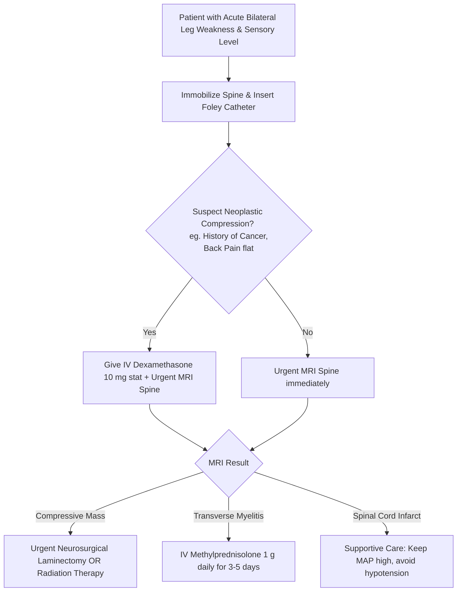

---
tags:
  - internalmedicine
  - disease
  - neurology
status: active
---

## type: disease

# Definition
Paraplegia is the complete or severe loss of motor function in the lower extremities (legs), with sparing of the upper extremities (arms). It is caused by a bilateral upper motor neuron (UMN) lesion in the thoracic, lumbar, or sacral spinal cord, or a lower motor neuron (LMN) lesion in the cauda equina.

# Epidemiology
* **Traumatic vs. Non-traumatic**: Traumatic spinal cord injury (SCI) is a major cause in young adults (motor vehicle accidents, falls). Non-traumatic causes (metastases, stenosis, infection) predominate in older populations.
* **Emergency Status**: Acute-onset paraplegia is a neurological emergency requiring rapid localization and treatment to prevent permanent paralysis.

# Etiology
Paraplegia can be categorized into compressive and non-compressive etiologies:

1. **Compressive Myelopathy (Urgent Surgical Evaluation)**:
   * **Metastatic Epidural Spinal Cord Compression (MESCC)**: Most commonly from prostate, breast, lung cancers, or Multiple Myeloma.
   * Epidural Abscess or Hematoma.
   * Thoracic disc herniation or severe spinal canal stenosis.
2. **Non-Compressive Myelopathy**:
   * **Transverse [[Myelitis]]**: Inflammatory demyelination (associated with Multiple Sclerosis, NMOSD, or post-infectious states).
   * **Anterior Spinal Artery Syndrome (Spinal Cord Infarction)**: Ischemia of the anterior two-thirds of the spinal cord (e.g., following abdominal aortic aneurysm repair or severe hypotension).
   * **Infectious**: **Pott's Disease** (Spinal Tuberculosis), HTLV-1 associated myelopathy (tropical spastic paraparesis).
   * **Hereditary**: Hereditary Spastic Paraplegia (HSP).
3. **Cerebral Mimic (Rare)**:
   * Bilateral parasagittal motor cortex lesions (e.g., parasagittal meningioma compressing the leg motor areas).
4. **Lower Motor Neuron Mimic**:
   * Cauda Equina Syndrome.

# Pathophysiology
1. **Upper Motor Neuron Interruption**: Lesions below the cervical cord block the descending bilateral corticospinal tracts, depriving lumbar motor neurons of voluntary cortical input.
2. **Spinal Shock (Acute Phase)**:
   * Immediately following acute spinal injury or transverse myelitis, there is a transient loss of all spinal cord reflex activity below the level of the lesion.
   * Clinically presents as **flaccid paralysis, areflexia**, and atonic bladder/rectum. This lasts for days to weeks.
3. **Spastic Paraplegia (Chronic Phase)**:
   * As spinal shock resolves, local spinal reflex arcs become hyperactive, leading to spasticity, hyperreflexia, and clonus.
4. **Anterior Spinal Artery Syndrome**:
   * Spares the posterior columns (vibration and proprioception are intact), but causes bilateral paraplegia and loss of pain/temperature sensation below the level (due to spinothalamic tract damage).

# Clinical Manifestations

## Symptoms
* Bilateral lower extremity weakness and difficulty walking.
* **Sensory Level**: Numbness, tingling, or a "band-like" sensation wrapping around the trunk, ending at a distinct dermatomal boundary.
* **Radicular Back Pain**: Sharp, localized back pain that is worsened by lying flat, coughing, or straining (highly suggestive of neoplastic compression).
* **Autonomic Dysfunction**: Urinary urgency, urinary retention, and fecal incontinence or constipation.

## Physical Examination
* **Motor Exam**: Bilateral lower limb weakness (symmetric or asymmetric). In the chronic phase, there is spasticity (increased tone) and pyramidal weakness.
* **Reflexes**: 
  * *Acute*: Areflexia (absent reflexes).
  * *Chronic*: Hyperreflexia (3+ or 4+), ankle clonus, and bilateral **positive Babinski signs**.
* **Sensory Exam**:
  * Map a clear **Sensory Level** on the trunk to localize the lesion (e.g., **T4 at the nipple line** indicates a upper thoracic lesion; **T10 at the umbilicus** indicates a lower thoracic lesion).
  * Check posterior columns (vibration/proprioception) vs. spinothalamic tracts (pain/temperature) to evaluate for incomplete cord syndromes.
* **Autonomic / Sphincter Exam**:
  * **High Post-Void Residual (PVR) volume** ($>200$ mL) indicating neurogenic urinary retention.
  * Decreased anal sphincter tone on digital rectal exam (DRE).

---

# Differential Diagnosis
* **[[Guillain-Barre Syndrome]]**: Also presents with bilateral leg weakness and areflexia. However, it is distinguished by the **absence of a sensory level**, ascending paresthesias, facial nerve involvement, and lack of bowel/bladder dysfunction early on.
* **Parasagittal Meningioma**: Presents with progressive spastic paraplegia. However, the patient will **not** have a sensory level on the trunk, and may have headache or focal seizures.
* **Cauda Equina Syndrome**: Compression of lumbar/sacral nerve roots. Presents with paraplegia, but it is **strictly LMN** (persistent flaccidity, areflexia, saddle anesthesia, and no Babinski sign).

---

# Investigations

## Laboratory
* **Routine Labs**: CBC, inflammatory markers (ESR, CRP).
* **CSF Analysis & [[Lumbar Puncture]]**:
  * Indicated for suspected transverse myelitis (shows lymphocytic pleocytosis, elevated protein, and **oligoclonal bands**).
  > [!WARNING]
    > **LP Safety Rule**: Do **not** perform an LP if MRI shows a compressive mass lesion, as this can cause spinal coning.

## Imaging
* **MRI Spine (Thoracic/Lumbar) with and without Contrast (Gold Standard)**:
  * **Urgent first-line imaging**. Visualizes the spinal cord parenchyma, nerve roots, and surrounding spinal column. Essential to differentiate compressive lesions (MESCC, epidural abscess) from intrinsic inflammation (transverse myelitis) or ischemia.

---

# Diagnostic Criteria
Diagnosis is confirmed by bilateral lower extremity paralysis associated with upper motor neuron signs (hyperreflexia, Babinski) and a localized sensory level on the trunk, with MRI identifying the anatomical spinal lesion.

---

# Management

## Initial Management
* **Spine Immobilization**: Keep the spine in a neutral position if trauma is suspected.
* **Bladder Management**: Immediately insert a **Foley catheter** to relieve acute urinary retention and prevent bladder detrusor damage.
* **Corticosteroids**:
  * If **Metastatic Epidural Spinal Cord Compression (MESCC)** is suspected, administer **Dexamethasone 10 mg IV stat**, followed by 4 mg IV every 6 hours. This reduces vasogenic edema around the cord, preserving neurological function while awaiting imaging/surgery.

## Definitive Management
* **Compressive Lesions**:
  * **Neurosurgery**: Urgent decompressive laminectomy (best for spinal instability, retropulsed bone fragments, or radiation-resistant tumors).
  * **Radiation Therapy**: Urgent external beam radiation (preferred for radiosensitive tumors like lymphoma, myeloma, or small cell lung cancer in stable spines).
* **Transverse Myelitis**:
  * High-dose **IV Methylprednisolone (1 g daily for 3 to 5 days)**. Initiate plasmapheresis if there is no response to steroids.
* **Supportive Care**:
  * Intensive physical and occupational therapy.
  * Spasticity control with **Baclofen**.
  * DVT prophylaxis with LMWH.

---

# Complications
* **Autonomic Dysreflexia (Life-Threatening)**:
   * Occurs in patients with lesions at or **above the T6 level**.
   * Triggered by noxious stimuli below the lesion (most commonly **bladder distension** or bowel impaction).
   * Presents with: **severe paroxysmal hypertension**, throbbing headache, bradycardia (reflexive), flushing/sweating above the lesion, and cold/pale skin below.
   * *Management*: Sit the patient upright, remove constrictive clothing, check/empty the bladder (check catheter for kinks), and administer short-acting antihypertensives (e.g., Nitropaste or Nifedipine) if BP remains elevated.
* **Neurogenic Bladder / Chronic UTIs**.
* **Decubitus Ulcers**: Secondary to sensory loss and immobility.

# Prognosis
* Patients with incomplete cord lesions (some motor or sensory preservation below the level) have a high chance of regaining ambulation.
* Complete paraplegia lasting $>24$ hours has a poor recovery rate.

# Clinical Pearls
* > [!IMPORTANT]
  > **The T6 Autonomic Dysreflexia Rule**: In any paraplegic patient with a lesion above T6 who complains of a **severe headache**, measure their **blood pressure** immediately. If they are hypertensive, check their Foley catheter. A kinked catheter causing bladder distension is the cause in $>80\%$ of autonomic dysreflexia cases.
* > [!TIP]
  > **Metastatic Back Pain Clue**: Unlike mechanical back pain (which is relieved by lying down), back pain from spinal metastases is typically **worse when lying flat** due to increased venous plexus pressure and stretching of the dural sheath.

---

# Related Notes
* [[Myelitis]]
* [[Tetraplegia]]
* [[Guillain-Barre Syndrome]]
* [[Acute Flaccid Paralysis]]
* [[Urinary Retention]]
* [[MRI Brain]]
* [[CSF Analysis]]
* [[Lumbar Puncture]]
