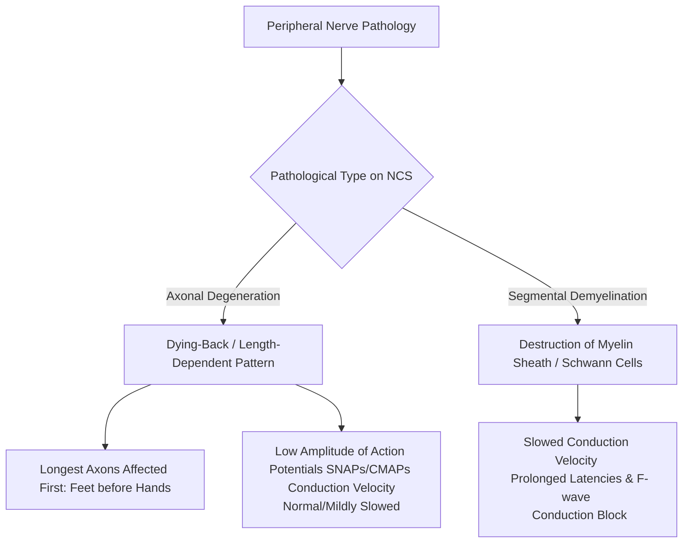

---
tags:
  - internalmedicine
  - disease
  - neurology
status: active
---

## type: disease

# Definition
Polyneuropathy is a generalized, homogeneous, and typically symmetric disease process affecting multiple peripheral nerves. It is characterized by length-dependent, distal sensory, motor, and/or autonomic dysfunction that characteristically progresses in a "stocking-glove" distribution.

# Epidemiology
* **Prevalence**: Affects approximately $2-3\%$ of the general population, rising to $>8\%$ in individuals older than 65 years.
* **Associations**: **Diabetic Neuropathy** is the most common cause in developed nations, affecting up to $50\%$ of patients with chronic Diabetes Mellitus. Alcohol abuse and chemotherapy-induced peripheral neuropathy (CIPN) are also highly prevalent.

# Etiology
Etiologies of polyneuropathy are vast and can be classified systematically:

| Class | Examples | Key Clinical Features |
| :--- | :--- | :--- |
| **Metabolic & Endocrine** | **Diabetes Mellitus** (most common), Uremia (chronic kidney disease), Hypothyroidism | Length-dependent, sensorimotor, slowly progressive |
| **Nutritional** | **Vitamin B12 deficiency**, Vitamin B1 (Thiamine), Vitamin B6 (excess or deficiency), Vitamin E | B12 deficiency causes subacute combined degeneration (SCD) affecting posterior columns |
| **Toxic / Drug-Induced** | **Alcohol**, Chemotherapy (Vincristine, Paclitaxel, Cisplatin), Isoniazid (causes B6 depletion), Amiodarone, Metronidazole, Heavy metals (Lead, Arsenic) | Axonal, painful, often sensory-predominant |
| **Infectious** | **HIV**, Leprosy (asymmetric early, but can mimic polyneuropathy), Lyme disease, Varicella-zoster | HIV causes distal symmetric polyneuropathy (DSPN) or inflammatory demyelinating polyneuropathy |
| **Autoimmune / Inflammatory** | **[[Guillain-Barre Syndrome]]** (acute), CIDP (chronic), Vasculitis (presents as mononeuritis multiplex) | Often demyelinating, early motor involvement, elevated CSF protein |
| **Hereditary** | **Charcot-Marie-Tooth (CMT) disease** | Very slowly progressive, distal muscle wasting, high-arched feet (*pes cavus*), family history |

# Pathophysiology
Peripheral neuropathies are classified pathologically into two primary categories, which are distinguished using Nerve Conduction Studies (NCS):
1. **Axonal Degeneration (Axonopathy) ($>80\%$)**:
   * *Mechanism*: "Dying-back" neuropathy. The pathology starts at the most distal nerve terminals and moves centripetally. The longest axons (supplying the feet) are affected first because they depend on axonal transport of nutrients/proteins over the greatest distance from the cell body (length-dependent).
   * *Causes*: Diabetes, toxins, alcohol, nutrition, amyloidosis.
2. **Segmental Demyelination (Demyelinating Neuropathy)**:
   * *Mechanism*: Immune-mediated or genetic destruction of myelin sheaths or Schwann cells along the axon. Conduction velocity is slowed or blocked, but the axon itself is initially preserved.
   * *Causes*: GBS, CIDP, Charcot-Marie-Tooth Type 1.

# Clinical Manifestations

## Symptoms
* **Sensory (Stocking-Glove Distribution)**:
  * *Negative symptoms*: Numbness, loss of feeling, feeling of "walking on cotton" or "wooden feet."
  * *Positive symptoms (Neuropathic Pain)*: Tingling, burning, electric-shock sensations, pins-and-needles (paresthesia), and pain from non-painful stimuli (**allodynia**) or exaggerated pain response (**hyperalgesia**).
  * Pain is often worse at night.
* **Motor**:
  * Distal muscle weakness, resulting in difficulty climbing stairs, opening jars, or turning keys.
  * Frequent tripping, foot drop, or loss of dexterity.
* **Autonomic**:
  * Orthostatic dizziness (orthostatic hypotension), early satiety/bloating (gastroparesis), alternating diarrhea and constipation, erectile dysfunction, dry skin, and pupillary abnormalities.

## Physical Examination
* **Sensory Exam**:
  * **Large-fiber loss**: Decreased vibration sense (using 128 Hz tuning fork, usually the earliest sign) and proprioception (joint position sense), leading to **Sensory Ataxia** and a **positive Romberg sign**.
  * **Small-fiber loss**: Decreased pinprick (pain) and temperature sensation.
* **Motor Exam**:
  * Distal muscle wasting (e.g., extensor digitorum brevis in the foot) and distal weakness (weakness of toe extension or ankle dorsiflexion).
* **Reflexes**:
  * Hyporeflexia or areflexia. The **Achilles (ankle) reflex is lost early** in length-dependent neuropathies. Knee jerk may be preserved until late.
* **Trophic Changes**:
  * Dry, shiny skin, loss of hair on lower legs, and painless calluses or **neuropathic ulcers** on pressure points of the sole.

---

# Differential Diagnosis
* **Radiculopathy (e.g., L5/S1 nerve root compression)**: Asymmetric, dermatomal distribution, associated with acute back pain radiating down the leg (sciatica), reflex loss is isolated.
* **Mononeuritis Multiplex**: Asymmetric, painful, asynchronous involvement of multiple separate, non-contiguous nerves. Suggests vasculitis (e.g., **[[Granulomatosis with Polyangiitis]]** or PAN).
* **Spinal Cord Disease (Myelopathy)**: Spasticity, hyperreflexia, extensor plantar response (Babinski sign), and a clear sensory level on the trunk.

---

# Investigations

## Laboratory
* **Screening Panel for Undiagnosed Polyneuropathy**:
  1. **Fasting Plasma Glucose & HbA1c**: Rule out Diabetes Mellitus (highest yield).
  2. **Basic Metabolic Panel / Creatinine**: Rule out uremic neuropathy.
  3. **Serum Vitamin B12 and Methylmalonic Acid (MMA)**: (MMA is elevated in subclinical B12 deficiency).
  4. **Serum Protein Electrophoresis (SPEP) with Immunofixation**: Screen for monoclonal gammopathy of undetermined significance (MGUS) or Multiple Myeloma.
  5. **TSH**: Screen for hypothyroidism.
* **Directed Rheumatologic Screen** (if vasculitis/autoimmune suspected): ANA, Rheumatoid Factor, ESR, CRP, ANCAs.

## Special Tests
* **[[EMG/NCS]]**:
  * **Nerve Conduction Studies (NCS)**: Differentiates axonal (reduced amplitudes of Sensory Nerve Action Potentials [SNAPs] and Compound Muscle Action Potentials [CMAPs] with relatively preserved conduction velocities) from demyelinating neuropathies (marked slowing of conduction velocity, prolonged distal latencies, conduction blocks, and prolonged F-wave latencies).
  * **Electromyography (EMG)**: Assesses for signs of active denervation (fibrillations and positive sharp waves) and chronic reinnervation.
* **Skin Biopsy (Epidermal Nerve Fiber Density)**:
  * Utilized when NCS is normal but small-fiber neuropathy is clinically suspected (small fibers are too small to be recorded on standard NCS). Shows reduced intraepidermal nerve fiber density.

---

# Diagnostic Criteria
Diagnosis is clinical, based on:
1. Symmetric distal "stocking-glove" sensory impairment, hyporeflexia, and distal weakness.
2. Characterization of the fiber type (sensory, motor, autonomic) and pathology (axonal vs. demyelinating) via EMG/NCS.
3. Matching laboratory findings explaining the underlying etiology.

---

# Management

## Initial Management
* **Treat the Underlying Cause**:
  * *Diabetic Neuropathy*: Optimize glycemic control to slow progression (though it rarely reverses established neuropathy).
  * *B12 Deficiency*: Administer intramuscular Vitamin B12 (Cyanocobalamin/Hydroxocobalamin).
  * *Toxic Neuropathy*: Discontinue offending drugs (e.g., substitute isoniazid, stop vincristine or adjust dose).
  * *Alcoholic Neuropathy*: Complete alcohol cessation and nutritional supplementation (Thiamine).
* **Patient Education & Foot Care**:
  * Teach the patient daily visual inspection of their feet for cuts, blisters, or calluses.
  * Wear well-fitted, protective footwear; avoid walking barefoot.
  * Professional podiatric care for nail trimming and callus removal.

## Definitive Management
* **Neuropathic Pain Pharmacotherapy**:
  1. **Gabapentinoids**:
     * **Gabapentin**: Start $300$ mg PO daily/tid, titrate slowly up to $1800 - 3600$ mg/day in divided doses. Side effects: somnolence, dizziness, peripheral edema.
     * **Pregabalin**: Start $50 - 75$ mg PO bid, titrate to $150 - 300$ mg PO bid.
  2. **Serotonin-Norepinephrine Reuptake Inhibitors (SNRIs)**:
     * **Duloxetine**: $30 - 60$ mg PO once daily. First-line for diabetic neuropathy. Side effects: nausea, dry mouth, somnolence.
  3. **Tricyclic Antidepressants (TCAs)**:
     * **Amitriptyline** or **Nortriptyline**: $10 - 75$ mg PO at bedtime. (Avoid or use with extreme caution in elderly due to strong anticholinergic side effects: confusion, urinary retention, orthostatic hypotension).
* **Physical Therapy & Assistive Devices**:
  * Ankle-foot orthoses (AFOs) for patients with symptomatic foot drop.
  * Balance training to reduce fall risks associated with sensory ataxia.

---

# Complications
* **Neuropathic Ulcers**: Loss of pain sensation leads to repetitive minor trauma to the soles, causing painless ulcers that easily become infected.
* **Charcot Neuroarthropathy**: Progressive destruction of joints (typically foot/ankle) due to repetitive microtrauma in a neuropathic limb. Presents as a warm, swollen, erythematous foot (often misdiagnosed as cellulitis or gout).
* **Osteomyelitis & Amputation**: Direct extension of infected neuropathic ulcers into the bone.
* **Falls**: Secondary to sensory ataxia.

# Prognosis
* Axonal neuropathies (e.g., diabetic, toxic) recover very slowly (axons regrow at a rate of 1 mm/day) and often incompletely.
* Hereditary neuropathies (CMT) are slowly progressive and incurable but do not affect lifespan.
* Demyelinating neuropathies (CIDP, GBS) can show dramatic recovery and remission with immunotherapies (IVIG, plasmapheresis, steroids).

# Clinical Pearls
* > [!TIP]
  > **Small-Fiber vs. Large-Fiber Clue**: If a patient has severe burning pain, allodynia, and normal reflexes and a normal EMG/NCS, suspect **Small-Fiber Neuropathy**. Reflexes and NCS are mediated by large myelinated fibers, which are spared in small-fiber disease.
* > [!IMPORTANT]
  > **Tricyclic Antidepressant Rule**: Avoid Amitriptyline in elderly patients presenting with neuropathy. The anticholinergic side effects can precipitate urinary retention, worsen orthostatic hypotension (increasing fall risks), and cause acute delirium. Use Pregabalin or Duloxetine instead.

---

# Related Notes
* [[Numbness]]
* [[Muscle Weakness]]
* [[Guillain-Barre Syndrome]]
* [[Granulomatosis with Polyangiitis]]
* [[EMG/NCS]]
* [[CBC]]
* [[Renal Function Test]]
* [[Urinalysis]]
* [[Urine Microscopy]]
