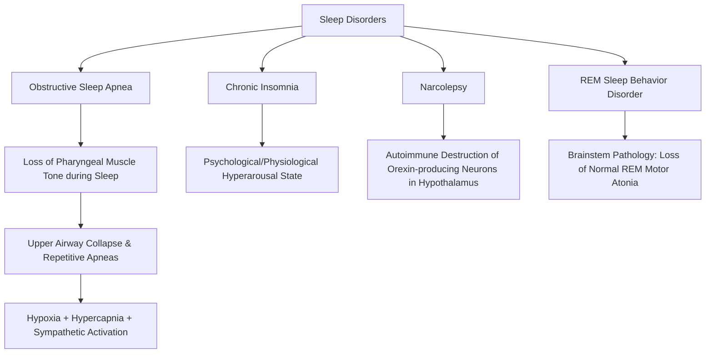

---
tags:
  - internalmedicine
  - disease
  - neurology
  - pulmonology
status: active
---

## type: disease

# Definition
Sleep disorders are a group of conditions that disturb normal sleep architecture, quality, timing, or duration, compromising daytime functioning and physical health. The primary clinical disorders in internal medicine and neurology include **Obstructive Sleep Apnea (OSA)**, **Chronic Insomnia**, **Narcolepsy**, and **REM Sleep Behavior Disorder (RBD)**.

# Epidemiology
* **Obstructive Sleep Apnea (OSA)**: Highly prevalent, affecting $10 - 15\%$ of adult males and $5 - 10\%$ of females. It is strongly linked to the global obesity epidemic.
* **Insomnia**: Affects up to $10\%$ of the population chronically, with a higher prevalence in women and older adults.
* **Narcolepsy**: Rare, affecting approximately 1 in 2,000 individuals, typically presenting in adolescence.
* **REM Sleep Behavior Disorder (RBD)**: Affects $<1\%$ of the general population but is highly prevalent in patients with neurodegenerative diseases (particularly **$\alpha$-synucleinopathies**).

# Etiology & Pathophysiology

1. **Obstructive Sleep Apnea (OSA)**:
   * *Mechanism*: Repetitive collapse and obstruction of the upper airway (pharynx) during sleep. 
   * *Pathophysiology*: Sleep onset causes relaxation of the upper airway dilator muscles (e.g., *genioglossus*). In anatomically predisposed individuals (due to fat deposition, micrognathia, or tonsillar hypertrophy), this leads to airway collapse.
   * *Consequences*: Apneas/hypopneas trigger hypoxemia and hypercapnia, which stimulate chemoreceptors, causing a surge in sympathetic activity (tachycardia, vasoconstriction) and micro-arousals to restore airway patency. This cycle repeats hundreds of times per night, causing sleep fragmentation.
2. **Chronic Insomnia**:
   * *Mechanism*: Hyperarousal state. Characterized by cognitive (worry about sleep), physiological (elevated cortisol, heart rate), and emotional hyperarousal.
3. **Narcolepsy**:
   * *Type 1 (with Cataplexy)*: Caused by the **autoimmune destruction of orexin (hypocretin)-producing neurons** in the lateral hypothalamus (strongly associated with HLA-DQB1*06:02). Orexin is a neuropeptide essential for stabilizing the boundary between wakefulness and sleep.
   * *Type 2 (without Cataplexy)*: Features normal orexin levels; etiology is less clear.
4. **REM Sleep Behavior Disorder (RBD)**:
   * *Mechanism*: Loss of the normal motor atonia that characterizes REM sleep.
   * *Pathophysiology*: Degeneration of brainstem nuclei (primarily the subcoeruleus nucleus in the pons) that normally inhibit motor neurons during REM sleep. This allows patients to physically act out their dreams.

# Clinical Manifestations

## Symptoms
* **Obstructive Sleep Apnea**:
   * Witnessed apneas, gasping, or choking episodes during sleep.
   * Loud, disruptive, irregular snoring.
   * **Excessive Daytime Sleepiness (EDS)**: Epworth Sleepiness Scale (ESS) is used to quantify.
   * Morning headaches (secondary to nocturnal hypercapnia/vasodilation), dry mouth, nocturia, and decreased libido.
* **Chronic Insomnia**:
   * Difficulty initiating sleep (sleep onset latency $>30$ minutes).
   * Difficulty maintaining sleep (waking up during the night and struggling to return to sleep).
   * Early morning awakening.
   * Daytime fatigue, irritability, and cognitive impairment.
* **Narcolepsy**:
   * **The Classic Tetrad**:
     1. **Excessive Daytime Sleepiness**: Uncontrollable, sudden "sleep attacks" throughout the day, which are classically refreshing (lasting 10-20 minutes).
     2. **Cataplexy**: Sudden, transient, bilateral loss of muscle tone triggered by strong positive emotions (laughter, surprise). The patient remains fully conscious.
     3. **Sleep Paralysis**: Inability to move or speak for several minutes upon awakening or falling asleep.
     4. **Hypnagogic / Hypnopompic Hallucinations**: Vivid, often frightening dream-like hallucinations when falling asleep (hypnagogic) or waking up (hypnopompic).
* **REM Sleep Behavior Disorder**:
   * Dream enactment behavior: Shouting, flailing, punching, kicking, or jumping out of bed during REM sleep.
   * The acted-out dreams are typically vivid and action-packed (e.g., fighting off attackers).
   * Unlike sleepwalking (non-REM parasomnia), patients are **instantly alert and oriented** upon awakening and can recall their dreams.

## Physical Examination
* **OSA Physical Markers**:
   * Obesity ($BMI > 30$ kg/m²).
   * Increased neck circumference ($>17$ inches in men, $>16$ inches in women).
   * **Mallampati Score** Class III or IV (suggesting a crowded oropharyngeal airway).
   * Retrognathia, macroglossia, or tonsillar hypertrophy.
   * Systemic hypertension (often resistant to multiple medications).
* **Neurological**:
   * In RBD, perform a detailed motor exam to screen for early signs of parkinsonism (rigidity, resting tremor, bradykinesia).

---

# Differential Diagnosis
* **Chronic Fatigue Syndrome**: Presents with persistent fatigue but lacks objective sleep disturbances or witnessed apneas.
* **Hypothyroidism**: Presents with lethargy, weight gain, and somnolence. Checked via TSH.
* **Circadian Rhythm Sleep Disorders**: Delayed or advanced sleep phase disorders (mismatch between desired sleep timing and internal clock).
* **Primary Depression**: Presents with early morning awakening or hypersomnia, alongside depressed mood and anhedonia.
* **Convulsive Seizures (Nocturnal)**: Can mimic RBD but occur during non-REM sleep, feature rhythmic clonic movements, post-ictal confusion, and are associated with abnormal EEG.

---

# Investigations

## Laboratory
* **TSH / Free T4**: Rule out hypothyroidism.
* **Serum Ferritin**: Rule out iron deficiency (a major risk factor for Restless Legs Syndrome / Periodic Limb Movement Disorder).
* **Urine Drug Screen**: Rule out toxic causes of hypersomnolence.

## Special Tests
* **[[Polysomnography]] (PSG / Sleep Study) (Gold Standard for OSA & RBD)**:
   * *For OSA*: Records EEG, electrooculogram (EOG), electromyogram (EMG), ECG, respiratory effort, airflow, and oxygen saturation. Calculates the **Apnea-Hypopnea Index (AHI)**:
     * *Mild OSA*: AHI $5 - 15$ events/hour.
     * *Moderate OSA*: AHI $15 - 30$ events/hour.
     * *Severe OSA*: AHI $>30$ events/hour.
   * *For RBD*: Demonstrates **REM sleep without atonia (RSWA)**—sustained or intermittent elevation of submental EMG tone during REM sleep.
* **Multiple Sleep Latency Test (MSLT) (Gold Standard for Narcolepsy)**:
   * Performed the day after an overnight PSG. The patient is given 5 opportunities to nap at 2-hour intervals.
   * *Diagnostic Criteria*: **Mean sleep latency $<8$ minutes** AND **$\ge 2$ Sleep-Onset REM Periods (SOREMPs)** (entering REM sleep within 15 minutes of sleep onset).
* **CSF Orexin-A (Hypocretin-1) Level**:
   * Demonstrates low or undetectable levels ($<110$ pg/mL) in Type 1 Narcolepsy.

---

# Diagnostic Criteria
Diagnosis is based on the International Classification of Sleep Disorders (ICSD-3) criteria, requiring compatible clinical history, questionnaire scores, and confirmation via objective testing (PSG or MSLT).

---

# Management

## Obstructive Sleep Apnea (OSA)
* **Lifestyle Modifications**: Weight loss (crucial), avoidance of alcohol and sedatives before bedtime (which relax pharyngeal muscles), and positional therapy (avoiding supine sleeping).
* **Continuous Positive Airway Pressure (CPAP)**:
  * **First-line, gold standard therapy** for moderate-to-severe OSA. Acts as a pneumatic splint to keep the pharyngeal airway open.
* **Oral Appliances (Mandibular Advancement Devices)**:
  * Alternative for mild-to-moderate OSA or patients intolerant to CPAP. Shifts the mandible forward to open the airway.
* **Surgical Interventions**:
  * Uvulopalatopharyngoplasty (UPPP), maxillomandibular advancement (MMA), or hypoglossal nerve stimulation.

## Chronic Insomnia
* **Cognitive Behavioral Therapy for Insomnia (CBT-I)**:
  * **First-line, most effective long-term treatment**. Includes stimulus control, sleep restriction, cognitive restructuring, and sleep hygiene education.
* **Pharmacotherapy** (indicated for short-term use or when CBT-I is unavailable):
  * **Non-Benzodiazepine Receptor Agonists (Z-drugs)**: **Zolpidem** ($5 - 10$ mg PO at bedtime), Eszopiclone, Zopiclone. (Carry risks of dependency and complex sleep behaviors like sleepwalking).
  * **Melatonin Receptor Agonists**: Ramelteon.
  * **Dual Orexin Receptor Antagonists (DORAs)**: Suvorexant, Lemborexant.
  * **Sedating Antidepressants** (useful if comorbid depression/anxiety): Low-dose **Trazodone** ($25 - 100$ mg) or **Mirtazapine** ($7.5 - 15$ mg).

## Narcolepsy
* **Excessive Daytime Sleepiness**:
  * **Modafinil** ($100 - 400$ mg PO daily in the morning): First-line agent. Blocks dopamine reuptake; low abuse potential.
  * **Armodafinil** or **Solriamfetol**.
  * **Methylphenidate** (second-line, stimulant).
* **Cataplexy**:
  * **Sodium Oxybate** (taken at bedtime and 2.5-4 hours later): First-line for cataplexy and EDS. Enhances slow-wave sleep and consolidates sleep.
  * **SNRIs/SSRIs** (e.g., **Venlafaxine** or Fluoxetine): Suppress REM sleep.

## REM Sleep Behavior Disorder (RBD)
* **Environmental Safety**: Crucial. Move the mattress to the floor, pad furniture corners, and remove sharp objects or firearms from the bedroom.
* **Pharmacotherapy**:
  * **Melatonin** ($3 - 12$ mg PO at bedtime): First-line, safe, and highly effective.
  * **Clonazepam** ($0.25 - 1$ mg PO at bedtime): Highly effective, but carries risks of falls, cognitive impairment, and worsening of concurrent OSA.

---

# Complications (Mainly OSA)
* **Cardiovascular**: OSA is a major cause of secondary hypertension (resistant to meds), pulmonary hypertension, cor pulmonale, congestive heart failure, atrial fibrillation, and stroke.
* **Accidents**: 7-fold increased risk of motor vehicle and occupational accidents due to daytime somnolence.
* **Neurodegeneration (RBD)**:
   * > [!WARNING]
     > **RBD Alpha-Synuclein Connection**: Idiopathic RBD is a highly specific **prodrome for alpha-synucleinopathies**. Over $80\%$ of patients with idiopathic RBD will convert to **Parkinson's Disease**, **Dementia with Lewy Bodies**, or Multiple System Atrophy (MSA) within $10 - 15$ years of diagnosis.

# Prognosis
* OSA and Insomnia have excellent prognoses if treatment compliance (CPAP, CBT-I) is maintained.
* Narcolepsy is a lifelong condition requiring ongoing medication management.

# Clinical Pearls
* > [!IMPORTANT]
  > **CPAP Compliance**: The most common reason for CPAP failure is patient non-compliance due to nasal dryness or mask discomfort. Always offer humidification and mask fitting adjustments before assuming the therapy is ineffective.
* > [!TIP]
  > **Nocturia in OSA**: Witnessed apneas create intense negative intrathoracic pressure, stretching the cardiac atria and releasing **Atrial Natriuretic Peptide (ANP)**. This presents clinically as refractory **nocturia**. If a patient has frequent nighttime urination without prostate disease or diabetes, check for OSA.

---

# Related Notes
* [[Parkinsonism]]
* [[Alzheimer Disease]]
* [[Cerebrovascular Disease]]
* [[Headache]]
* [[Fatigue]]
* [[Dizziness]]
* [[ECG]]
* [[Echocardiography]]
