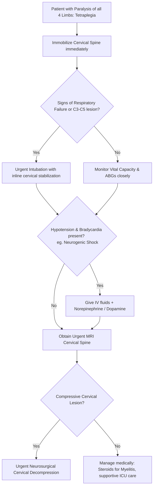

---
tags:
  - internalmedicine
  - disease
  - neurology
status: active
---

## type: disease

# Definition
Tetraplegia (historically known as quadriplegia) is the complete or severe loss of motor and sensory function in all four extremities (both arms and legs), along with the trunk, caused by a lesion in the cervical spinal cord (from C1 to C8) or the brainstem.

# Epidemiology
* **Acuity**: A high-stakes, life-threatening neurological emergency.
* **Etiology Split**: Traumatic cervical spinal cord injury (SCI) from high-velocity impact, diving accidents, or falls accounts for the majority of cases. Non-traumatic compressive and inflammatory myelopathies represent the remainder.
* **Mortality**: High in the acute phase, primarily due to respiratory arrest from diaphragmatic paralysis or neurogenic shock.

# Etiology
1. **Traumatic Cervical Spinal Cord Injury**:
   * Vertebral fracture, subluxation, or dislocation of the cervical spine.
2. **Compressive Myelopathy (Cervical)**:
   * Cervical spondylotic myelopathy (severe degenerative narrowing of the canal).
   * Metastatic epidural spinal cord compression (MESCC) in the cervical spine.
   * Cervical epidural abscess or hematoma.
3. **Inflammatory / Autoimmune**:
   * **[[Myelitis]]** (Transverse myelitis, MS, Neuromyelitis Optica [NMOSD]).
4. **Vascular**:
   * Cervical spinal cord infarction (anterior spinal artery occlusion).
   * Vertebrobasilar stroke (brainstem infarction).
5. **Peripheral Mimics**:
   * Severe, fulminant **[[Guillain-Barre Syndrome]]** or myasthenic crisis (causing generalized weakness of all four limbs, mimicking tetraplegia).

# Pathophysiology
1. **Corticospinal Tract Interruption**: A lesion in the cervical cord blocks descending corticospinal fibers bilaterally, paralyzing all motor units below the head.
2. **Respiratory Paralysis**:
   * The **phrenic nerve nucleus** is located in the **C3 - C5 segment** of the spinal cord and controls the diaphragm.
   * Lesions at or above C3-C5 cause complete paralysis of the diaphragm, leading to immediate respiratory arrest unless mechanical ventilation is initiated (**"C3, 4, 5 keep the diaphragm alive"**).
   * Lesions below C5 preserve diaphragmatic function but paralyze intercostal and abdominal muscles, causing severe restrictive lung disease and an inability to clear secretions.
3. **Neurogenic Shock (Autonomic Disruption)**:
   * Injury above **T6** disrupts the descending sympathetic tracts, leaving parasympathetic (vagal) tone unopposed.
   * Clinically characterized by the triad of: **profound hypotension** (due to loss of vasomotor tone and widespread vasodilation) and **bradycardia** (due to loss of cardiac accelerator fibers C8-T4), with **warm, flushed skin** (loss of peripheral vasoconstriction).
   * Differentiated from spinal shock, which is a transient loss of reflexes.

```
                           ┌──────────────────────────┐
                           │   CERVICAL CORD LESION   │
                           └────────────┬─────────────┘
                                        │
             ┌──────────────────────────┴──────────────────────────┐
             ▼                                                     ▼
┌──────────────────────────┐                         ┌──────────────────────────┐
│   MOTOR PATHWAY BLOCK    │                         │   SYMPATHETIC DISRUPTION │
└────────────┬─────────────┘                         └────────────┬─────────────┘
             │                                                     │
    Bilateral paralysis of                                Loss of Vasomotor Tone &
    Arms and Legs (UMN signs)                             Unopposed Vagal Tone
             │                                                     │
             ▼                                                     ▼
┌──────────────────────────┐                         ┌──────────────────────────┐
│   RESPIRATORY COMPROMISE │                         │    NEUROGENIC SHOCK      │
│   (Diaphragm paralyzed   │                         │  (Hypotension + Brady-   │
│       if C3-C5 affected) │                         │    cardia + Warm Skin)   │
└──────────────────────────┘                         └──────────────────────────┘
```

# Clinical Manifestations

## Symptoms
* Complete paralysis of all four limbs.
* Loss of sensation in the arms, legs, and trunk below the clavicles.
* Severe dyspnea, choking sensation, or respiratory distress.
* Complete urinary retention and loss of bowel control.

## Physical Examination
* **Motor Exam**: Paralysis of all four limbs.
  * In cervical cord lesions, a **segmental motor level** in the arms can localize the lesion (e.g., C5 preserves shoulder abduction; C6 preserves wrist extension; C7 preserves elbow extension; C8 preserves finger flexion).
* **Reflexes**: 
  * *Acute*: Areflexia in all four limbs (spinal shock).
  * *Chronic*: Hyperreflexia and bilateral Babinski signs in the legs. Arms may show LMN reflex loss at the level of injury (e.g., absent biceps reflex in C5-C6 lesion) and hyperreflexia below it (triceps).
* **Sensory Exam**: A sensory level located on the neck or upper chest (e.g., C4 dermatome corresponds to the clavicles; C3/C4 covers the neck).
* **Hemodynamic Signs (Neurogenic Shock)**: Hypotension accompanied by **bradycardia** (highly specific; hypovolemic shock causes tachycardia).
* **Respiratory Exam**: Paradoxical breathing (the abdomen expands during inspiration while the chest collapses, indicating exclusive use of the diaphragm without intercostal muscle help).

---

# Differential Diagnosis
* **Locked-In Syndrome**: Ventral pons lesion. The patient is tetraplegic but **fully awake, alert**, and can blink and move their eyes vertically. (Tetraplegic spinal cord patients can move their head, face, eyes, and speak normally).
* **Guillain-Barré Syndrome (Severe)**: Ascending paralysis that progresses to involve all limbs and bulbar muscles. Distinguished by **diffuse areflexia, absence of a trunk sensory level**, and albuminocytologic dissociation on LP.
* **Brainstem Stroke**: Presents with tetraplegia, but is accompanied by **altered consciousness (coma)**, pupillary abnormalities, and cranial nerve palsies (CN III-XII).

---

# Investigations

## Laboratory
* **Arterial Blood Gas ([[ABG]])**: Essential to monitor for hypoxemia and respiratory acidosis (indicates diaphragmatic fatigue and impending respiratory failure).

## Imaging
* **MRI Cervical Spine (Gold Standard)**:
  * Ordered immediately to visualize cervical cord compression, edema, transection, or intrinsic myelitis plaques.
* **CT Cervical Spine**:
  * Used in trauma to evaluate for cervical vertebral fractures or dislocations.

---

# Diagnostic Criteria
Diagnosis is confirmed by bilateral motor and sensory paralysis of all four limbs associated with UMN signs, a cervical sensory level, and MRI confirmation of cervical spinal cord pathology.

---

# Management



## Initial Management (The Critical Resuscitation)
* **Spinal Immobilization**: Immediately apply a rigid cervical collar. Keep the patient in a neutral position; use the log-roll technique for turning.
* **Airway & Ventilation**:
  * **Prophylactic Intubation**: Indicated if there is diaphragmatic weakness, C3-C5 lesion, or signs of hypoventilation on ABG.
  * > [!IMPORTANT]
  > **Inline Cervical Stabilization**: During intubation, **do not extend the neck**. Use video laryngoscopy (GlideScope) or fiberoptic intubation while an assistant manually stabilizes the head and neck in a neutral alignment.
* **Neurogenic Shock Management**:
  * **Fluid Resuscitation**: Administer IV crystalloid boluses.
  * **Vasopressor / Inotrope Support**: If hypotension is refractory to fluids, initiate **Norepinephrine** or **Dopamine**. (Do **not** use phenylephrine, as its pure alpha-adrenergic vasoconstriction can worsen bradycardia via reflex pathways. Norepinephrine has beta-activity to support heart rate).
  * **Atropine**: For symptomatic bradycardia.
* **Bladder & Bowel Care**: Foley catheterization to treat acute urinary retention.

## Definitive Management
* **Cervical Decompression (Neurosurgery)**: Urgent surgical stabilization and decompression of the spinal cord (e.g., anterior cervical discectomy and fusion [ACDF] or posterior laminectomy).
* **Chronic Rehabilitation**:
  * Physical therapy to maintain range of motion and prevent contractures.
  * Occupational therapy to teach adaptive control of motorized wheelchairs (e.g., sip-and-puff controls).
  * Long-term tracheostomy and mechanical ventilation if the lesion is at C3-C4.

---

# Complications
* **Respiratory Failure / Aspiration**: Leading cause of death in chronic tetraplegia.
* **Autonomic Dysreflexia**: (Classically seen in lesions above T6). Triggered by bowel/bladder distension, presenting with severe, life-threatening paroxysmal hypertension.
* **Neurogenic Shock**.
* **Deep Vein Thrombosis (DVT)**: Extremely high risk due to complete immobility.
* **Pressure Ulcers & Joint Contractures**.

# Prognosis
* Complete C1-C4 lesions are highly disabled, requiring permanent mechanical ventilation and 24-hour care.
* C6-C8 lesions preserve shoulder movement and elbow flexion/extension, allowing the patient to feed themselves and drive modified vehicles.

# Clinical Pearls
* > [!IMPORTANT]
  > **The Inline Intubation Rule**: When intubating a patient with suspected cervical spine trauma, never use the standard "sniffing position" (neck flexion and head extension). This can compress the spinal cord further, turning a partial injury into permanent, complete tetraplegia.
* > [!WARNING]
  > **Phenylephrine Danger**: Avoid Phenylephrine in neurogenic shock. Because it lacks beta-adrenergic activity, it does not treat bradycardia and can trigger reflex vagal discharge, worsening bradycardia and potentially causing cardiac arrest. Use Norepinephrine.

---

# Related Notes
* [[Paraplegia]]
* [[Myelitis]]
* [[Guillain-Barre Syndrome]]
* [[Acute Flaccid Paralysis]]
* [[Shock]]
* [[Respiratory Failure]]
* [[Urinary Retention]]
* [[MRI Brain]]
* [[ABG]]
