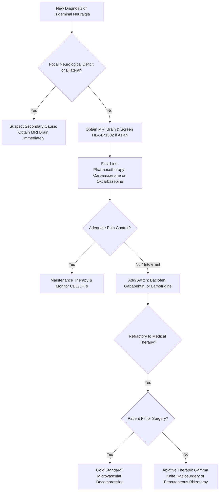

---
tags:
  - internalmedicine
  - disease
  - neurology
status: active
---

## type: disease

# Definition
Trigeminal neuralgia (TN), historically known as *tic douloureux*, is a neuropathic pain disorder characterized by sudden, brief, unilateral, stabbing, or shock-like pain paroxysms in the distribution of one or more branches of the trigeminal nerve (cranial nerve V).

# Epidemiology
* **Incidence**: Approximately 4 to 13 per 100,000 people annually.
* **Age & Sex**: Primarily affects individuals older than 50 years; incidence increases with age. There is a slight female predominance (1.5:1 ratio).
* **Associations**: Bilateral trigeminal neuralgia is rare and strongly raises suspicion for **Multiple Sclerosis** or bilateral base of skull lesions.

# Etiology
Trigeminal neuralgia is classified based on etiology:
1. **Classical TN ($>75\%$)**: Caused by neurovascular compression of the trigeminal nerve root entry zone (REZ) in the prepontine cistern, most commonly by an aberrant loop of the **superior cerebellar artery (SCA)** or, less frequently, the anterior inferior cerebellar artery (AICA) or petrosal vein.
2. **Secondary TN ($15\%$)**: Due to an underlying structural disease other than vascular compression, such as:
   * Demeylinating plaque at the root entry zone in **Multiple Sclerosis** (occurs in 2-4% of MS patients).
   * Tumor at the cerebellopontine angle (CPA) (e.g., vestibular schwannoma/acoustic neuroma, meningioma, epidermoid cyst).
3. **Idiopathic TN**: No vascular compression or secondary structural cause is identified on high-resolution imaging.

# Pathophysiology
1. **Mechanical Compression**: Chronic pulsatile compression of the trigeminal nerve root by an adjacent artery or vein at the central-peripheral myelin junction (transition zone between oligodendrocytes and Schwann cells).
2. **Focal Demyelination**: The persistent mechanical stress leads to focal demyelination and axonal injury.
3. **Hyperexcitability & Ephaptic Transmission**: Demyelinated axons become hyperexcitable, demonstrating ectopic pacemaker activity and tactile-induced firing. Furthermore, the lack of myelin insulation allows for **ephaptic transmission** (electrical "cross-talk") between adjacent fibers.
4. **Triggering Mechanism**: Light, non-painful tactile stimuli carried by large myelinated beta-fibers ($A\beta$) aberrantly excite adjacent unmyelinated or thinly myelinated pain-carrying fibers ($A\delta$ and $C$ fibers), triggering a severe pain paroxysm.

# Clinical Manifestations

## Symptoms
* **Pain Character**: Unilateral, sudden, excruciating, lancinating, sharp, stabbing, or electric shock-like pain.
* **Duration**: Paroxysms last from a fraction of a second to a maximum of 2 minutes. They may occur in rapid succession, with a dull background ache between spasms in some chronic cases (TN with concomitant continuous pain).
* **Anatomical Distribution**: Unilateral and confined to the sensory distribution of the trigeminal nerve:
   * **V2 (Maxillary)** and/or **V3 (Mandibular)** branches are most commonly affected ($>95\%$).
   * **V1 (Ophthalmic)** division is affected in $<5\%$ of cases.
   * Pain rarely crosses the midline.
* **Trigger Factors**: Paroxysms are precipitated by innocuous mechanical stimuli to specific facial "trigger zones." Common triggers include:
   * Light touch to the face or upper lip.
   * Shaving, washing, or applying makeup.
   * Chewing, talking, smiling, or drinking.
   * Brushing teeth.
   * Exposure to cold wind.
* **Refractory Period**: Immediately after a paroxysm, there is a short refractory window (seconds to minutes) during which the trigger zone cannot stimulate another attack.
* **Autonomic Symptoms**: Mild lacrimation or conjunctival injection may occur, but prominent autonomic features suggest alternative diagnoses.

## Physical Examination
* **Neurological Examination**:
   * In classical or idiopathic TN, the neurological exam—including facial sensation (light touch, pinprick) in all three divisions, corneal reflex, and motor function of the muscles of mastication (CN V motor)—is **entirely normal**.
   * The presence of persistent facial sensory deficits, loss of corneal reflex, or weakness of temporalis/masseter muscles indicates **Secondary TN** and warrants urgent structural evaluation.
* **Trigger Point Mapping**: Careful examination may identify highly localized hyperalgesic areas on the cheek, nose, or gingiva.

---

# Differential Diagnosis
* **Dental Pain / Odontalgia**: Continuous throbbing pain, localized to teeth, exacerbated by thermal stimuli (hot/cold); identified via dental X-rays.
* **Glossopharyngeal Neuralgia**: Pain in the tonsillar fossa, base of the tongue, ear, or angle of the jaw, triggered by swallowing, talking, or coughing.
* **Postherpetic Neuralgia (V1 division)**: Continuous burning pain following an episode of herpes zoster (shingles) along the ophthalmic division, accompanied by chronic scarring/pigmentation changes.
* **Trigeminal Autonomic Cephalalgias (TACs)**:
   * *Short-lasting Unilateral Neuralgiform headache attacks with Conjunctival injection and Tearing (SUNCT)*: Very brief attacks but feature prominent autonomic signs (lacrimation, rhinorrhea) and lack a post-paroxysm refractory period.
   * *Cluster [[Headache]]*: Unilateral retro-orbital pain lasting 15 to 180 minutes, associated with agitation and autonomic symptoms.
* **Temporomandibular Disorder (TMD)**: Dull, aching, continuous pain localized to the preauricular area, exacerbated by jaw movement, with tenderness of masticatory muscles.
* **Giant Cell Arteritis**: Throbbing temporal pain, jaw claudication, systemic symptoms (fever, weight loss), elevated ESR/CRP.

---

# Investigations

## Laboratory
* **Routine Labs**: Usually normal.
* **HLA-B\*1502 Screening**: **Mandatory in patients of Asian ancestry** before initiating carbamazepine therapy due to the high risk of Stevens-Johnson syndrome (SJS) and toxic epidermal necrolysis (TEN).

## Imaging
* **[[MRI Brain]] (with and without gadolinium contrast)**:
   * **Indications**: Essential for all newly diagnosed patients with trigeminal neuralgia to rule out secondary causes (demeylinating plaques of multiple sclerosis, cerebellopontine angle tumors like meningioma or acoustic neuroma).
   * **Specialized Protocol**: High-resolution 3D T2-weighted cisternography sequences (e.g., **FIESTA** [Fast Imaging Employing Steady-state Acquisition] or **CISS** [Coherent Interfering in Steady State]) combined with **MR Angiography (MRA)** are utilized to visualize the anatomical relationship between the trigeminal nerve root and adjacent arterial loops, demonstrating neurovascular contact/compression.

## Special Tests
* **[[EMG/NCS]] (Blink Reflex Testing)**: May show abnormalities (e.g., delayed R1 or R2 responses) in patients with secondary trigeminal neuralgia or subclinical neuropathy, but has been largely replaced by high-resolution MRI.

---

# Diagnostic Criteria
According to the International Classification of Headache Disorders (ICHD-3), diagnostic criteria for Trigeminal Neuralgia include:
1. At least 3 attacks of unilateral facial pain fulfilling criteria B and C.
2. Occurring in one or more divisions of the trigeminal nerve, with no radiation beyond the trigeminal distribution.
3. Pain has at least 3 of the following 4 characteristics:
   * Recurrent paroxysms lasting from a fraction of a second to 2 minutes.
   * Severe intensity.
   * Electric shock-like, shooting, stabbing, or sharp quality.
   * Precipitated by innocuous stimuli to the affected side.
4. No clinically evident neurological deficit (or explained by a secondary cause).
5. Not better accounted for by another ICHD-3 diagnosis.

---

# Management

## Initial Management
* **Pharmacotherapy** is the cornerstone of initial treatment:
  * **Carbamazepine**: The undisputed **first-line choice**.
    * *Mechanism*: Blocks voltage-gated sodium channels, stabilizing hyperexcitable neuronal membranes.
    * *Dosing*: Start low at $100-200$ mg PO daily or bid, slowly titrating upward (increments of $100-200$ mg every few days) until pain control is achieved or side effects limit use. Standard maintenance dose is $600-1200$ mg/day in divided doses.
    * *Monitoring*: Baseline and periodic CBC (risk of aplastic anemia and agranulocytosis), LFTs (hepatotoxicity), and serum sodium (risk of SIADH / hyponatremia).
  * **Oxcarbazepine**: An acceptable first-line alternative with a better tolerability profile, fewer drug interactions, and no requirement for HLA screening, though hyponatremia risk remains high.
    * *Dosing*: Start $150-300$ mg PO bid, titrate to maintenance of $600-1800$ mg/day.
  * **Second-line / Adjunctive Agents** (used if first-line fails or causes intolerable side effects):
    * **Baclofen**: $10-80$ mg/day (GABA-B agonist; synergistic with carbamazepine).
    * **Gabapentin**: $900-3600$ mg/day (calcium channel subunit ligand; useful in elderly and MS patients).
    * **Lamotrigine**: $100-400$ mg/day (slow titration required to avoid Stevens-Johnson syndrome).

## Definitive Management
Surgical intervention is indicated for patients with classical or idiopathic TN whose pain is refractory to medical therapy or who experience intolerable drug toxicities:
1. **Microvascular Decompression (MVD) / Jannetta Procedure**:
   * *Procedure*: Suboccipital craniectomy to access the cerebellopontine angle, isolation of the trigeminal nerve root, and placement of a synthetic sponge (Teflon) to separate the compressing vessel from the nerve.
   * *Efficacy*: **Gold standard surgery**. Provides the highest immediate pain relief rate ($>90\%$) and the longest duration of pain-free survival ($>70\%$ at 10 years) without causing facial numbness.
   * *Risks*: Cerebellar injury, CSF leak, hearing loss (CN VIII damage, 1-3%), facial palsy (CN VII damage), and meningitis.
2. **Ablative / Destructive Procedures** (preferred for patients unfit for major neurosurgery, or with MS):
   * **Stereotactic Radiosurgery (Gamma Knife)**: Focused radiation targeted at the trigeminal nerve root. Slow onset of pain relief (weeks to months), but highly non-invasive.
   * **Percutaneous Rhizotomy**: Accessing the Gasserian ganglion through the foramen ovale using radiofrequency thermocoagulation, glycerol injection, or balloon compression. Leads to immediate relief but carries a high rate of permanent ipsilateral facial numbness and corneal anesthesia.

---

# Complications
* **Nutritional Impairment**: Severe weight loss and dehydration due to patient avoidance of chewing and drinking (odontophobia/phagophobia).
* **Psychosocial Sequelae**: Severe depression, anxiety, social isolation, and suicidal ideation due to the excruciating, unpredictable nature of the pain.
* **Surgical Complications**:
   * Permanent facial sensory loss/numbness.
   * **Anesthesia Dolorosa**: A rare, intractable, painful dysesthesia in an area of complete sensory loss (most feared complication of ablative surgery).
   * Loss of corneal reflex predisposes to corneal ulceration and keratitis.

# Prognosis
* TN is a chronic condition characterized by unpredictable cycles of remission (lasting months to years) and exacerbation.
* Over time, remissions tend to shorten, and the pain often becomes more resistant to pharmacotherapy.
* Surgical interventions offer high rates of immediate pain control, but recurrence rates rise over years (approx. 20-30% recurrence within 5-10 years post-MVD).

# Clinical Pearls
> [!TIP]
  > **Sleep Exemption**: Trigeminal neuralgia pain paroxysms **rarely occur during sleep**. If a patient reports being frequently awakened by unilateral facial pain, suspect alternative diagnoses such as cluster headaches or secondary structural lesions.

> [!IMPORTANT]
  > **Asian Ancestry Carbamazepine Rule**: Always screen for the **HLA-B\*1502 allele** in patients of Asian descent (including Thai, Han Chinese, and Malay populations) before starting carbamazepine. The allele has a strong association with carbamazepine-induced Stevens-Johnson syndrome/TEN.
 
 > [!WARNING]
  > **Young Patient Rule**: If a patient younger than 40 years presents with classic trigeminal neuralgia, always obtain an **MRI Brain** to rule out **Multiple Sclerosis**.

---

# Related Notes
* [[Headache]]
* [[Dizziness]]
* [[Facial Nerve Palsy]]
* [[MRI Brain]]
* [[CT Brain]]
* [[EMG/NCS]]
* [[Lumbar Puncture]]
* [[Weakness]]
* [[Numbness]]
