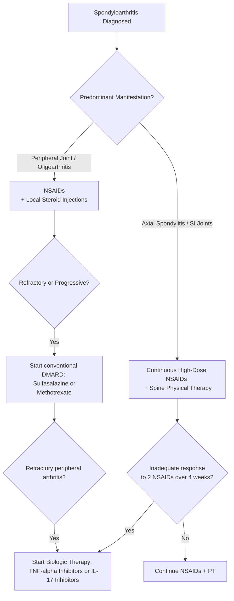

---
tags:
  - internalmedicine
  - disease
  - rheumatology
status: active
---

## type: disease

# Definition
Spondyloarthritis (SpA), also known as seronegative spondyloarthropathy, is a group of interrelated chronic inflammatory joint diseases characterized by axial skeleton involvement (sacroiliitis and spondylitis), peripheral arthritis (typically asymmetric and lower-limb predominant), **enthesitis**, **dactylitis**, and a strong genetic association with the **HLA-B27** allele. They are termed "seronegative" due to the absence of Rheumatoid Factor (RF) and Anti-CCP antibodies.

# Classification & Subtypes
SpA is clinically divided into two major groups based on the predominant clinical manifestation:

```
                                  ┌──────────────────────────────┐
                                  │    SPONDYLOARTHRITIS (SpA)   │
                                  └──────────────┬───────────────┘
                 ┌───────────────────────────────┴───────────────────────────────┐
                 ▼                                                               ▼
     ┌───────────────────────┐                                       ┌───────────────────────┐
     │       AXIAL SpA       │                                       │     PERIPHERAL SpA    │
     │  (Axial Predominant)  │                                       │ (Peripheral/Entheseal)│
     └───────────┬───────────┘                                       └───────────┬───────────┘
     ┌───────────┴───────────┐                                       ┌───────────┴───────────┐
     │ • Ankylosing          │                                       │ • Psoriatic Arthritis │
     │   Spondylitis         │                                       │ • Reactive Arthritis  │
     │ • Non-radiographic    │                                       │ • Enteropathic (IBD)  │
     │   Axial SpA           │                                       │   Arthritis           │
     └───────────────────────┘                                       └───────────────────────┘
```

### 1. Axial Spondyloarthritis (axSpA)
Predominantly involves the spine and sacroiliac joints.
* **Ankylosing Spondylitis (AS)**: Characterized by structural damage visible on plain radiographs (definitive radiographic sacroiliitis).
* **Non-radiographic Axial SpA (nr-axSpA)**: Patients present with symptoms of axial SpA and active inflammation on MRI (bone marrow edema) but do not have diagnostic structural changes on plain X-rays.

### 2. Peripheral Spondyloarthritis (pSpA)
Predominantly involves peripheral joints, entheses, or digits.
* **Psoriatic Arthritis (PsA)**: Associated with cutaneous psoriasis. Involves the DIP joints, nail changes (pitting, onycholysis), and can cause severe joint destruction (arthritis mutilans).
* **Reactive Arthritis (ReA)**: Sterile arthritis triggered by a preceding GI or GU infection.
* **Enteropathic (IBD-associated) Arthritis**: Associated with Crohn's disease or Ulcerative Colitis.
  * *Type 1 (Pauciarticular)*: Affects $<5$ joints, acute, flares mirror active bowel disease.
  * *Type 2 (Polyarticular)*: Affects $\ge 5$ joints, chronic, runs independent of bowel disease activity.
  * *Axial type*: Sacroiliitis/spondylitis, runs completely independent of bowel disease.

---

# Pathophysiology & The IL-23 / IL-17 Axis
The primary lesion in SpA is **enthesitis** (inflammation of the tendon/ligament attachment to bone), contrasting with RA where the primary lesion is synovitis.
1. **Mechanical Stress & Gut Inflammation**: Mechanical microtrauma at the entheses or subclinical gut inflammation triggers the production of **IL-23** by local dendritic cells and macrophages.
2. **Receptor Activation**: Resident immune cells within the entheses (specifically γδ T-cells, Innate Lymphoid Cells [ILC3s], and CD8+ T-cells) express IL-23 receptors (IL-23R).
3. **IL-17 Production**: IL-23 stimulation drives these local cells to secrete **IL-17** and **TNF-$\alpha$**.
4. **Bone Remodeling**: IL-17 and TNF-$\alpha$ promote inflammatory cell infiltration. Furthermore, IL-17 acts on osteoblasts to stimulate new bone formation (osteoproliferation/syndesmophytes) and on osteoclasts to drive bone resorption, leading to the pathognomonic mix of joint erosion and bony fusion.

---

# Clinical Manifestations (Common Core Features)
* **Inflammatory Back Pain**: Back pain lasting $>3$ months, onset age $<40$, insidious, worse with rest, improves with exercise, and causes night pain.
* **Enthesitis**: Exquisite tenderness at tendon insertions. Most commonly: **Achilles tendonitis**, **plantar fasciitis**, and costochondral junctions.
* **Dactylitis ("Sausage Digit")**: Diffuse, uniform swelling of an entire finger or toe, representing a mix of joint synovitis, tenosynovitis of the flexor tendon sheath, and enthesitis.
* **Asymmetric Oligoarthritis**: Predominantly affecting large, lower extremity joints (knees, ankles).
* **Ocular Involvement**: Acute anterior uveitis (unilateral, painful red eye, photophobia).
* **Mucocutaneous**: Psoriatic plaques, keratoderma blennorrhagicum, circinate balanitis, painless oral ulcers.

---

# Investigations

## Laboratory
* **Serology**: Rheumatoid Factor (RF) and Anti-CCP are **characteristically negative**.
* **HLA-B27**: Highly supportive, particularly for axial SpA ($>90\%$ positive in AS; $30-50\%$ in reactive/psoriatic).
* **Inflammatory Markers**: ESR and CRP are elevated in active disease (more consistently elevated in peripheral disease than isolated axial disease).

## Imaging
* **Plain Radiography**:
  * Sacroiliac joints: Erosions, sclerosis, joint space narrowing, and eventual fusion.
  * Spine: Vertebral squaring, shiny corners, syndesmophytes, and ligamentous calcification.
  * Peripheral joints: Asymmetric joint space narrowing, periostitis (new bone formation), and "pencil-in-cup" deformity in Psoriatic Arthritis (osteolysis of distal phalangeal head with expansion of proximal base).
* **MRI (SI joints / Spine)**:
  * Mandatory for diagnosing **non-radiographic axial SpA**.
  * Look for **bone marrow edema** (active sacroiliitis) on STIR/T2 sequences.

---

# Diagnostic Criteria
### ASAS Classification Criteria for Axial SpA (For patients with back pain $\ge 3$ months and age of onset $<45$ years)
* **Sacroiliitis on imaging** (X-ray or MRI) + **$\ge 1$ SpA feature** OR
* **HLA-B27 positive** + **$\ge 2$ SpA features**
* *SpA features*: Inflammatory back pain, arthritis, enthesitis, uveitis, dactylitis, psoriasis, Crohn's/UC, good response to NSAIDs, family history of SpA, elevated CRP.

---

# Management



## Pharmacological Therapy
* **NSAIDs (First-line for both Axial and Peripheral)**: Full therapeutic doses of NSAIDs (e.g., Naproxen, Indomethacin, Celecoxib) are highly effective.
* **Conventional synthetic DMARDs (e.g., Sulfasalazine, Methotrexate)**:
  * **Completely ineffective for axial spinal symptoms.**
  * Useful for managing **peripheral arthritis** (e.g., polyarticular psoriatic arthritis or chronic reactive arthritis).
* **Biologic DMARDs**:
  * Indicated for axial disease refractory to NSAIDs, and peripheral disease refractory to conventional DMARDs.
  * **TNF-$\alpha$ Inhibitors** (e.g., Adalimumab, Infliximab, Etanercept): Highly effective for both axial and peripheral disease, uveitis, and IBD.
  * **IL-17 Inhibitors** (e.g., Secukinumab): Highly effective for axial disease and psoriasis/PsA.
  * **IL-23 / IL-12/23 Inhibitors** (e.g., Ustekinumab, Guselkumab): Highly effective for psoriasis and peripheral PsA, but **ineffective for axial spondyloarthritis**.

---

# Clinical Pearls
* > [!IMPORTANT]
  > **IL-17 Inhibitor Contradiction in IBD**: While IL-17 inhibitors (e.g., Secukinumab) are highly effective for Ankylosing Spondylitis and Psoriatic Arthritis, they are **strictly contraindicated in patients with active Inflammatory Bowel Disease (IBD)**, as blockading IL-17 can disrupt mucosal barrier integrity and trigger severe flares of Crohn's or Ulcerative Colitis. Use TNF-α inhibitors instead.
* > [!TIP]
  > **Dactylitis vs. Synovitis**: Dactylitis ("sausage digit") is a pathognomonic sign of spondyloarthritis. Unlike the isolated joint swelling seen in Rheumatoid Arthritis, dactylitis represents diffuse inflammation of the entire digit, involving the PIP and DIP joints, the flexor tendon sheath (tenosynovitis), and the surrounding entheses.

---

# Related Notes
* [[Spondylitis]]
* [[Reactive Arthritis]]
* [[Infectious Arthritis]]
* [[Osteoarthritis]]
* [[Joint Deformity]]
* [[Back Pain]]
