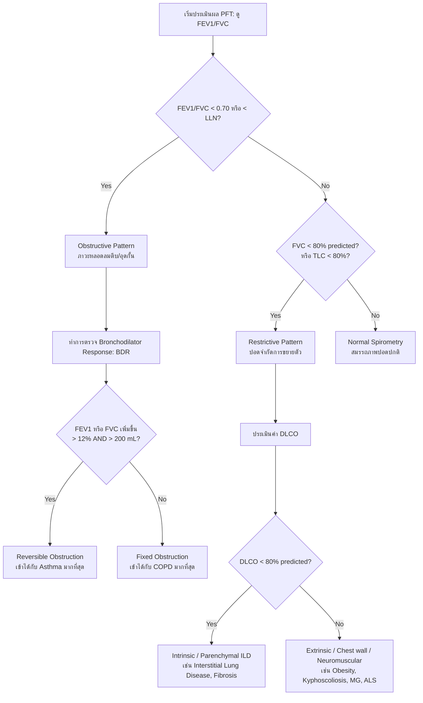

# 🩺 Pulmonary Function Test (PFT)

การตรวจสมรรถภาพปอดเป็นการประเมินความสามารถในการทำงานของระบบหายใจ ครอบคลุมปริมาตรอากาศในปอด (Lung Volumes), อัตราการไหลของอากาศ (Airflow Rates) และประสิทธิภาพการแลกเปลี่ยนแก๊ส (Gas Exchange) ใช้เป็นเครื่องมือหลักในการแยกแยะกลุ่มโรคปอดอุดกั้น (Obstructive) และกลุ่มโรคปอดจำกัดการขยายตัว (Restrictive)

---

## 📊 Key Parameters & Definitions

* **FVC (Forced Vital Capacity)**: ปริมาตรอากาศสูงสุดที่เป่าออกอย่างเร็วและแรงที่สุดจนหมดก้นปอด หลังสูดหายใจเข้าเต็มที่
* **FEV1 (Forced Expiratory Volume in 1 second)**: ปริมาตรอากาศที่เป่าออกมาได้ในวินาทีแรกของการเป่า FVC (สะท้อนอัตราการไหลของอากาศในหลอดลมขนาดใหญ่และกลาง)
* **FEV1/FVC Ratio**: สัดส่วนปริมาตรลมเป่าในวินาทีแรกต่อปริมาตรทั้งหมด (ค่าปกติมักจะอยู่ที่ $\ge 0.70$ หรือสูงกว่า Lower Limit of Normal [LLN])
* **TLC (Total Lung Capacity)**: ความจุปอดทั้งหมดเมื่อสูดลมหายใจเข้าเต็มที่ (ค่าปกติ $\ge 80\%$ predicted)
* **DLCO (Diffusing Capacity of Carbon Monoxide)**: ความสามารถในการซึมผ่านแก๊สของถุงลมปอดเข้าสู่เม็ดเลือดแดง (ค่าปกติ $\ge 80\%$ predicted)

---

## 🔍 Step-by-Step Diagnostic Algorithm (ขั้นตอนการวิเคราะห์ผล PFT)

### 1. Obstructive Lung Disease (โรคปอดอุดกั้น)
* **เกณฑ์วินิจฉัย**: **$\text{FEV1/FVC} < 0.70$**
* **ความรุนแรง (Severity)** ประเมินจากค่า **FEV1 % predicted**:
  * **Mild**: $\ge 80\%$ predicted
  * **Moderate**: $50\% - 79\%$ predicted
  * **Severe**: $30\% - 49\%$ predicted
  * **Very Severe**: $< 30\%$ predicted
* **Bronchodilator Response (BDR)**: ตรวจหลังให้สูดยาขยายหลอดลม (เช่น Albuterol/Salbutamol 4 puffs) 15 นาที
  * **Positive BDR (Reversible)**: FEV1 หรือ FVC เพิ่มขึ้น **$> 12\%$ และมีปริมาตรเพิ่มขึ้น $> 200$ mL** จากค่าเริ่มต้น (เป็นลักษณะสำคัญของ **Asthma**)

### 2. Restrictive Lung Disease (โรคปอดจำกัดการขยายตัว)
* **เกณฑ์วินิจฉัย**: $\text{FEV1/FVC} \ge 0.70$ ร่วมกับ **$\text{TLC} < 80\%$ predicted** (หากดูเฉพาะ Spirometry จะเห็น FVC $< 80\%$ predicted แต่ต้องยืนยันด้วย TLC เสมอเพื่อตัดภาวะลมค้างในปอดเป่าออกไม่หมด)
* **การแยกสาเหตุด้วย DLCO**:
  * **DLCO ลดลง ($< 80\%$)**: เกิดจากพยาธิสภาพที่เนื้อปอดหรือหลอดเลือดปอดโดยตรง เช่น **Interstitial Lung Disease (ILD)**, Idiopathic Pulmonary Fibrosis (IPF), Pneumonitis
  * **DLCO ปกติ ($\ge 80\%$)**: เกิดจากปัจจัยนอกเนื้อปอด เช่น โรคอ้วนรุนแรง, หลังคด (Scoliosis), หรือโรคกล้ามเนื้ออ่อนแรง (Myasthenia Gravis, ALS)

---

## 💡 Clinical Pearls & Red Flags

> [!IMPORTANT]
> **DLCO in Obstructive Lung Disease**:
> - ใช้แยกแยะระหว่าง **COPD (Emphysema)** และ **Asthma**
> - **COPD (Emphysema)**: มีการทำลายผนังถุงลมปอดและพื้นที่แลกเปลี่ยนแก๊สอย่างถาวร ทำให้ **DLCO ต่ำลง**
> - **Asthma**: โครงสร้างถุงลมปอดและพื้นที่แลกเปลี่ยนแก๊สปกติ ทำให้ **DLCO ปกติ หรืออาจสูงขึ้นเล็กน้อย** (จาก pulmonary capillary blood volume ที่เพิ่มขึ้นขณะหายใจลำบาก)

> [!WARNING]
> **Contraindications for PFT**:
> หลีกเลี่ยงการทำ PFT ในผู้ป่วยที่มีความดันสูงขึ้นในส่วนต่าง ๆ ของร่างกายเนื่องจากแรงเบ่งขณะเป่าอาจเป็นอันตราย:
> - มีประวัติ Myocardial Infarction หรือ Stroke ภายใน 1 เดือน
> - มี Aortic Aneurysm ขนาดใหญ่ หรือมีภาวะสมองบวม/ความดันในกะโหลกศีรษะสูง
> - เพิ่งผ่าตัดตา (เช่น ลอกต้อกระจก) หรือผ่าตัดช่องท้อง/ทรวงอก ภายใน 1-4 สัปดาห์
> - มีภาวะลมรั่วในโพรงเยื่อหุ้มปอด (Pneumothorax) ที่ยังไม่หายดี

---
* [[Investigations/index|Investigations Index]]
