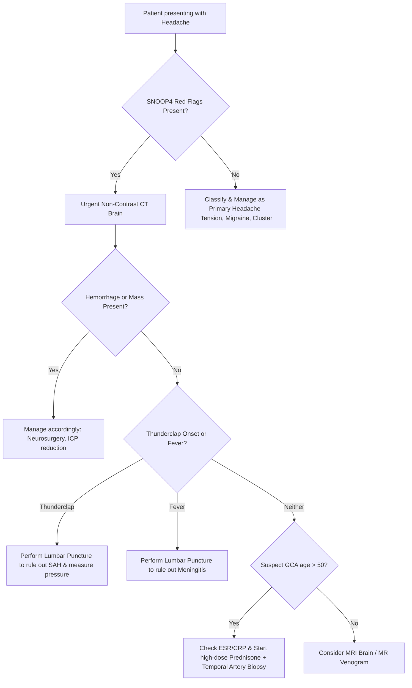

---
tags:
  - internalmedicine
  - disease
  - neurology
  - symptom
  - approach
status: active
---

# 🧠 Headache (ปวดศีรษะ)

> **Definition**: Headache is one of the most common clinical complaints, defined as pain localized to any region of the head or upper neck. The primary clinical goal when approaching a headache is to reliably distinguish benign primary headache disorders from life-threatening secondary headaches.

---

## 🎯 30-Second Rounding Guide
> [!IMPORTANT]
> **Immediate Ward Approach:**
> 1. **Rule Out Secondary Causes**: Use the **SNOOP4** screen for red flags.
> 2. **Identify Thunderclap Onset**: Pain reaching maximum intensity within **1 minute** is a medical emergency. **Rule out SAH immediately.**
> 3. **Assess for Meningeal Signs**: Check for neck stiffness, Kernig's, and Brudzinski's signs if fever is present.
> 4. **Check for Papilledema**: Perform fundoscopy to evaluate for raised intracranial pressure.

---

## 📊 Epidemiology
* **Prevalence**: Lifetime prevalence of headache exceeds $90\%$. Tension-type headache is the most common ($40-80\%$), followed by migraine ($12-15\%$).
* **Secondary Headaches**: Accounts for $<10\%$ of presentations in primary care but up to $20-30\%$ of emergency department headache presentations, representing high-acuity pathologies.

---

## 🔍 Physiology & Pathophysiology

### Pain-Sensitive Structures
The brain parenchyma itself is **not pain-sensitive** as it lacks nociceptors. Headaches arise from the stimulation or traction of pain-sensitive structures:
* **Intracranial**: Large veins/dural sinuses, middle meningeal artery, proximal segments of large cerebral arteries, dura mater at the base of the skull, cranial nerves V (Trigeminal), IX (Glossopharyngeal), and X (Vagus), and upper cervical nerves.
* **Extracranial**: Skin, muscles, fascia, nerves, arteries of the scalp, eyes, ears, sinuses, teeth, mucous membranes of the nasal cavity.

### The Trigeminal Pathway
Sensory inputs from pain-sensitive cranial structures are carried via the **ophthalmic division of the trigeminal nerve (V1)** and upper cervical nerves to the **trigeminocervical complex (TCC)** in the brainstem. From the TCC, pain signals project to the thalamus and then to the primary somatosensory cortex, registering as a headache.

### Secondary Headache Mechanisms
* *Meningeal Irritation*: Direct chemical or bacterial inflammation of the pia-arachnoid leads to nociceptive activation (e.g., SAH, meningitis).
* *Traction/Stretching*: Displacement of large vessels or dural membranes by mass lesions (tumor, hemorrhage) or ventriculomegaly.
* *Ischemia*: Vascular inflammation (GCA) or arterial dissection.

---

## 🦠 Etiology & Causes
Secondary headaches can be caused by various systemic or intracranial pathologies, classified by etiology:
* **Vascular**:
   * Subarachnoid Hemorrhage (SAH) or Intracerebral Hemorrhage (detailed in **[[Intracranial Hemorrhage]]**).
   * **Cerebral Venous Sinus Thrombosis (CVST)** (associated with pregnancy, oral contraceptives, hypercoagulable states).
   * **Giant Cell Arteritis (GCA) / Temporal Arteritis** (necrotizing vasculitis of large/medium arteries in patients $>50$ years).
   * Carotid or Vertebral Artery Dissection.
   * Reversible Cerebral Vasoconstriction Syndrome (RCVS).
* **Infectious**:
   * **[[Meningitis]]**, **[[Encephalitis]]**, **[[Brain Abscess]]**, or systemic viral infections.
* **Intracranial Pressure Derangements**:
   * **Raised ICP**: Brain tumor, **[[Hydrocephalus]]**, Idiopathic Intracranial Hypertension (IIH/Pseudomotor cerebri).
   * **Low ICP**: Spontaneous intracranial hypotension (CSF leak) or post-lumbar puncture headache.
* **Systemic / Metabolic**:
   * Hypertensive emergency, Carbon monoxide poisoning, Hypoxia, Hypercapnia.
* **Local Structures**:
   * Acute angle-closure glaucoma (presents with unilateral headache, eye pain, and blurred vision).
   * Sinusitis, dental infections.

---

## 🗣️ Clinical Manifestations & History

### Character of Pain
* **Tension-Type**: Bilateral, band-like, pressing, mild-to-moderate pain, no nausea, not worsened by routine physical activity.
* **Migraine**: Unilateral, throbbing/pulsating, moderate-to-severe, associated with nausea, photophobia, phonophobia, and worsened by activity (detailed in **[[Migraine]]**).
* **Cluster Headache**: Unilateral, severe orbital/retro-orbital pain, lasting $15-180$ minutes, associated with ipsilateral autonomic signs (lacrimation, rhinorrhea, miosis/ptosis) and restlessness/agitation.

### Primary Headache Differentiation
Differentiating primary headaches by historical features:

| Feature | Migraine | Tension Headache | Cluster Headache |
| :--- | :--- | :--- | :--- |
| **Pain Quality** | Throbbing, pulsating | Dull, band-like, pressing | Excruciating, sharp, stabbing, burning |
| **Location** | Unilateral ($60\%$), can be bilateral | Bilateral, generalized | Unilateral, strictly **periorbital/temporal** |
| **Onset & Duration** | Gradual; lasts $4-72$ hours | Gradual; lasts hours to days | Abrupt; lasts $15-180$ minutes |
| **Associated Symptoms** | Nausea, vomiting, photophobia, phonophobia, +/- Aura | No nausea/vomiting, no photo/phonophobia | **Ipsilateral autonomic signs** (lacrimation, rhinorrhea, miosis, ptosis) |
| **Patient Behavior** | Seeks quiet, dark room; lies still | Remains active or normal | **Restless, paces the floor**, agitated |
| **Frequency** | Episodic | Variable | Attacks occur in "clusters" (daily for weeks) |

---

## 🩺 Physical Examination

* **Vital Signs**: Document Blood Pressure and Temperature. Fever indicates infectious source ([[Meningitis]], brain abscess).
* **Meningeal Signs**:
  * *Neck Stiffness (Nuchal rigidity)*: Inability to touch chin to chest due to neck muscle spasm.
  * *Kernig's Sign*: Pain/resistance when extending the knee with the hip flexed at 90 degrees.
  * *Brudzinski's Sign*: Involuntary flexion of hips/knees when the neck is passively flexed.
* **Neurological Examination**:
  * *Cranial Nerves*: Check pupillary reflexes, extraocular movements (CN VI palsy in raised ICP), facial symmetry.
  * *Motor & Sensory*: Look for focal weakness or sensory deficits (suggests space-occupying lesion or stroke).
  * *Fundoscopy*: Check for loss of venous pulsations and **papilledema** (raised ICP).
* **Local / HEENT Exam**:
  * Palpate **temporal arteries** in patients $>50$ years (thickened, tender, pulseless artery indicates Giant Cell Arteritis).
  * Palpate paranasal sinuses (tenderness in sinusitis).
  * Inspect the eyes: Conjunctival injection, pupillary dilation, or corneal clouding (glaucoma).

---

## 📂 Differential Diagnosis

| Category | Primary (Benign) | Secondary (Dangerous / Can't Miss) |
| :--- | :--- | :--- |
| **Vascular** | None | • **Subarachnoid Hemorrhage (SAH)** (ruptured aneurysm) • **Cerebral Venous Sinus Thrombosis (CVST)** • Ischemic Stroke / TIA / Intracerebral Hemorrhage • Giant Cell (Temporal) Arteritis |
| **Infectious** | None | • **[[Meningitis]]** (bacterial, viral, fungal) • Encephalitis • Brain Abscess |
| **Structural / ICP** | None | • Brain Tumor (primary or metastatic) • Idiopathic Intracranial Hypertension (Pseudotumor cerebri) • Subdural / Epidural Hematoma |
| **Other / Local** | • Migraine • Tension Headache • Cluster Headache | • Acute Angle-Closure Glaucoma (red eye, hazy cornea, fixed mid-dilated pupil) • Carbon Monoxide poisoning |
| **Neuralgias** | • Trigeminal Neuralgia | None |

---

## 🚨 SNOOP4 Red Flags for Secondary Headache
Perform urgent neuroimaging (CT/MRI) if any red flags are present:

| Letter | Red Flag Feature | Clinical Suspicion |
| :--- | :--- | :--- |
| **S** | **Systemic symptoms** (Fever, weight loss) or systemic diseases (HIV, malignancy) | [[Meningitis]], brain abscess, metastatic tumor |
| **N** | **Neurological signs** (Focal deficits, altered mental status, weakness) | Stroke, space-occupying lesion, encephalitis |
| **O** | **Onset sudden** ("Thunderclap" - peaks in $<1$ minute) | Subarachnoid Hemorrhage (SAH), CVST, RCVS |
| **O** | **Older age of onset** (New headache in patient $>50$ years) | Giant Cell Arteritis, malignancy |
| **P1** | **Pattern change** (Progressive, different from previous) | Space-occupying lesion, chronic subdural hematoma |
| **P2** | **Positional headache** (Worse lying flat vs. standing) | Raised ICP (worse flat) vs. Low ICP CSF leak (worse upright) |
| **P3** | **Precipitated** by Valsalva, coughing, exertion | Chiari malformation, posterior fossa lesion |
| **P4** | **Papilledema** on fundoscopy / **Pregnancy or Puerperium** | Brain tumor, venous sinus thrombosis, eclampsia |

---

## 🧪 Investigations

### Emergency Workup Flowchart

### Diagnostics Detail
* **Inflammatory Markers (ESR / CRP)**: Order immediately in any patient $>50$ years with new-onset headache (highly sensitive for Giant Cell Arteritis).
* **CBC**: Check for leukocytosis (infection).
* **CT Brain (without contrast)**: First-line for acute-onset, thunderclap headache. Excellent sensitivity for acute Subarachnoid Hemorrhage ($>98\%$ in first 6 hours) and intracranial bleeding.
* **Brain MRI (with/without Contrast)**: Superior for detecting space-occupying lesions (tumors, abscesses), venous sinus thrombosis (MR Venogram), and posterior fossa pathology.
* **Lumbar Puncture (LP) and CSF Analysis**:
  * **Indications**: Suspected [[Meningitis]] or suspected SAH when CT scan is completely normal but clinical suspicion remains high.
  * **SAH Clues**: Check for **Xanthochromia** (yellow CSF due to hemoglobin breakdown) and persistent RBC count from tube 1 to tube 4 (does not clear, unlike a traumatic tap).
  * **Opening Pressure**: Elevated in IIH, depressed in CSF leak.
  * **Safety check**: *Always perform head CT prior to LP if the patient has focal neurological signs, papilledema, or altered mental status to rule out mass lesion and avoid brain herniation.*

---

## Diagnostic Criteria
Classification is based on the ICHD-3 criteria, differentiating primary headaches by character, duration, and frequency, and diagnosing secondary headaches based on a temporal relationship to a confirmed underlying disease.

---

## 🏥 Management Principles

### Secondary Headaches
* **Subarachnoid Hemorrhage**: Admit to neuro-ICU, control blood pressure (keep SBP $< 140$ mmHg), administer **Nimodipine** (to prevent vasospasm), and consult neurosurgery.
* **Bacterial Meningitis**: Start empiric IV third-generation Cephalosporin (Ceftriaxone) + Vancomycin + Dexamethasone (give with or just before first dose of antibiotics). Add Ampicillin if patient $>50$ years (for *Listeria*).
* **Giant Cell (Temporal) Arteritis**:
  * **Do not wait for biopsy results**. If GCA is suspected, start **Prednisone 40 - 60 mg PO daily** immediately (or IV Methylprednisolone pulse if the patient has visual loss) to prevent permanent blindness. Schedule a **temporal artery biopsy** within 1-2 weeks.
* **Raised Intracranial Pressure**: Elevate head of bed, administer **Mannitol** (or Hypertonic Saline), and consult neurosurgery.

### Primary Headaches
* **Tension-Type**:
  * *Acute*: Acetaminophen, Aspirin, or NSAIDs (Ibuprofen, Naproxen).
  * *Prophylaxis* (if chronic/frequent): **Amitriptyline** (TCAs) at bedtime.
* **Migraine**:
  * *Acute*: Triptans (e.g., Sumatriptan - avoid in CAD/uncontrolled HTN), NSAIDs, antiemetics (Metoclopramide).
  * *Prophylaxis*: Beta-blockers (Propranolol), anticonvulsants (Topiramate, Valproate), tricyclic antidepressants (Amitriptyline).
* **Cluster Headache**:
  * *Acute*: **100% High-flow Oxygen (12 - 15 L/min)** via a non-rebreather mask for 15-20 minutes, or subcutaneous **Sumatriptan 6 mg**. (Oral meds are ineffective due to short attack duration).
  * *Prophylaxis*: **Verapamil** ($240-480$ mg/day in divided doses) is first-line; requires serial ECGs to monitor for PR interval prolongation.

---

## 🫁 Complications & Prognosis
* **Permanent Blindness**: Irreversible visual loss in untreated Giant Cell Arteritis.
* **Medication Overuse Headache (MOH) / Rebound Headache**:
  * A chronic headache caused by frequent use of acute headache medications (triptans/opioids/combination analgesics $\ge 10$ days/month, or simple NSAIDs/acetaminophen $\ge 15$ days/month for $>3$ months).
  * *Management*: Discontinuation of the overused medication, patient education, and bridge therapy (e.g., topiramate or amitriptyline).

---

## 💡 Clinical Pearls

* > [!IMPORTANT]
  > **Thunderclap LP Rule**: Up to $10-15\%$ of patients with subarachnoid hemorrhage have a normal CT Brain, especially if they present $>24$ hours after headache onset or have a small bleed. If a patient describes their headache as a **sudden thunderclap ("worst headache of my life")**, a normal CT Brain **never** rules out SAH; you **must** perform a **Lumbar Puncture**.
* > [!TIP]
  > **Trigeminal Autonomic Cephalgias (TACs)**: Cluster headache belongs to this class. The hallmark is strictly unilateral pain accompanied by prominent ipsilateral cranial autonomic symptoms (tearing, nasal congestion, eyelid swelling, miosis/ptosis).
* > [!TIP]
  > **Medication Overuse Prevention**: Limit use of acute abortive medications to a maximum of **2 days per week** to prevent developing medication overuse headache.

---

## 🔗 Related Notes
* [[Migraine]]
* [[Meningitis]]
* [[Encephalitis]]
* [[Brain Abscess]]
* [[Intracranial Hemorrhage]]
* [[Cerebrovascular Disease]]
* [[Trigeminal Neuralgia]]
* [[Hydrocephalus]]
* [[Altered Consciousness]]
* [[Muscle Weakness]]
* [[Numbness]]
* [[CT Brain]]
* [[MRI Brain]]
* [[Lumbar Puncture]]
* [[CSF Analysis]]
